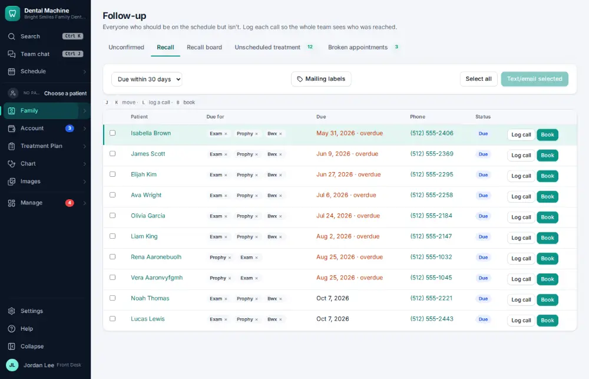
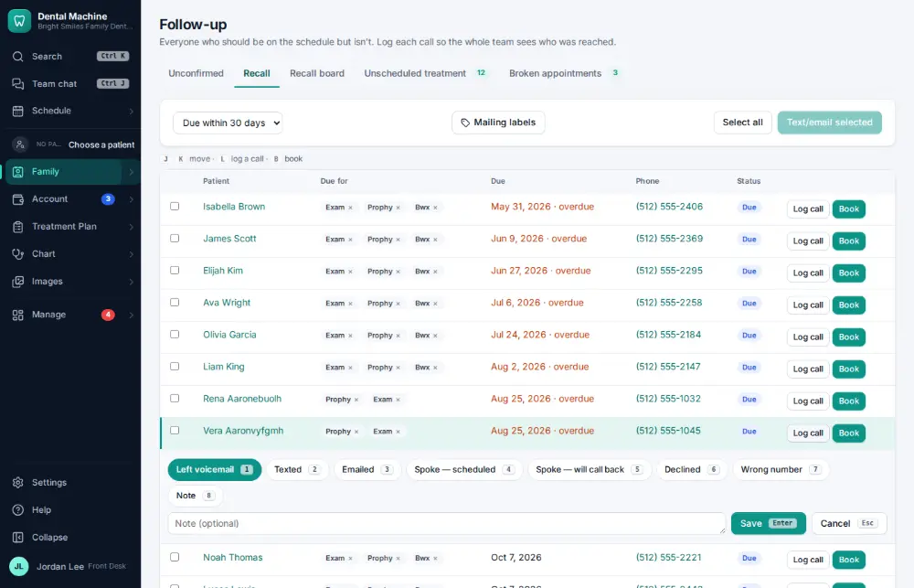
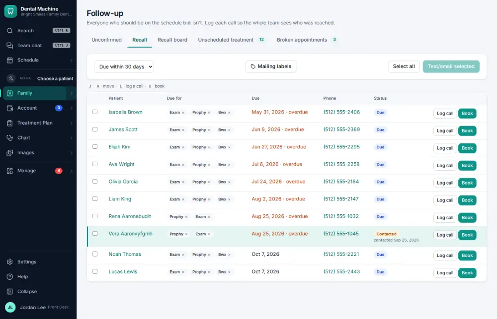

# How do I mark a recall call as “left a message”?

**Who:** front desk · **Where:** Family ▾ → Follow-up lists → Recall · **How often:** Every day

After calling a recall patient, log how it went so the rest of the team knows. “Left voicemail” is already picked.

## Where to start

## Steps

1. Recall: one row per patient, what they’re due for as chips. Click "Log call" on their row: it opens under the row, "Left voicemail" picked, Save focused

   

2. Press Enter: logged for the whole team, and all their recalls are marked contacted  
   Keys: <kbd>Enter</kbd>

   

## Tips

- On the list, L opens the call log for the highlighted patient; 1–8 picks how it went; Enter saves.
- One call covers all of that patient’s recalls.

## Related

- [How do I call a patient who is due for recall?](A037-call-a-patient-who-is-due-for-recall.md)
- [How do I call a patient about unscheduled treatment?](A057-call-a-patient-about-unscheduled-treatment.md)
- [How do I work the broken-appointments list?](A093-work-the-broken-appointments-list.md)
- [How do I change a patient's recall interval?](A097-change-a-patient-s-recall-interval.md)
- [How do I check what the recall autopilot did?](A125-check-what-the-recall-autopilot-did.md)

---
[All how-tos](README.md) · Action A051 · screenshots from the robot run of 2026-09-25
