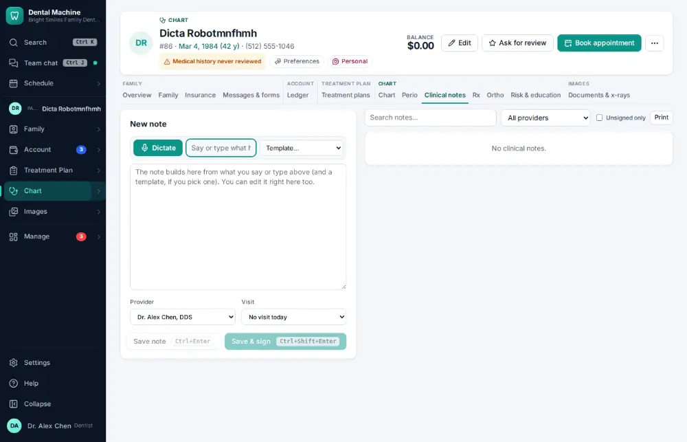
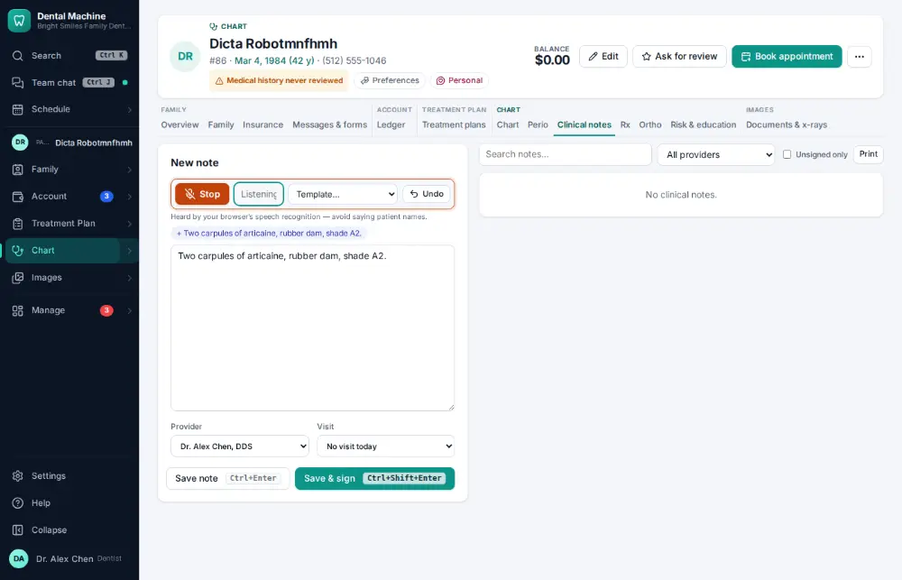
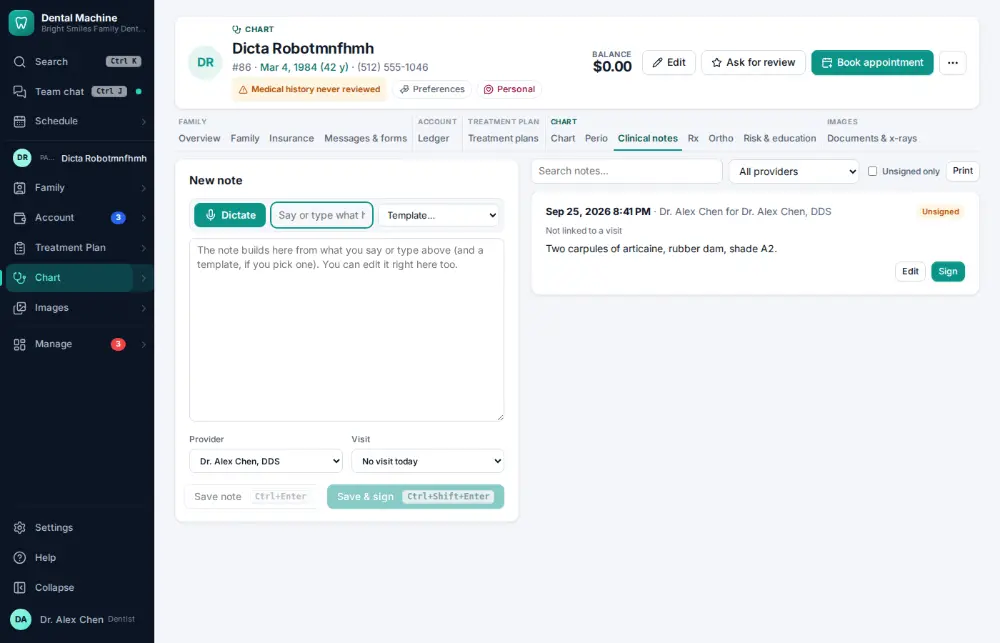

# How do I dictate a note by voice?

**Who:** dentist, hygienist · **Where:** Clinical notes — Alt+M (needs a microphone) · **How often:** Every day

Talk instead of typing: Alt+M in a note starts dictation, and what you say is written into the note (with a template, answered questions are filled in and wording that contradicts it is changed and flagged). Alt+M again stops.

## Where to start

## Steps

1. Notes: press Alt+M and say what happened: it’s written into the note  
   Keys: <kbd>Alt M</kbd>

   

2. Press Ctrl/⌘+Enter: saved  
   Keys: <kbd>Ctrl/⌘ Enter</kbd>

   

## Tips

- The AI scribe (Clinical notes) can instead listen to the whole visit and draft the note, procedures and findings for you to review; the conversation isn’t kept.

## If something goes wrong

- **“Nothing was dictated”** — The microphone heard nothing — check it is plugged in and allowed in the browser.
- **“That dictation is too long — dictate a section at a time”** — Stop and start again for each part of the note.

## Related

- [How do I write a clinical note?](A011-write-a-clinical-note.md)
- [How do I sign a clinical note?](A023-sign-a-clinical-note.md)
- [How do I chart perio?](A045-chart-perio.md)
- [How do I present a treatment plan and get it signed?](A042-present-a-treatment-plan-and-get-it-signed.md)
- [How do I build a treatment plan?](A038-build-a-treatment-plan.md)

---
[All how-tos](README.md) · Action A052 · screenshots from the robot run of 2026-09-25
