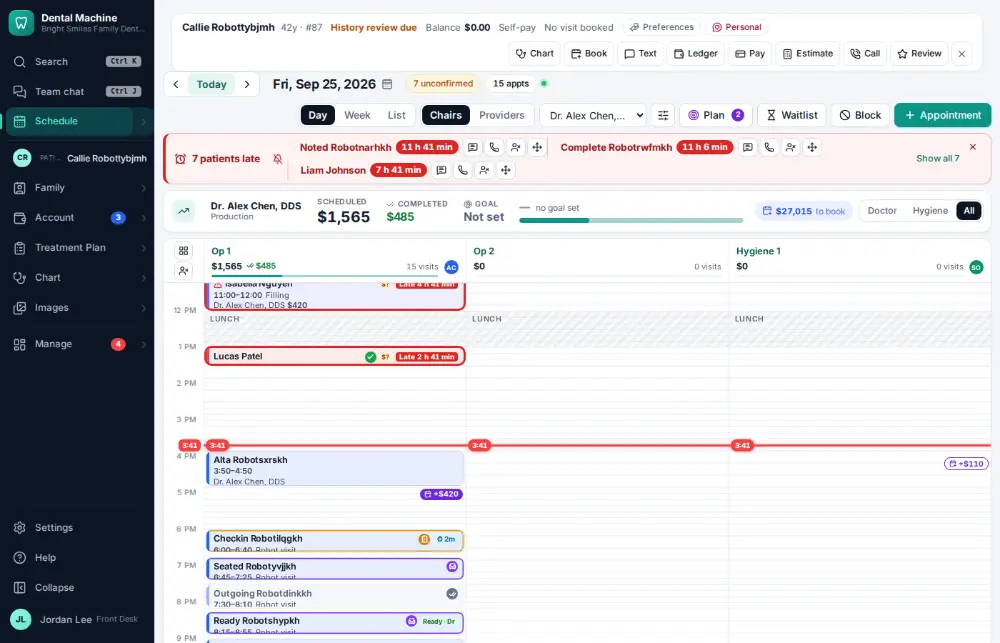
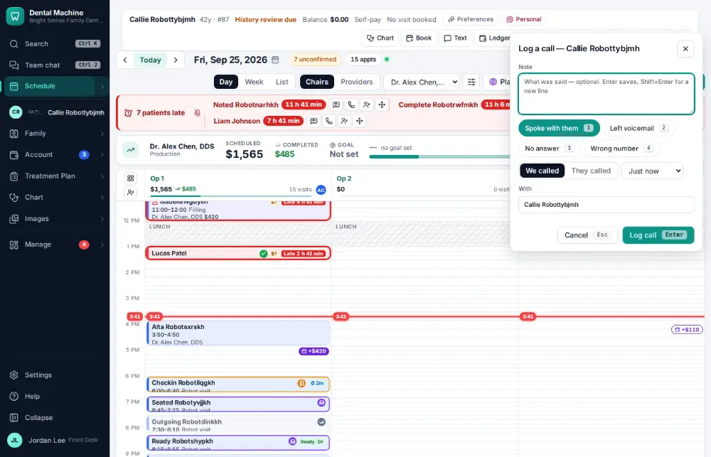
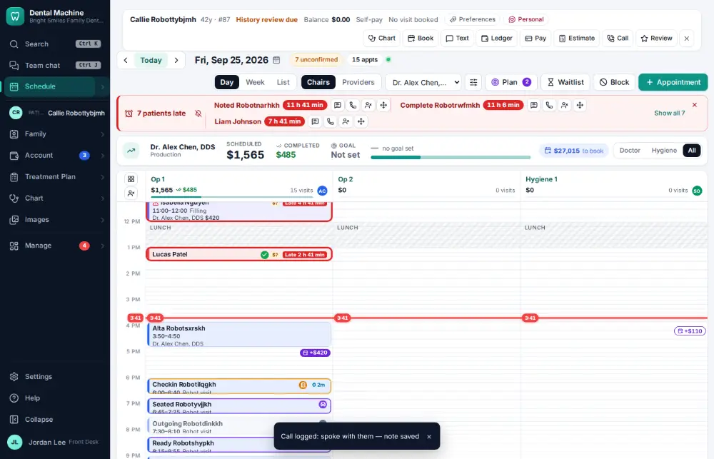

# How do I log a phone call with a patient?

**Who:** front desk · **Where:** Alt+G from any screen (active patient) or Messages & forms → Calls → Log a call: type the note, Enter · **How often:** Every day

Alt+G opens “Log a call” beside whatever you are doing, already filled in: we called, spoke with them, just now, about the active patient. Type what was said and press Enter.

## Where to start

## Steps

1. Press Alt+G: "Log a call" opens beside the screen — we called, spoke with them, just now, with the patient — the cursor in the note  
   Keys: <kbd>Alt G</kbd>

   

2. Type what was said and press Enter: it’s on the chart’s call history (Messages & forms → Calls)  
   Keys: <kbd>Enter</kbd>

   

## With the mouse

Click Call on the patient bar, type the note and click Save.

## Tips

- The call is listed on the chart under Messages & forms → Calls.

## Related

- [How do I answer a call and open the caller's chart?](A004-answer-a-call-and-open-the-caller-s-chart.md)
- [How do I text a patient?](A008-text-a-patient.md)
- [How do I mark a recall call as “left a message”?](A051-mark-a-recall-call-as-left-a-message.md)
- [How do I ask a patient for a review?](A065-ask-a-patient-for-a-review.md)
- [How do I text back an unknown caller?](A066-text-back-an-unknown-caller.md)

---
[All how-tos](README.md) · Action A053 · screenshots from the robot run of 2026-09-25
