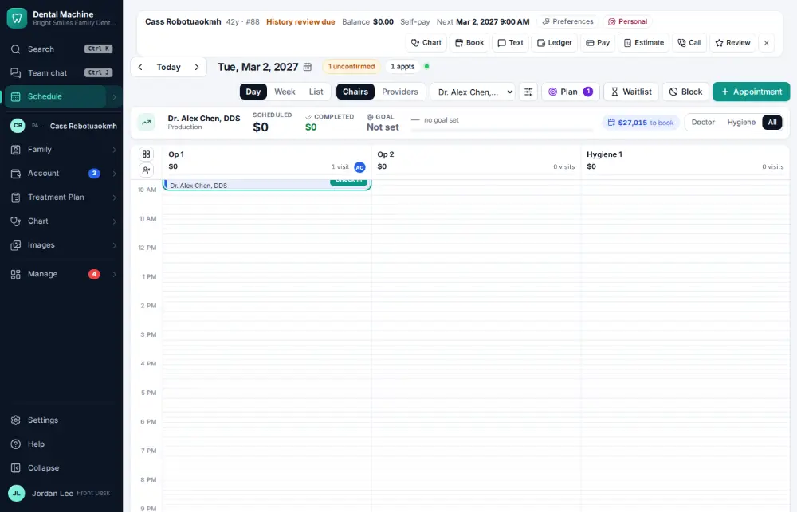
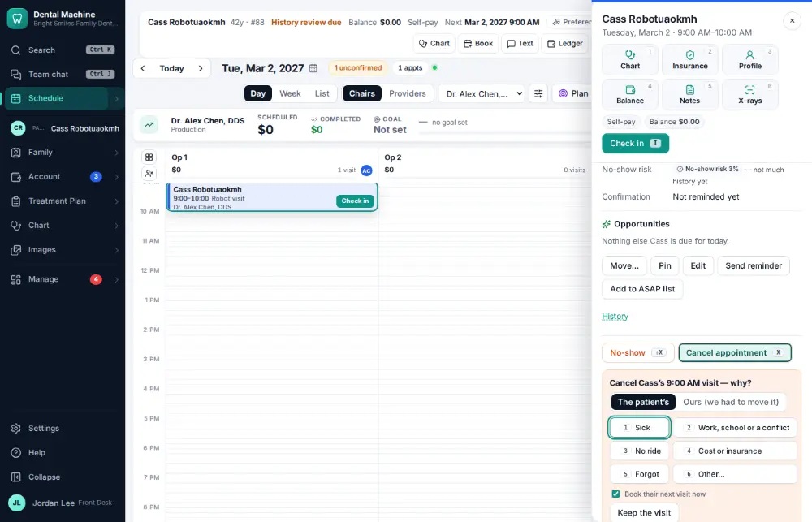
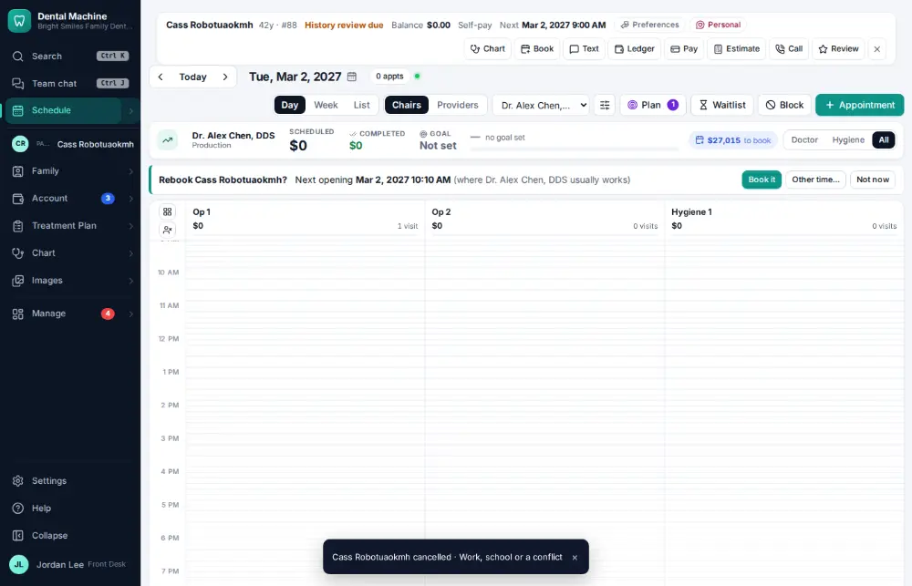
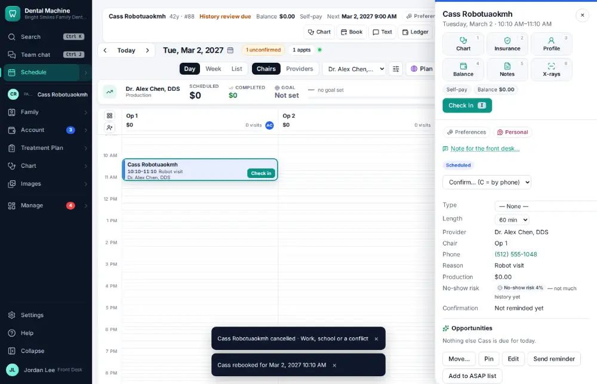

# How do I cancel an appointment?

**Who:** front desk · **Where:** Schedule — X, reason number, Enter · **How often:** Every day · ⌨ keyboard only

X cancels the selected visit. Pick the reason with its number; the next opening then shows with “Book it” ready, so you can rebook while the patient is on the phone.

## Where to start

Select the visit on the schedule first.

## Steps

1. Press X: the reasons list opens  
   Keys: <kbd>X</kbd>

   

2. Press 2 ("schedule conflict"): cancelled, and the next opening shows on the schedule with Book it ready  
   Keys: <kbd>2</kbd>

   

3. Press Enter: rebooked  
   Keys: <kbd>Enter</kbd>

   

## With the mouse

Open the visit, click “Cancel appointment”, pick the reason, then click Book it (or close if they’re not rebooking).

## Tips

- A cancelled visit is kept with its reason (it is never deleted).
- If “Fill cancellations automatically” is on, the opening is texted to the ASAP list and the waitlist.

## Related

- [How do I mark a no-show?](A071-mark-a-no-show.md)
- [How do I reschedule an appointment?](A029-reschedule-an-appointment.md)
- [How do I fill an opening from the ASAP list?](A070-fill-an-opening-from-the-asap-list.md)
- [How do I accept an online booking request?](A058-accept-an-online-booking-request.md)
- [How do I change an appointment's type, length or note?](A041-change-an-appointment-s-type-length-or-note.md)

---
[All how-tos](README.md) · Action A054 · screenshots from the robot run of 2026-09-25
