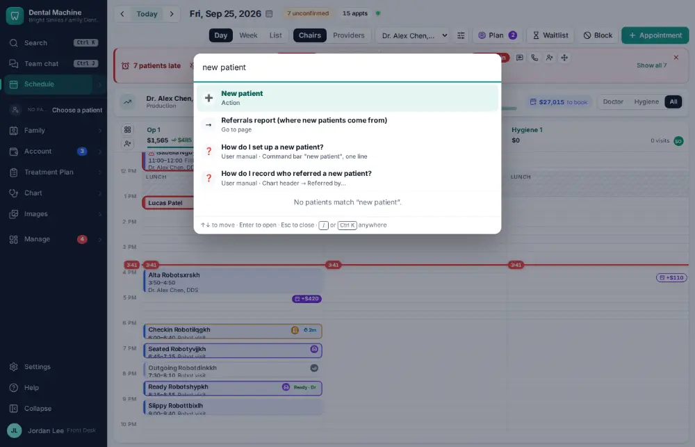
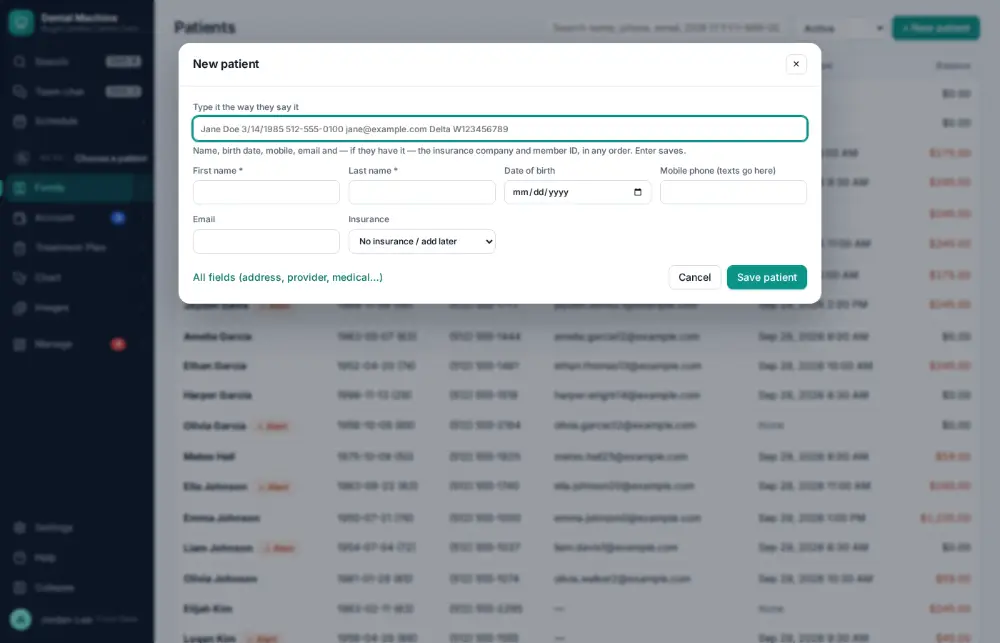
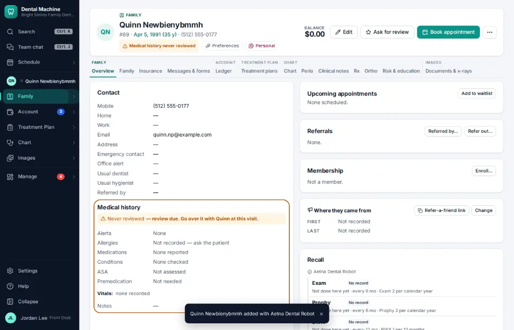

# How do I set up a new patient?

**Who:** front desk · **Where:** Command bar "new patient", one line · **How often:** Every day

Type the whole new patient on one line — name, birth date, phone, email, insurance and member ID — and press Enter. The chart and the insurance policy are made together.

## Steps

1. Press Ctrl/⌘K and type "new patient"  
   Keys: <kbd>Ctrl/⌘ K</kbd> type “new patient”

   

2. Press Enter: the one-line new patient box opens  
   Keys: <kbd>Enter</kbd>

   

3. Type name, birth date, phone, email, insurance and member ID on one line; press Enter: chart and policy made  
   Keys: <kbd>Enter</kbd>

   

## With the mouse

Family ▾ → Patients list → + New patient, or choose “New patient” in the command bar.

## Tips

- Anything the line doesn’t have can be added later on the chart.
- If the patient may already exist, search first ([A002](A002-find-and-open-a-patient-s-chart.md)) — a duplicate can be merged later ([A121](A121-merge-duplicate-patient-charts.md)).

## If something goes wrong

- **“dob must be a real date of birth…”** — Type the birth date as it’s written, e.g. 3/14/1985.

## Related

- [How do I find and open a patient's chart?](A002-find-and-open-a-patient-s-chart.md)
- [How do I add a secondary insurance policy?](A091-add-a-secondary-insurance-policy.md)
- [How do I add a family member to a household?](A090-add-a-family-member-to-a-household.md)
- [How do I review an online intake form?](A046-review-an-online-intake-form.md)
- [How do I update a phone number or email?](A043-update-a-phone-number-or-email.md)

---
[All how-tos](README.md) · Action A055 · screenshots from the robot run of 2026-09-25
