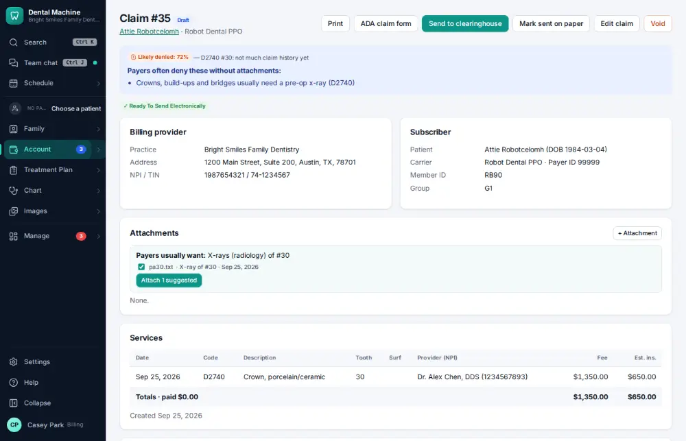
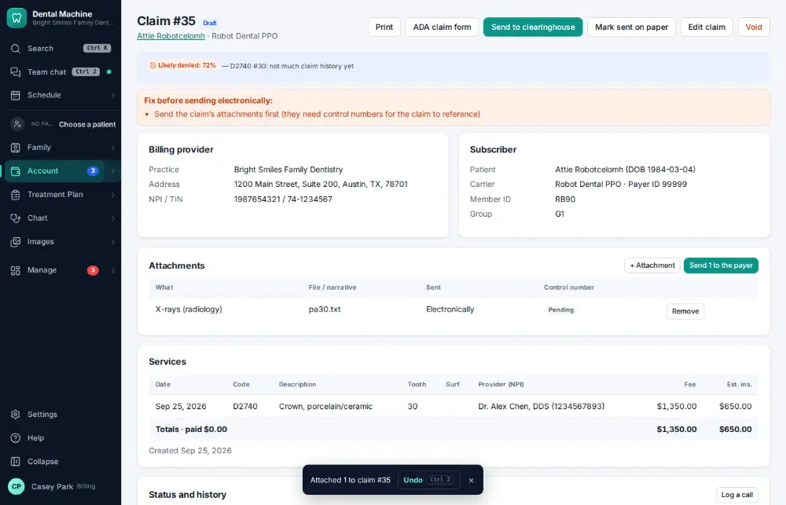
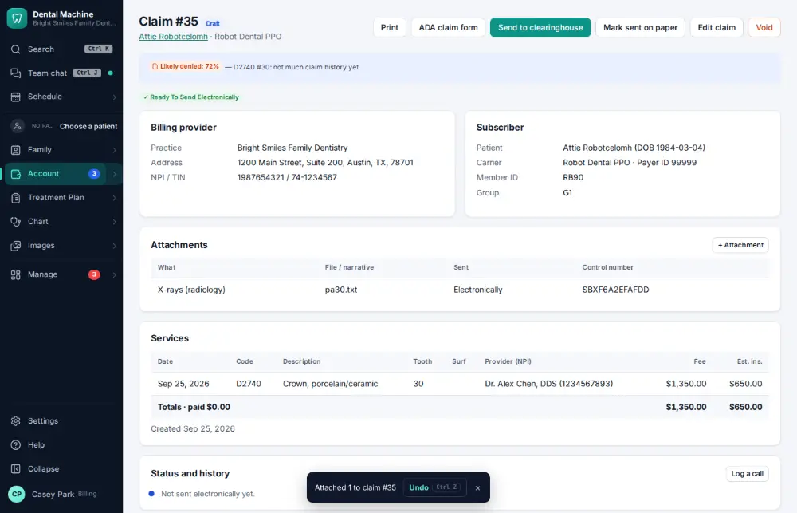

# How do I attach x-rays to a claim?

**Who:** billing · **Where:** The claim (Account ▾ → Billing & claims → the claim) · **How often:** Every day

The claim suggests the right x-rays for its procedures (the #30 x-ray for work on #30). Attach them and send the attachment to the payer.

## Where to start

## Steps

1. On the claim, click "Attach 1 suggested": the x-ray of #30 is attached (not #3)

   

2. Click "Send 1 to the payer": sent

   

## Tips

- On the claim, A attaches the suggested x-rays or perio chart.

## Related

- [How do I create and send an insurance claim?](A022-create-and-send-an-insurance-claim.md)
- [How do I approve claims that are ready to send?](A048-approve-claims-that-are-ready-to-send.md)
- [How do I scan a new insurance card into a policy?](A047-scan-a-new-insurance-card-into-a-policy.md)
- [How do I post an insurance payment from an ERA?](A063-post-an-insurance-payment-from-an-era.md)
- [How do I look up a claim's status?](A067-look-up-a-claim-s-status.md)

---
[All how-tos](README.md) · Action A056 · screenshots from the robot run of 2026-09-25
