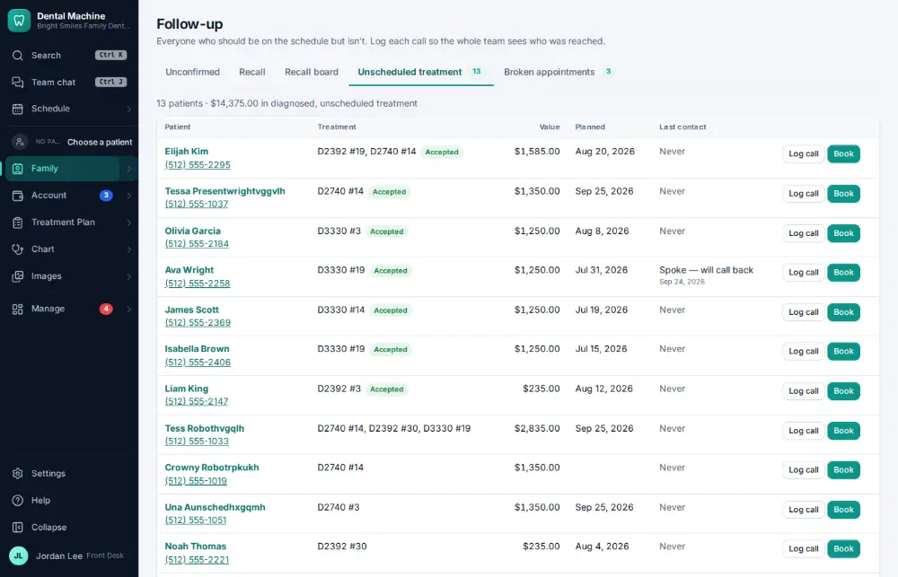
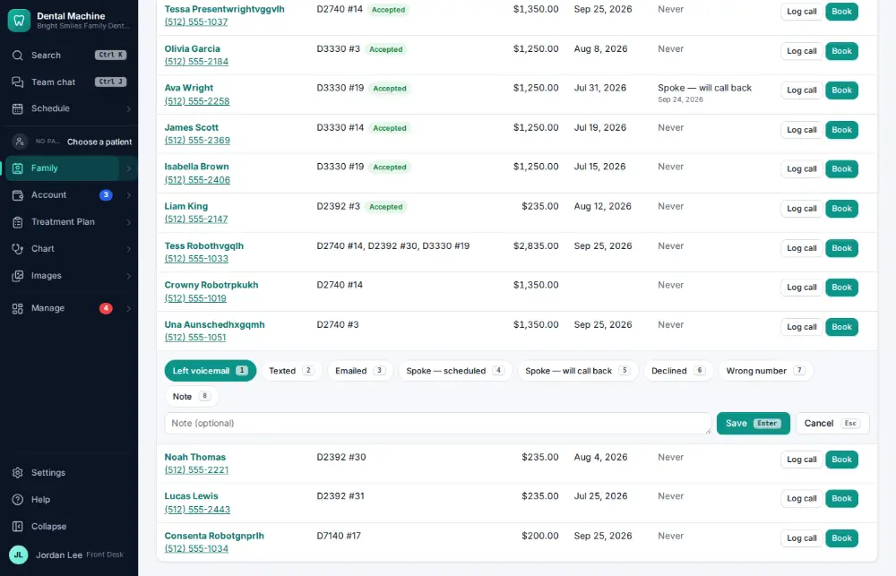
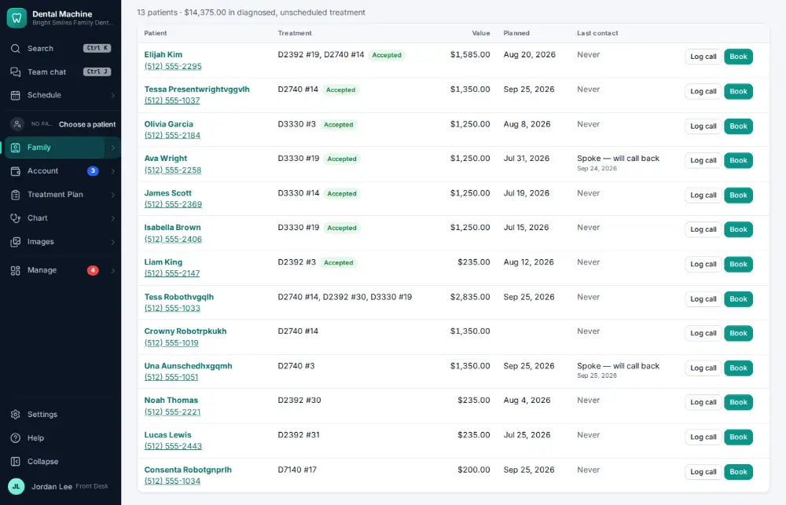

# How do I call a patient about unscheduled treatment?

**Who:** front desk · **Where:** Family ▾ → Follow-up lists → Unscheduled treatment · **How often:** Every day

Patients with treatment that was planned but never booked are listed under Follow-up lists → Unscheduled treatment. Log each call on their row.

## Where to start

## Steps

1. Follow-up → Unscheduled treatment: click "Log call" on their row (it opens under the row)

   

2. Press 5 ("Spoke — will call back") and Enter: saved  
   Keys: <kbd>5</kbd> <kbd>Enter</kbd>

   

## Tips

- The number keys pick how the call went; Enter saves.

## Related

- [How do I check treatment follow-up results?](A126-check-treatment-follow-up-results.md)
- [How do I mark a recall call as “left a message”?](A051-mark-a-recall-call-as-left-a-message.md)
- [How do I call a patient who is due for recall?](A037-call-a-patient-who-is-due-for-recall.md)
- [How do I work the broken-appointments list?](A093-work-the-broken-appointments-list.md)
- [How do I change a patient's recall interval?](A097-change-a-patient-s-recall-interval.md)

---
[All how-tos](README.md) · Action A057 · screenshots from the robot run of 2026-09-25
