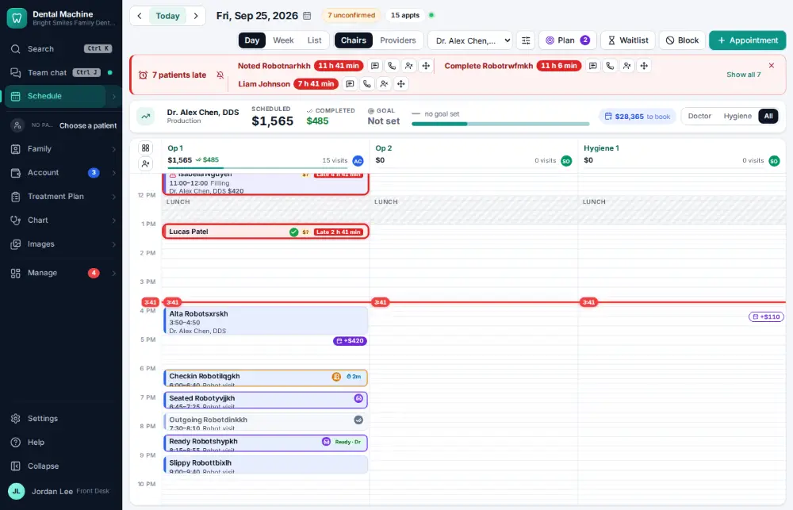
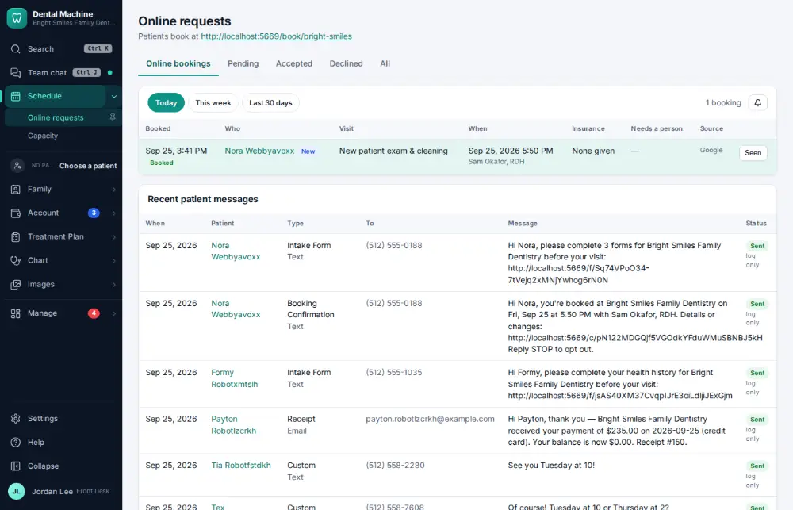
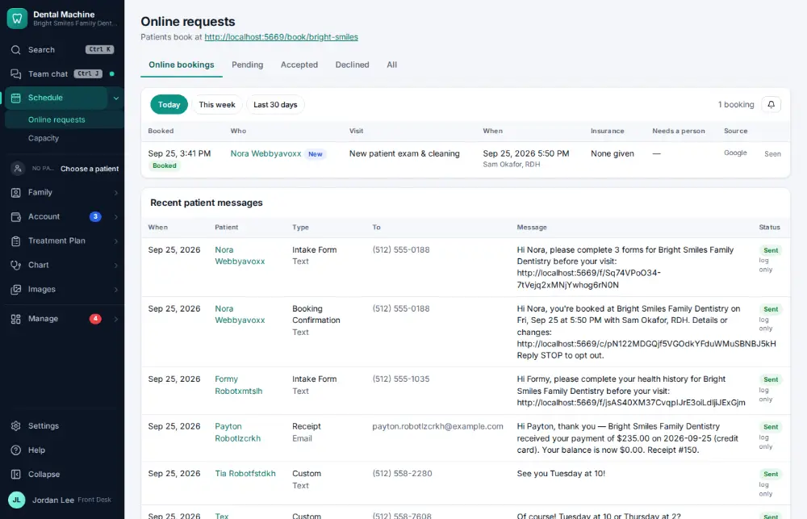

# How do I accept an online booking request?

**Who:** front desk · **Where:** Schedule ▾ → Online requests · **How often:** Every day

Bookings made on your website or Google are already on the schedule. Online requests lists them so someone can check each one and mark it seen.

## Where to start

## Steps

1. Schedule ▾ → Online requests: today’s online bookings, already on the schedule

   

2. Click "Seen" on the booking

   

## Related

- [How do I set up an online booking link?](A180-set-up-an-online-booking-link.md)
- [How do I book an appointment for an existing patient?](A020-book-an-appointment-for-an-existing-patient.md)
- [How do I cancel an appointment?](A054-cancel-an-appointment.md)
- [How do I fill an opening from the ASAP list?](A070-fill-an-opening-from-the-asap-list.md)
- [How do I mark a no-show?](A071-mark-a-no-show.md)

---
[All how-tos](README.md) · Action A058 · screenshots from the robot run of 2026-09-25
