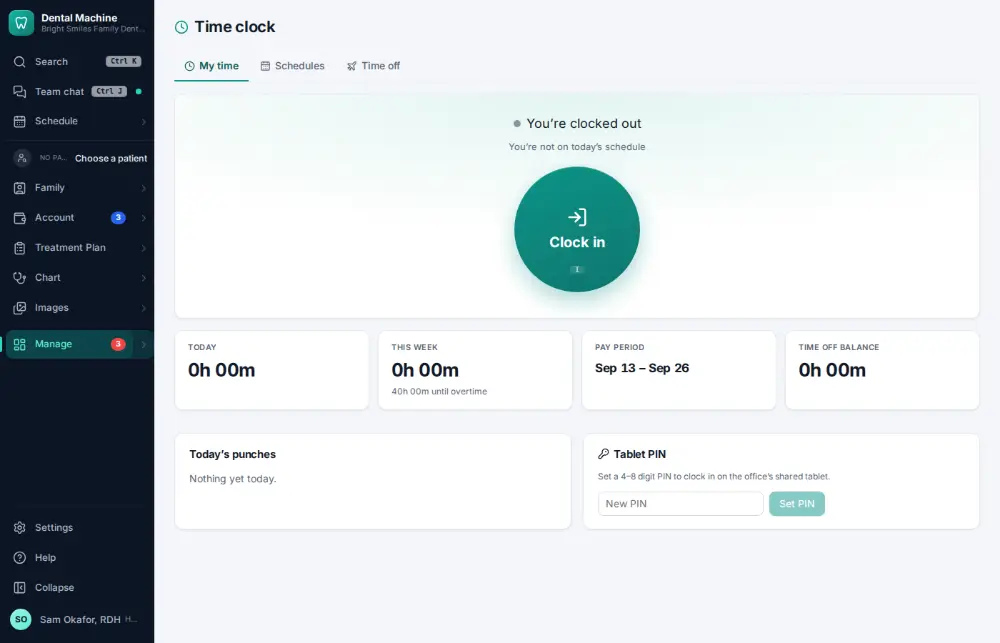
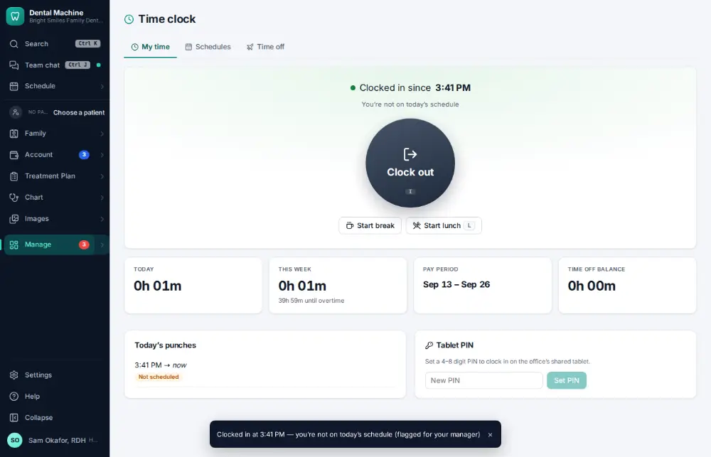

# How do I clock in?

**Who:** everyone · **Where:** Manage ▾ → Time clock, or the menu under your name · **How often:** Every day

The time clock records your hours for payroll. I clocks you in.

## Where to start

## Steps

1. Time clock: press I — clocked in  
   Keys: <kbd>I</kbd>

   

## With the mouse

Manage ▾ → Time clock → click Clock in.

## If something goes wrong

- **You forgot to clock in** — Ask your manager to add the missed time ([A107](A107-fix-a-missed-time-clock-punch.md)).

## Related

- [How do I clock out?](A060-clock-out.md)
- [How do I start or end a lunch break?](A061-start-or-end-a-lunch-break.md)
- [How do I fix a missed time-clock punch?](A107-fix-a-missed-time-clock-punch.md)
- [How do I see who is clocked in today?](A100-see-who-is-clocked-in-today.md)
- [How do I approve payroll hours?](A122-approve-payroll-hours.md)

---
[All how-tos](README.md) · Action A059 · screenshots from the robot run of 2026-09-25
