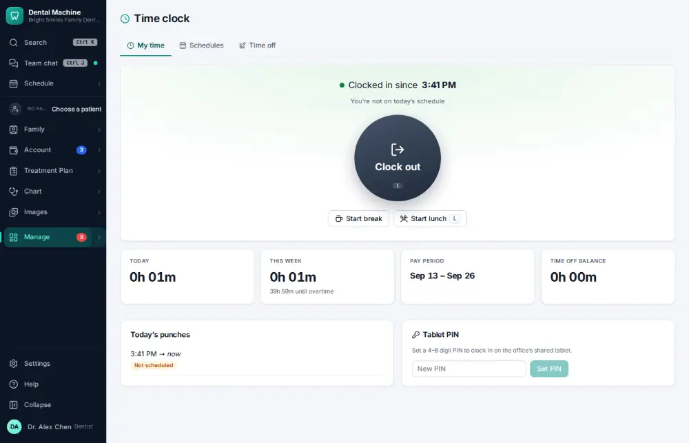
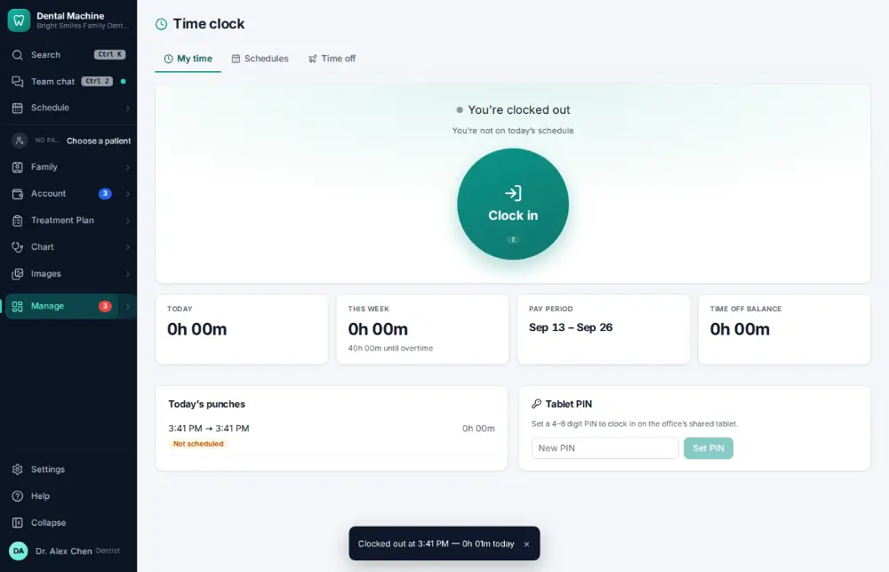

# How do I clock out?

**Who:** everyone · **Where:** Manage ▾ → Time clock · **How often:** Every day

Press I again on the time clock to clock out.

## Where to start

## Steps

1. Time clock: press I again — clocked out  
   Keys: <kbd>I</kbd>

   

## With the mouse

Manage ▾ → Time clock → click Clock out.

## If something goes wrong

- **You forgot to clock out** — Ask your manager to fix the punch ([A107](A107-fix-a-missed-time-clock-punch.md)).

## Related

- [How do I clock in?](A059-clock-in.md)
- [How do I start or end a lunch break?](A061-start-or-end-a-lunch-break.md)
- [How do I see who is clocked in today?](A100-see-who-is-clocked-in-today.md)
- [How do I fix a missed time-clock punch?](A107-fix-a-missed-time-clock-punch.md)
- [How do I approve payroll hours?](A122-approve-payroll-hours.md)

---
[All how-tos](README.md) · Action A060 · screenshots from the robot run of 2026-09-25
