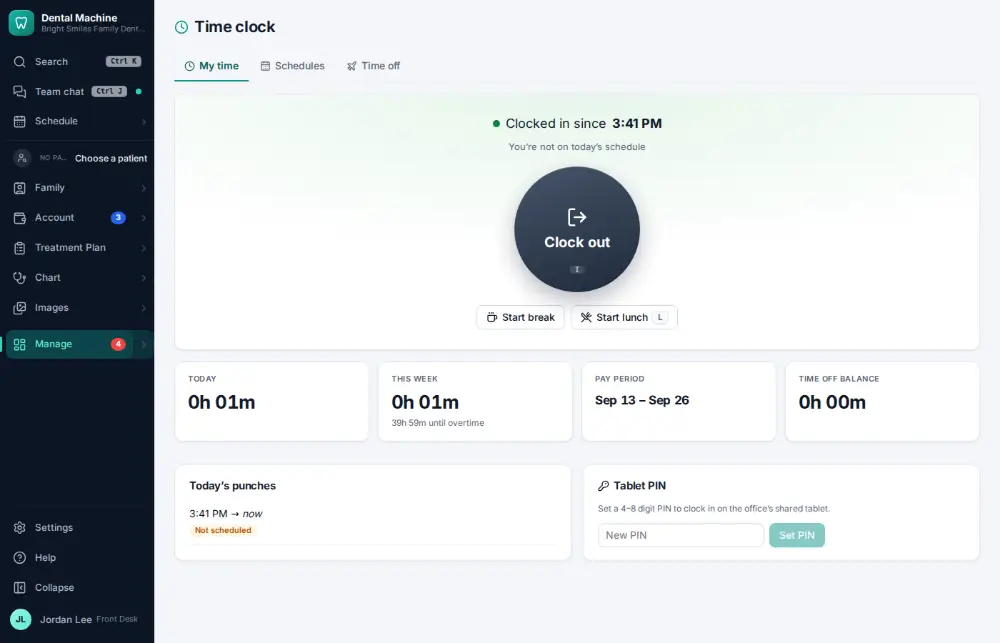
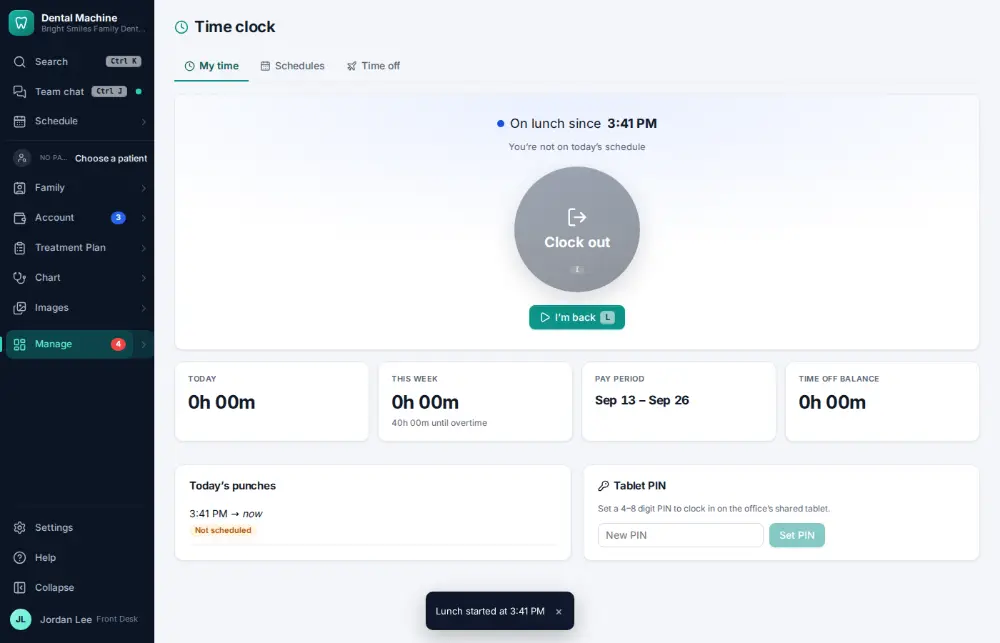

# How do I start or end a lunch break?

**Who:** everyone · **Where:** Manage ▾ → Time clock · **How often:** Every day

L starts your lunch break on the time clock; press L again when you are back.

## Where to start

## Steps

1. Press L: on lunch (the time is kept; L again when you’re back)  
   Keys: <kbd>L</kbd>

   

## Related

- [How do I clock in?](A059-clock-in.md)
- [How do I clock out?](A060-clock-out.md)
- [How do I see who is clocked in today?](A100-see-who-is-clocked-in-today.md)
- [How do I fix a missed time-clock punch?](A107-fix-a-missed-time-clock-punch.md)
- [How do I approve payroll hours?](A122-approve-payroll-hours.md)

---
[All how-tos](README.md) · Action A061 · screenshots from the robot run of 2026-09-25
