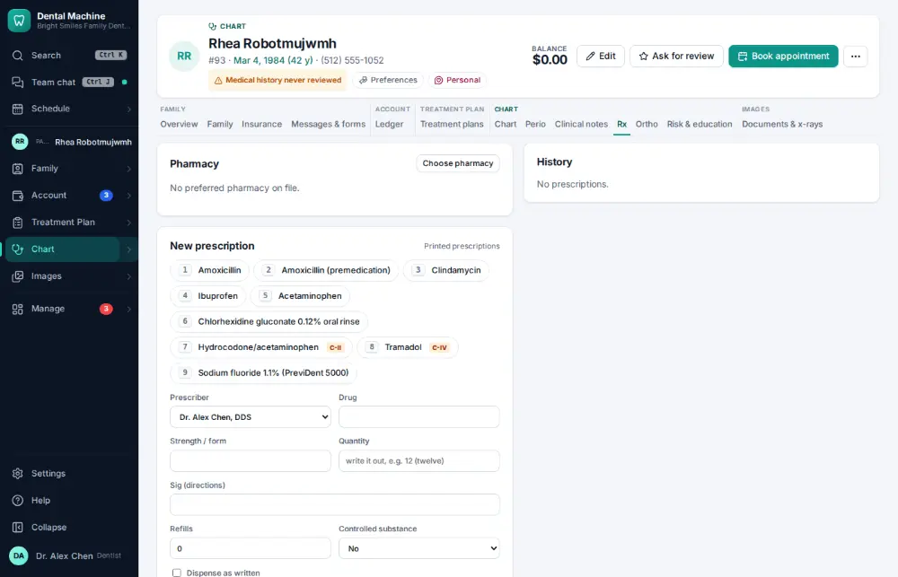
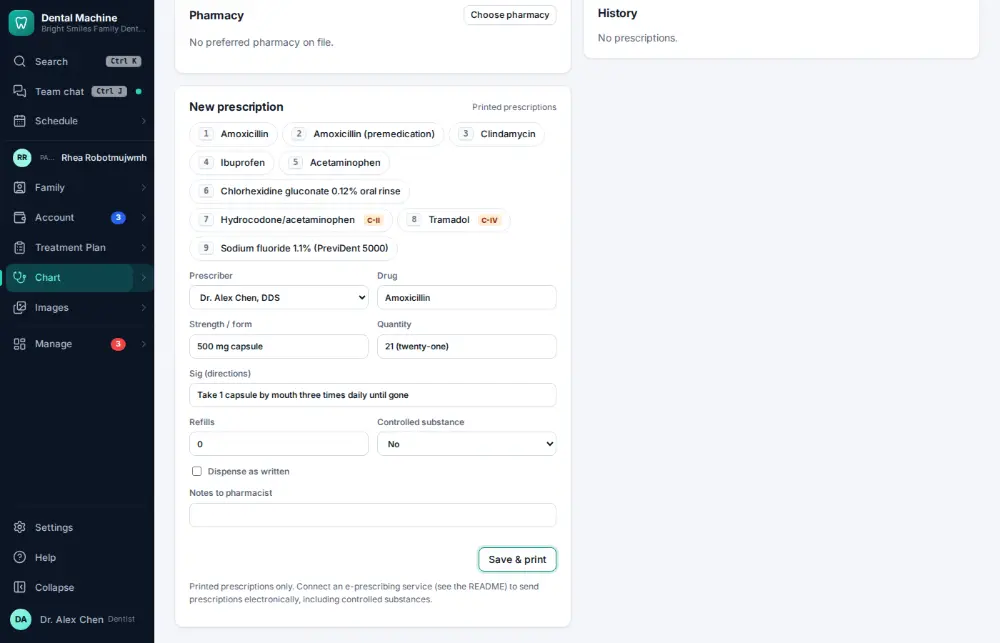
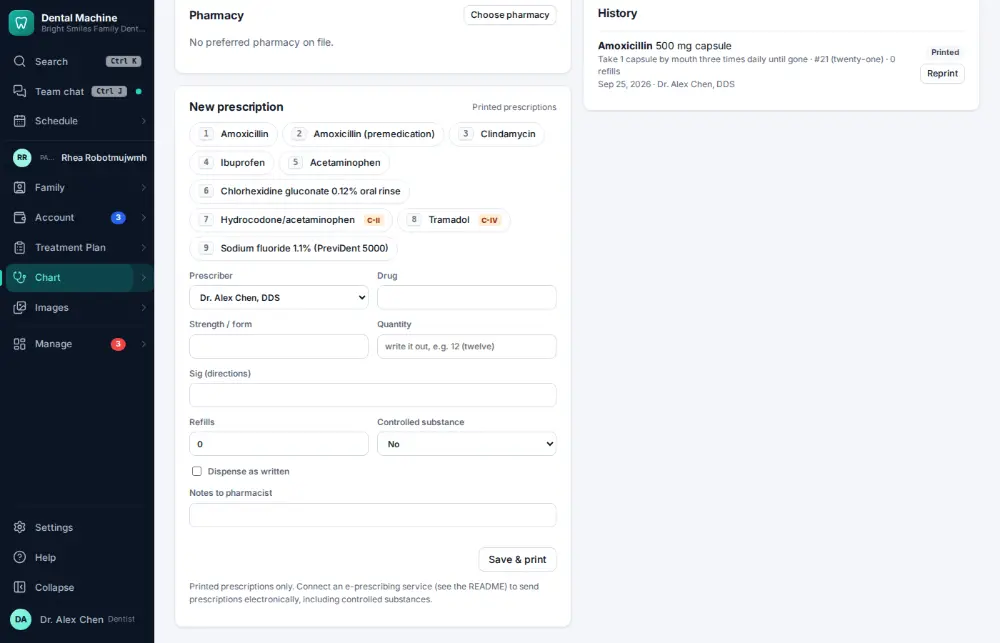

# How do I write a prescription?

**Who:** dentist · **Where:** Chart ▾ → Rx tab · **How often:** Every day

The Rx tab lists your favorite prescriptions with numbers. Press the number to fill one in, then Enter to save it (and print or send it).

## Where to start

## Steps

1. Press 1: the first favorite prescription fills in, the Save button has focus  
   Keys: <kbd>1</kbd>

   

2. Press Enter: saved (and printed or sent)  
   Keys: <kbd>Enter</kbd>

   

## Tips

- A controlled drug asks for a prescription-monitoring (PDMP) check first ([A178](A178-check-the-prescription-monitoring-program-before-an-opioid.md)).

## If something goes wrong

- **“Missing permission: clinical:sign”** — Only a prescriber can write prescriptions.

## Related

- [How do I check the prescription monitoring program before an opioid?](A178-check-the-prescription-monitoring-program-before-an-opioid.md)
- [How do I write a clinical note?](A011-write-a-clinical-note.md)
- [How do I record a caries risk assessment?](A068-record-a-caries-risk-assessment.md)
- [How do I chart perio?](A045-chart-perio.md)
- [How do I dictate a note by voice?](A052-dictate-a-note-by-voice.md)

---
[All how-tos](README.md) · Action A062 · screenshots from the robot run of 2026-09-25
