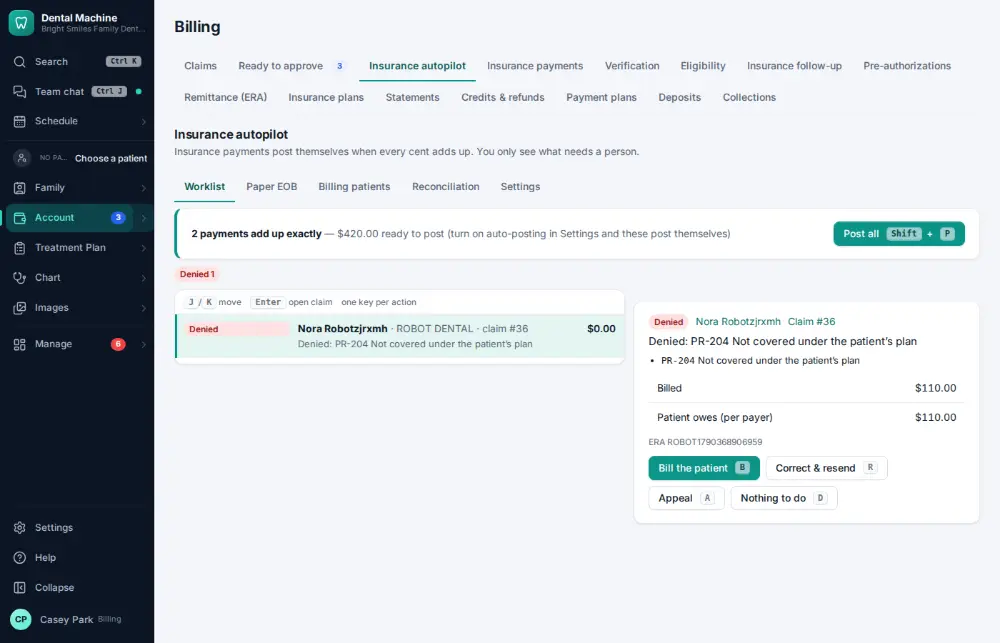
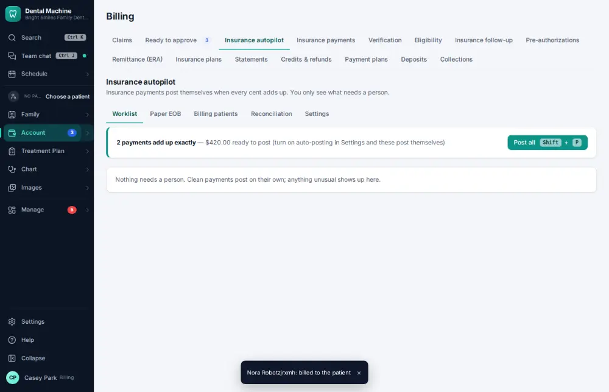

# How do I post an insurance payment from an ERA?

**Who:** billing · **Where:** Account ▾ → Billing & claims → Insurance autopilot · **How often:** Every day

Electronic insurance payments (ERAs) are posted automatically when they match. Insurance autopilot shows only what needs a person — for example a denial — highlighted.

## Where to start

## Steps

1. Insurance autopilot: clean payments posted on their own; the denial waits, highlighted. Press B: bill the patient  
   Keys: <kbd>B</kbd>

   

## Tips

- J/K move between items; Enter opens the claim; Shift+P posts all clean payments at once.
- Payments are matched against the bank deposit later ([A127](A127-reconcile-insurance-payments-with-the-bank.md)).

## Related

- [How do I post a paper EOB / insurance check?](A072-post-a-paper-eob-insurance-check.md)
- [How do I reconcile insurance payments with the bank?](A127-reconcile-insurance-payments-with-the-bank.md)
- [How do I appeal a denied claim?](A109-appeal-a-denied-claim.md)
- [How do I look up a claim's status?](A067-look-up-a-claim-s-status.md)
- [How do I attach x-rays to a claim?](A056-attach-x-rays-to-a-claim.md)

---
[All how-tos](README.md) · Action A063 · screenshots from the robot run of 2026-09-25
