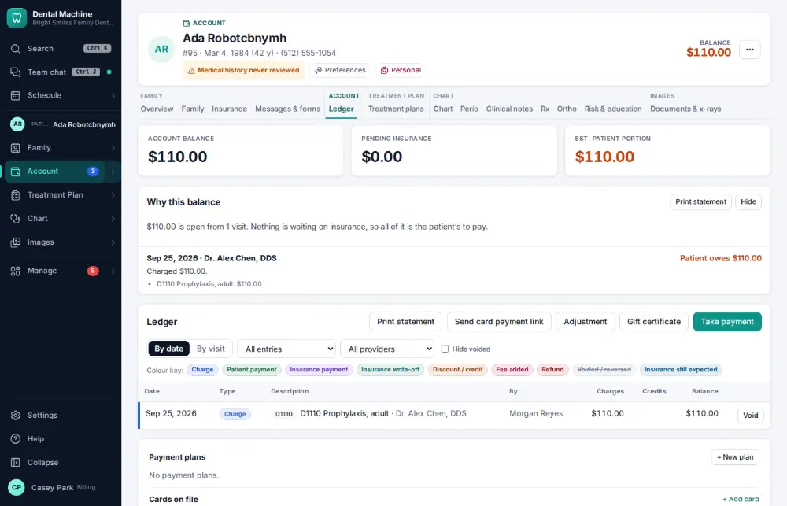
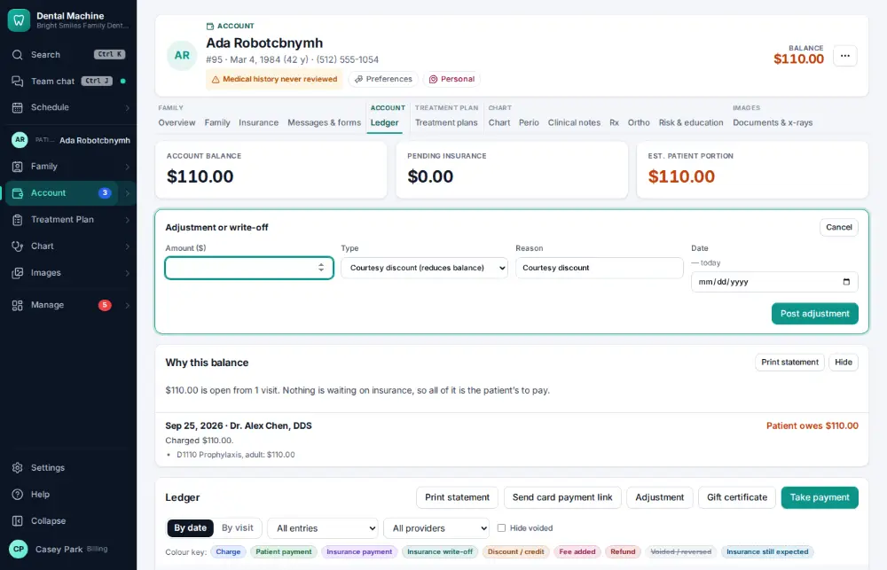
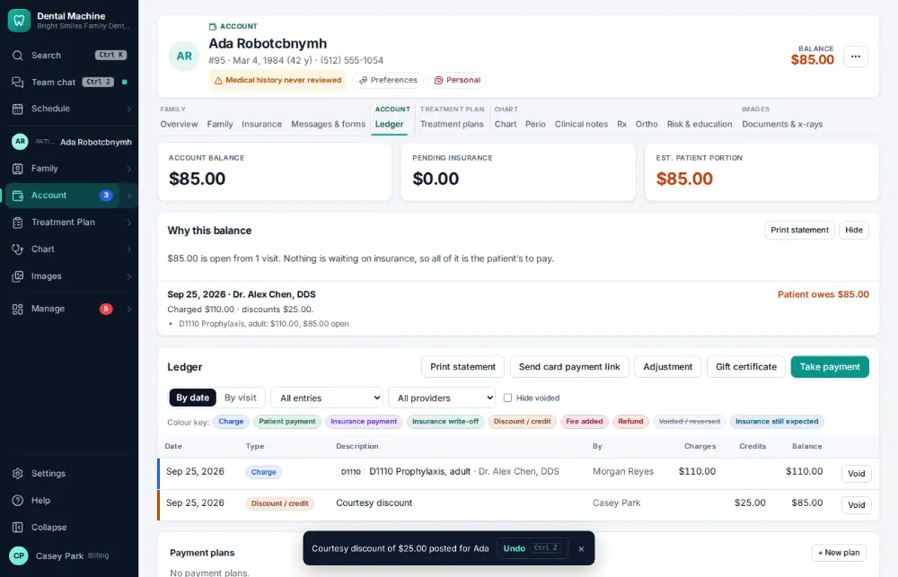

# How do I post an adjustment or write-off?

**Who:** billing · **Where:** Ledger tab — A, amount, Enter · **How often:** Every day

A opens the adjustment line on the ledger with the cursor on the amount; the type you used last is remembered. Enter posts it with its reason.

## Where to start

Open the patient’s ledger (Alt+L).

## Steps

1. Press A: the adjustment line opens with the cursor on the amount (last type remembered)  
   Keys: <kbd>A</kbd>

   

2. Type the amount and press Enter: posted with its reason (Undo reverses it)  
   Keys: <kbd>Enter</kbd>

   

## With the mouse

On the ledger click Adjustment, type the amount, pick the type and click “Post adjustment”.

## Tips

- Undo on the notice reverses it: the ledger keeps both lines.

## If something goes wrong

- **“Write-offs over $… need an administrator”** — Large write-offs need an administrator — ask one to post it.
- **“Adjustment amount cannot be zero”** — Type the amount.

## Related

- [How do I take a patient payment?](A019-take-a-patient-payment.md)
- [How do I void a payment posted by mistake?](A102-void-a-payment-posted-by-mistake.md)
- [How do I explain a balance (show the ledger)?](A024-explain-a-balance-show-the-ledger.md)
- [How do I send a payment link by text?](A077-send-a-payment-link-by-text.md)
- [How do I make the daily bank deposit?](A084-make-the-daily-bank-deposit.md)

---
[All how-tos](README.md) · Action A064 · screenshots from the robot run of 2026-09-25
