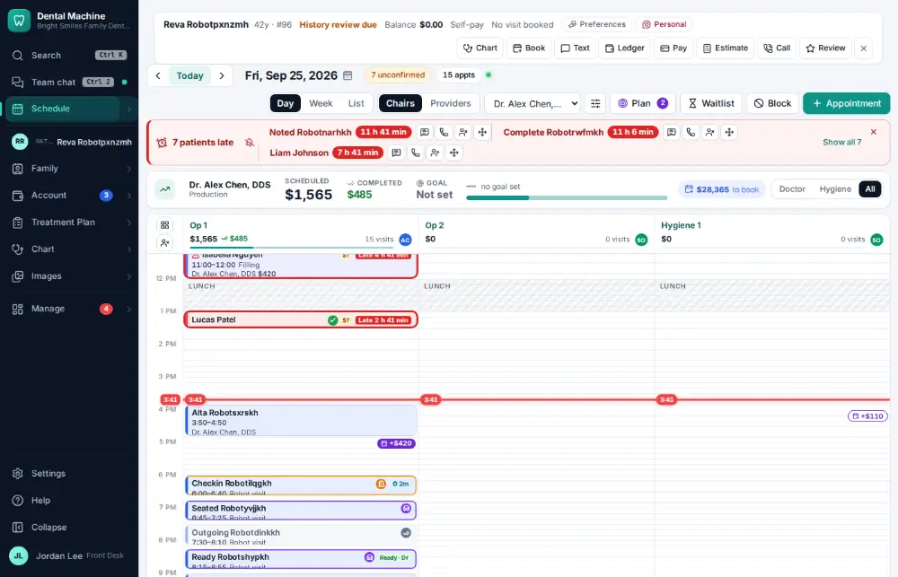
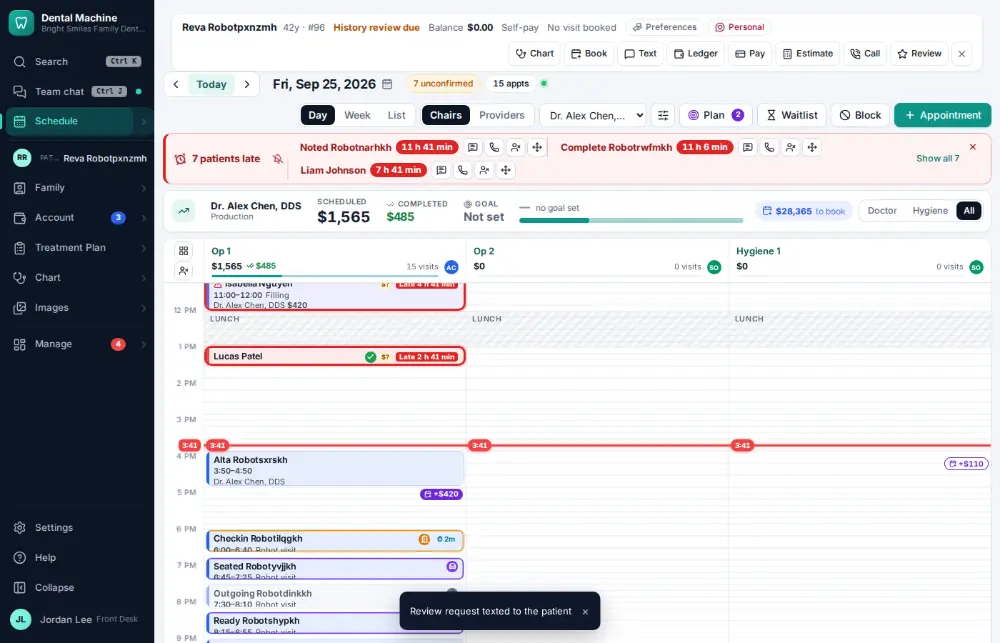

# How do I ask a patient for a review?

**Who:** front desk · **Where:** Alt+R (active patient) · **How often:** Every day

Alt+R texts the active patient a link asking how their visit went. Everyone rates first; happy patients are invited to post on Google, a patient with a complaint can tell the office privately, and every patient can always post a public review.

## Where to start

## Steps

1. Press Alt+R: the review request is texted  
   Keys: <kbd>Alt R</kbd>

   

## With the mouse

Click “Ask for review” on the chart, or Review on the patient bar.

## Related

- [How do I read patient feedback?](A130-read-patient-feedback.md)
- [How do I reply to an online review?](A116-reply-to-an-online-review.md)
- [How do I text back an unknown caller?](A066-text-back-an-unknown-caller.md)
- [How do I send patient education after a visit?](A080-send-patient-education-after-a-visit.md)
- [How do I log a phone call with a patient?](A053-log-a-phone-call-with-a-patient.md)

---
[All how-tos](README.md) · Action A065 · screenshots from the robot run of 2026-09-25
