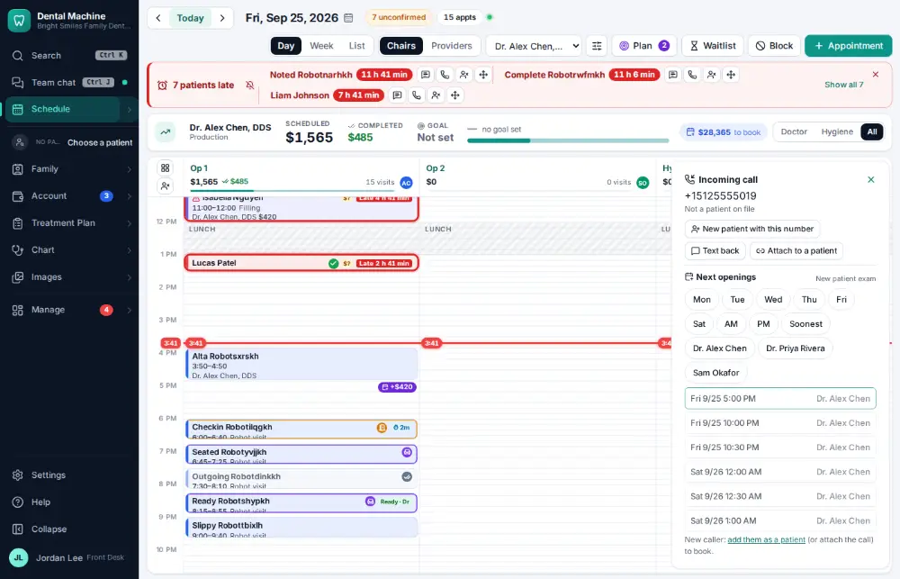
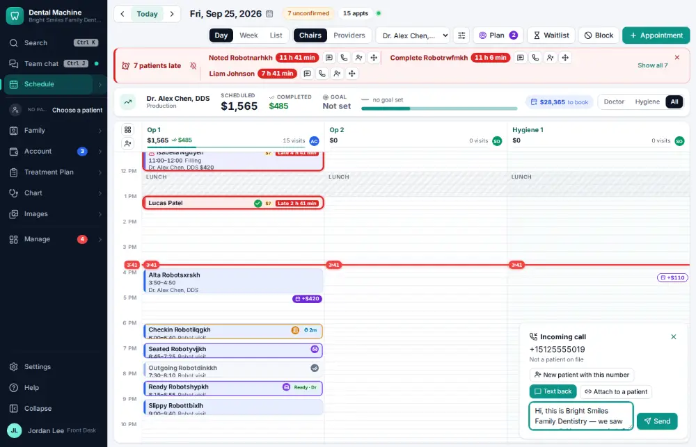
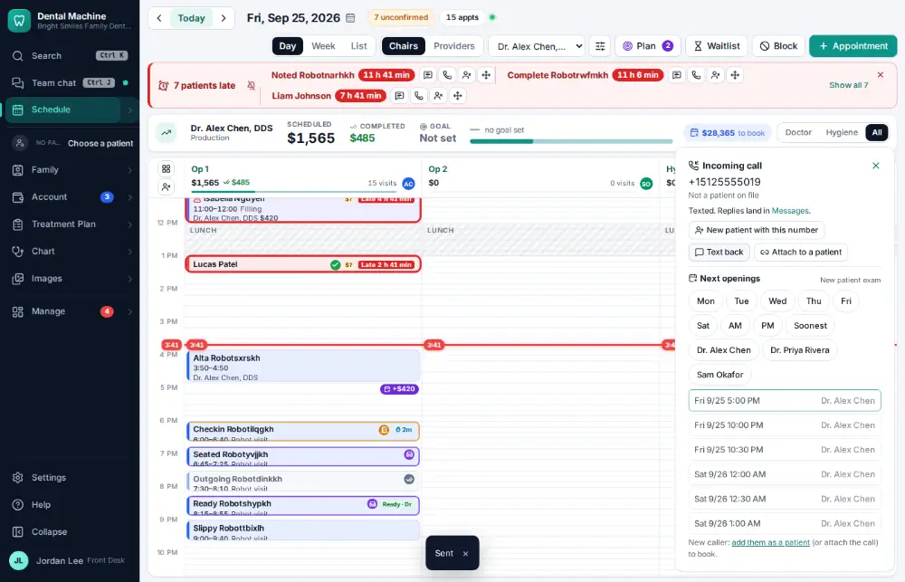

# How do I text back an unknown caller?

**Who:** front desk · **Where:** Call pop-up — Text back · **How often:** Every day

When a number that isn’t on file calls, the pop-up offers Text back, Attach (to a patient) and New patient. Text back already has a friendly message written.

## Where to start

## Steps

1. An unknown number rings: "Not a patient on file" with Text back / Attach / New patient

   

2. Click "Text back": a friendly text is already in the box

   

3. Press Enter: texted  
   Keys: <kbd>Enter</kbd>

   

## Related

- [How do I answer a call and open the caller's chart?](A004-answer-a-call-and-open-the-caller-s-chart.md)
- [How do I set up a new patient?](A055-set-up-a-new-patient.md)
- [How do I ask a patient for a review?](A065-ask-a-patient-for-a-review.md)
- [How do I send patient education after a visit?](A080-send-patient-education-after-a-visit.md)
- [How do I log a phone call with a patient?](A053-log-a-phone-call-with-a-patient.md)

---
[All how-tos](README.md) · Action A066 · screenshots from the robot run of 2026-09-25
