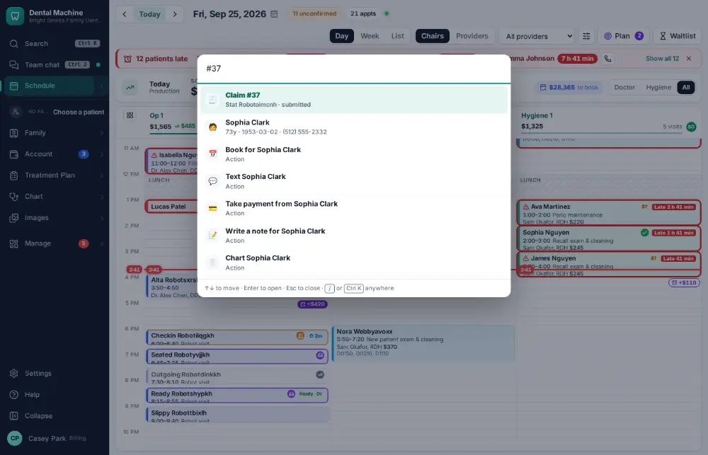
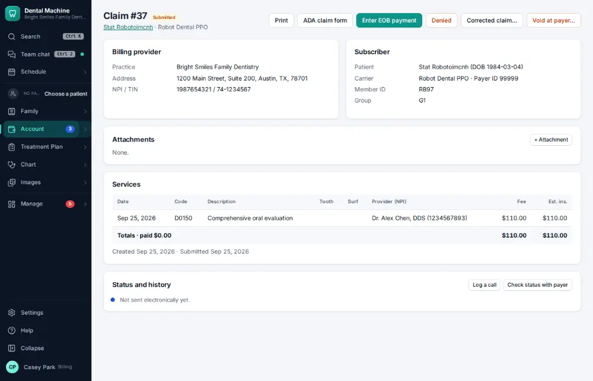

# How do I look up a claim's status?

**Who:** billing · **Where:** Command bar "#33" or "claim 33" → claim · **How often:** Every day

Type the claim number in the command bar (“#33” or “claim 33”): the claim opens with its status and history.

## Steps

1. Press Ctrl/⌘K and type the claim number as it is written ("#33"; "claim 33" works too)  
   Keys: <kbd>Ctrl/⌘ K</kbd>

   

2. Press Enter on "Claim #…" (first): the claim with its status and history  
   Keys: <kbd>Enter</kbd>

   

## With the mouse

Account ▾ → Billing & claims and click the claim.

## Tips

- From Billing → Insurance follow-up, S asks the payer for a claim’s status.

## Related

- [How do I call an insurance company about an unpaid claim?](A075-call-an-insurance-company-about-an-unpaid-claim.md)
- [How do I resend or fix a rejected claim?](A106-resend-or-fix-a-rejected-claim.md)
- [How do I post an insurance payment from an ERA?](A063-post-an-insurance-payment-from-an-era.md)
- [How do I attach x-rays to a claim?](A056-attach-x-rays-to-a-claim.md)
- [How do I post a paper EOB / insurance check?](A072-post-a-paper-eob-insurance-check.md)

---
[All how-tos](README.md) · Action A067 · screenshots from the robot run of 2026-09-25
