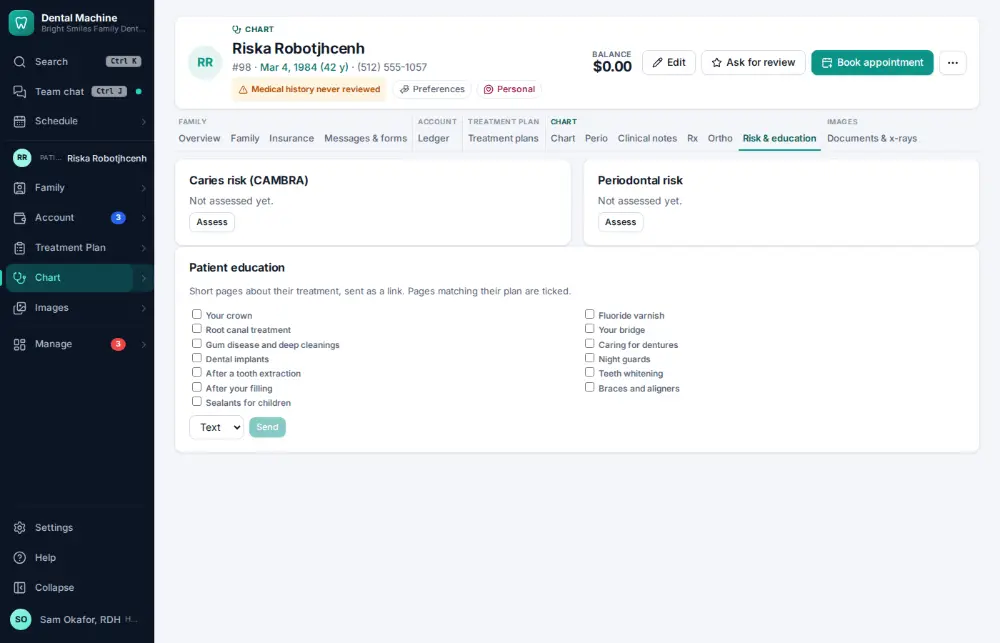
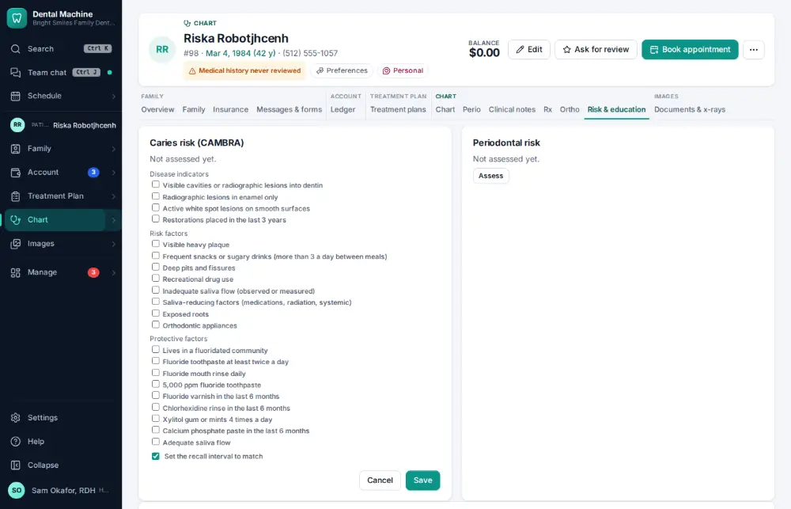
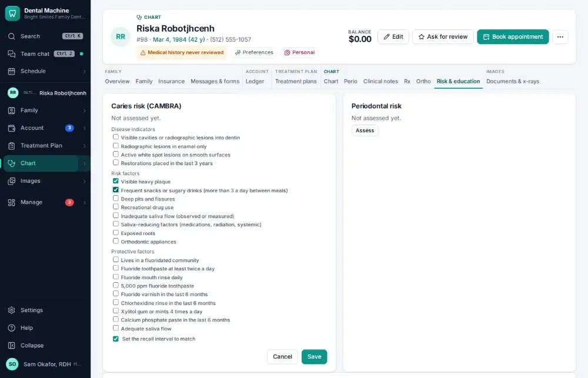
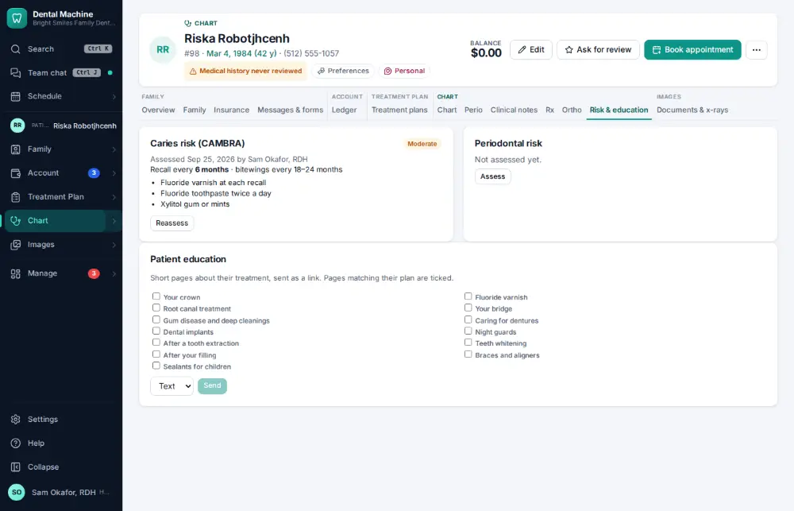

# How do I record a caries risk assessment?

**Who:** hygienist, dentist · **Where:** Chart ▾ → Risk & education tab · **How often:** Every day

The caries risk assessment (CAMBRA) is a checklist of risk and protective factors; saving works out the risk level and recall advice.

## Where to start

## Steps

1. Risk & education: click "Assess" under Caries risk (CAMBRA): the checklist of risk and protective factors

   

2. Tick the factors that apply (two here)

   

3. Click Save: the risk level is worked out and recorded

   

## Related

- [How do I send patient education after a visit?](A080-send-patient-education-after-a-visit.md)
- [How do I change a patient's recall interval?](A097-change-a-patient-s-recall-interval.md)
- [How do I write a prescription?](A062-write-a-prescription.md)
- [How do I chart perio?](A045-chart-perio.md)
- [How do I dictate a note by voice?](A052-dictate-a-note-by-voice.md)

---
[All how-tos](README.md) · Action A068 · screenshots from the robot run of 2026-09-25
