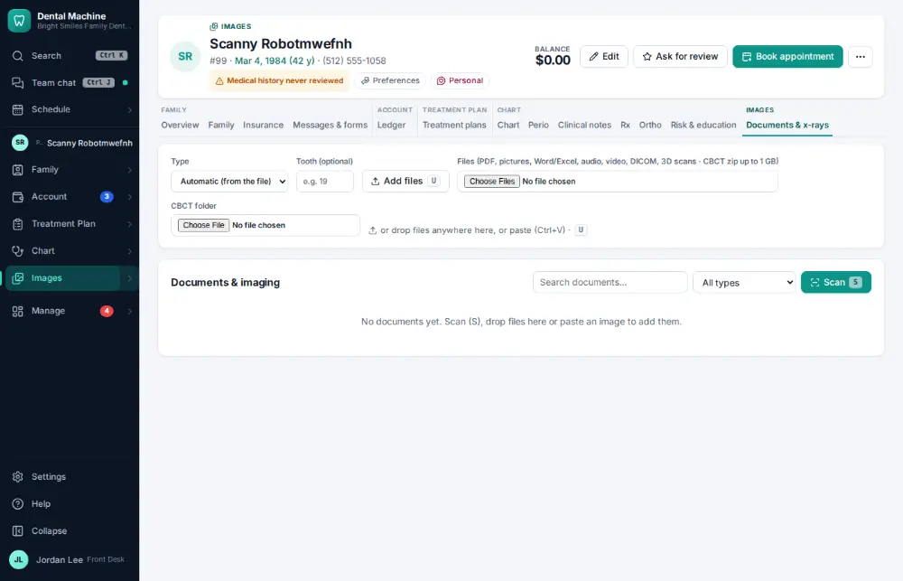
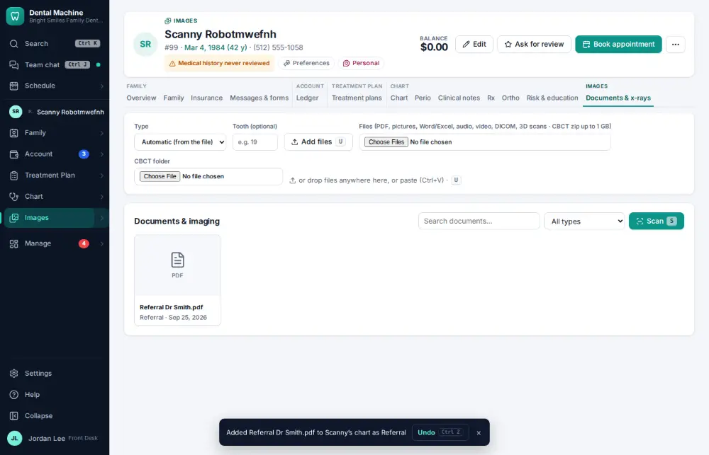

# How do I upload a scanned paper document?

**Who:** front desk · **Where:** Documents & x-rays tab — scan / drop · **How often:** Every day

Add a scanned paper (a referral letter, an old record) to the chart’s documents.

## Where to start

## Steps

1. Documents & x-rays: press U and choose the scan (the file picker takes its name and Enter): filed on the chart  
   Keys: <kbd>U</kbd>

   

## With the mouse

Documents & x-rays tab → Add files, or drag the file onto the page.

## Tips

- You can also scan with a phone: the Documents tab shows a code to scan, and the pages arrive as one PDF.
- Documents are searchable by the words inside them from the command bar.

## Related

- [How do I add x-rays or photos to the chart?](A031-add-x-rays-or-photos-to-the-chart.md)
- [How do I file an office document?](A153-file-an-office-document.md)
- [How do I review x-ray AI findings?](A078-review-x-ray-ai-findings.md)
- [How do I take intraoral photos with the camera?](A050-take-intraoral-photos-with-the-camera.md)
- [How do I take x-rays with the sensor?](A030-take-x-rays-with-the-sensor.md)

---
[All how-tos](README.md) · Action A069 · screenshots from the robot run of 2026-09-25
