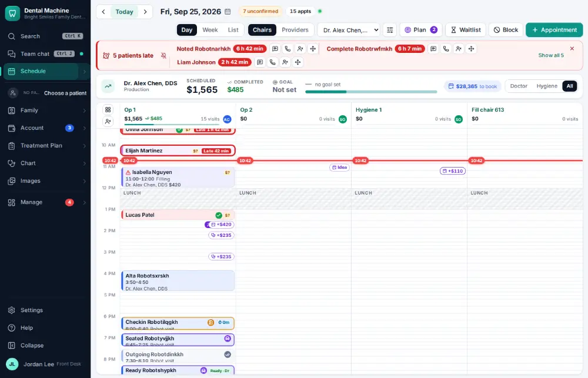
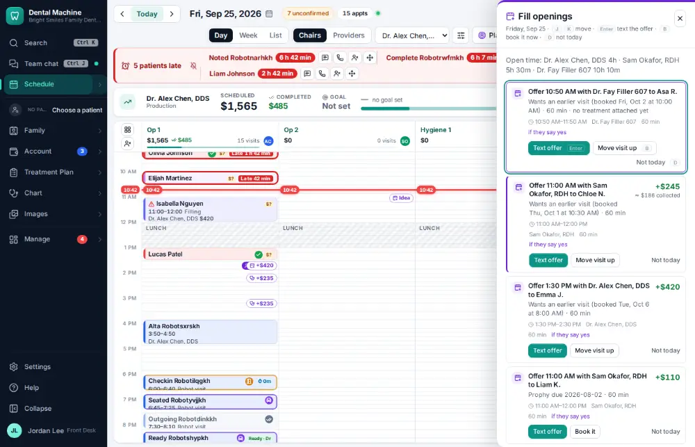
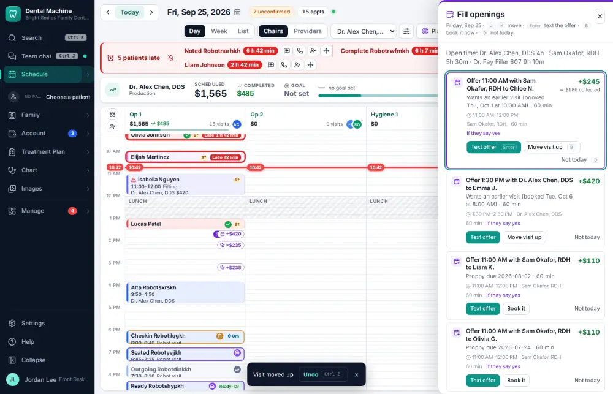

# How do I fill an opening from the ASAP list?

**Who:** front desk · **Where:** Schedule — L, B · **How often:** Every day

L on the schedule opens today’s plan on the first opening with the ASAP patient who fits it. B moves their visit up into the opening.

## Where to start

Open the schedule on the day with the opening.

## Steps

1. Schedule: press L — today’s plan opens on the first opening, with the ASAP patient who fits  
   Keys: <kbd>L</kbd>

   

2. Press B: their visit moves up into the opening (Undo shows)  
   Keys: <kbd>B</kbd>

   

## Tips

- Undo on the notice puts the visit back.
- Turn on “Fill cancellations automatically” (Settings → Messages) to text openings to ASAP patients automatically.

## Related

- [How do I put a patient on the ASAP list?](A076-put-a-patient-on-the-asap-list.md)
- [How do I cancel an appointment?](A054-cancel-an-appointment.md)
- [How do I mark a no-show?](A071-mark-a-no-show.md)
- [How do I book a same-day emergency visit?](A082-book-a-same-day-emergency-visit.md)
- [How do I accept an online booking request?](A058-accept-an-online-booking-request.md)

---
[All how-tos](README.md) · Action A070 · screenshots from the robot run of 2026-09-25
