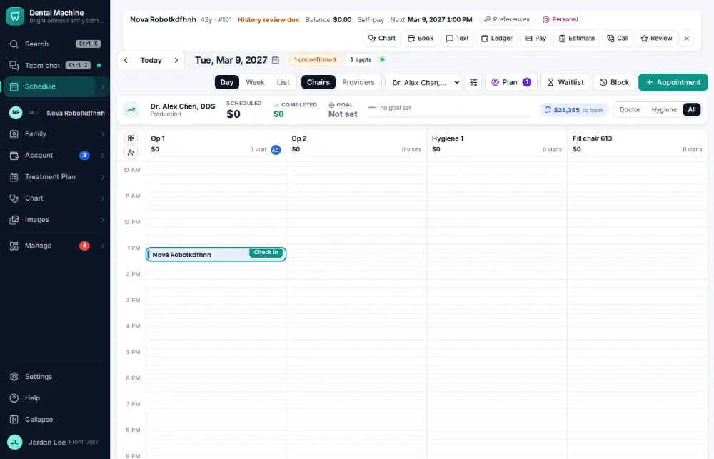
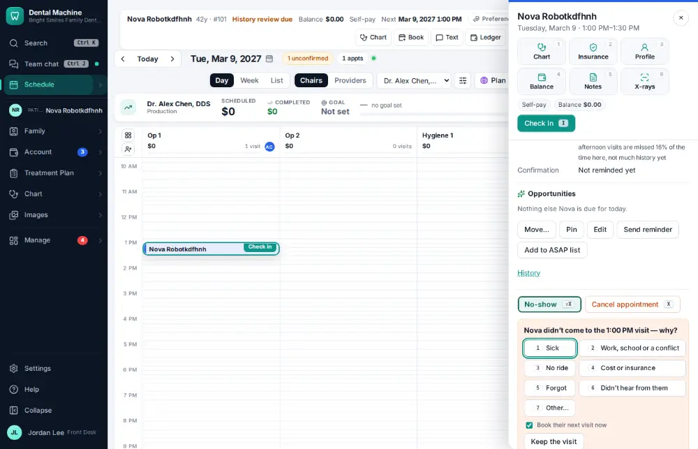
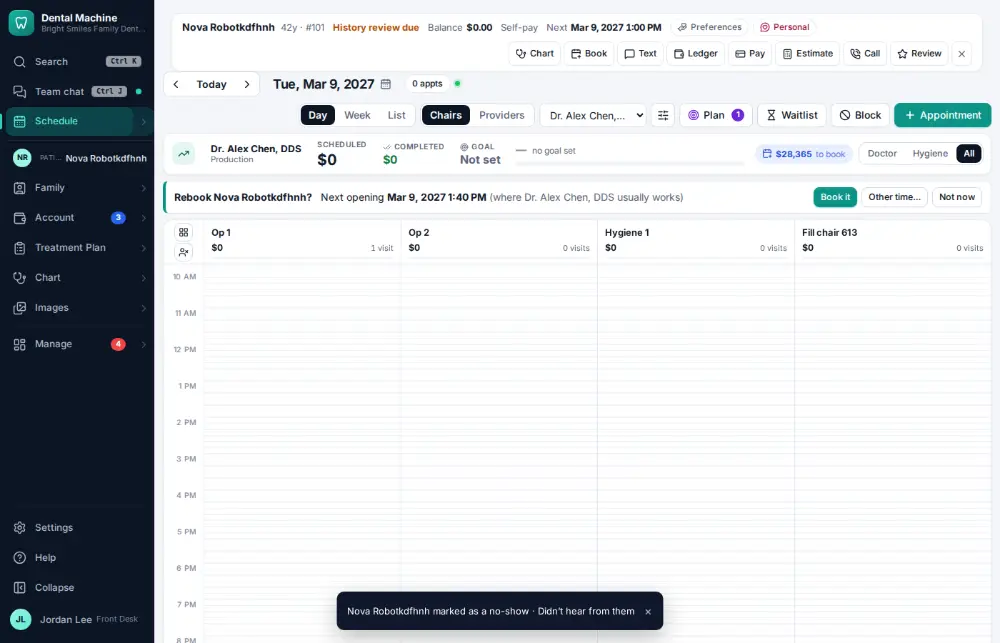

# How do I mark a no-show?

**Who:** front desk · **Where:** Schedule — Shift+X, reason · **How often:** Every day · ⌨ keyboard only

Shift+X marks the selected visit as a no-show; press the reason’s number. The next opening shows on the schedule in case you rebook now.

## Where to start

Select the visit on the schedule first.

## Steps

1. Press Shift+X: the reasons list opens  
   Keys: <kbd>Shift X</kbd>

   

2. Press 6 ("couldn’t reach them"): marked no-show; the next opening shows on the schedule (nothing to close if not rebooking now)  
   Keys: <kbd>6</kbd>

   

## With the mouse

Open the visit and click No-show, then pick the reason.

## Tips

- No-shows go on Follow-up lists → Broken appointments ([A093](A093-work-the-broken-appointments-list.md)).

## Related

- [How do I cancel an appointment?](A054-cancel-an-appointment.md)
- [How do I work the broken-appointments list?](A093-work-the-broken-appointments-list.md)
- [How do I fill an opening from the ASAP list?](A070-fill-an-opening-from-the-asap-list.md)
- [How do I put a patient on the ASAP list?](A076-put-a-patient-on-the-asap-list.md)
- [How do I book a same-day emergency visit?](A082-book-a-same-day-emergency-visit.md)

---
[All how-tos](README.md) · Action A071 · screenshots from the robot run of 2026-09-25
