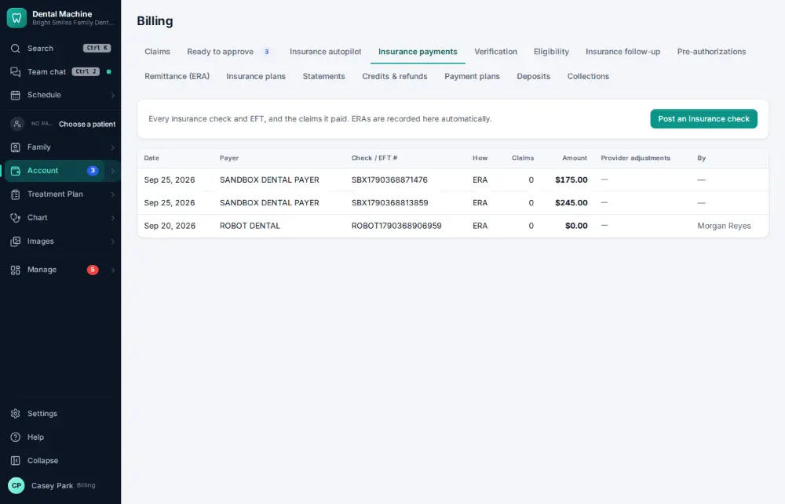
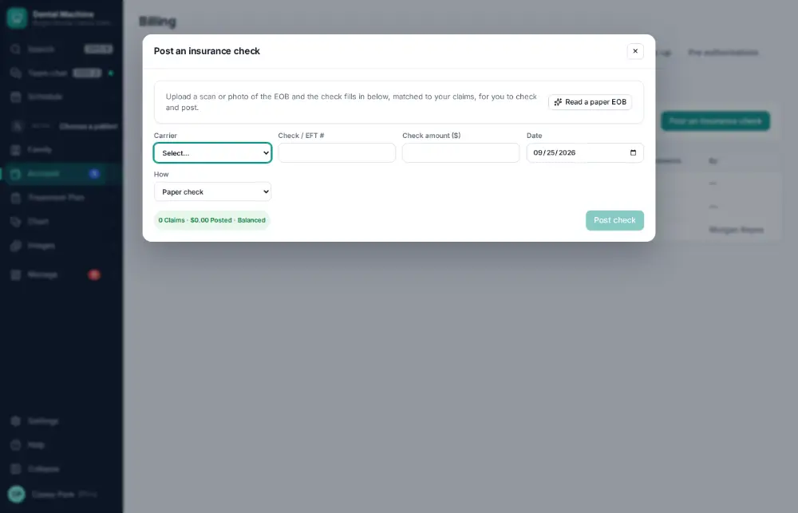
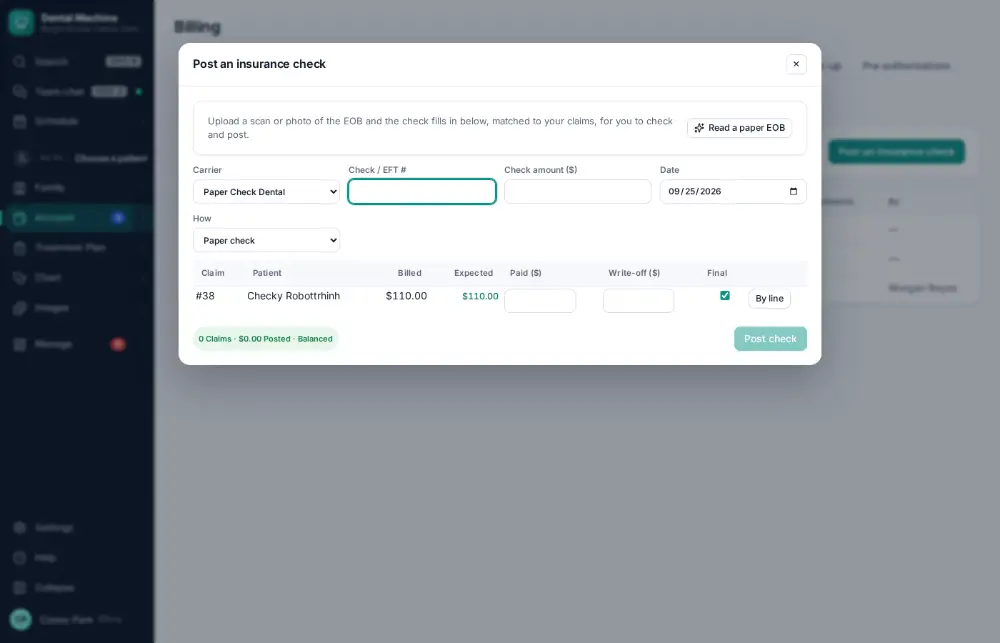
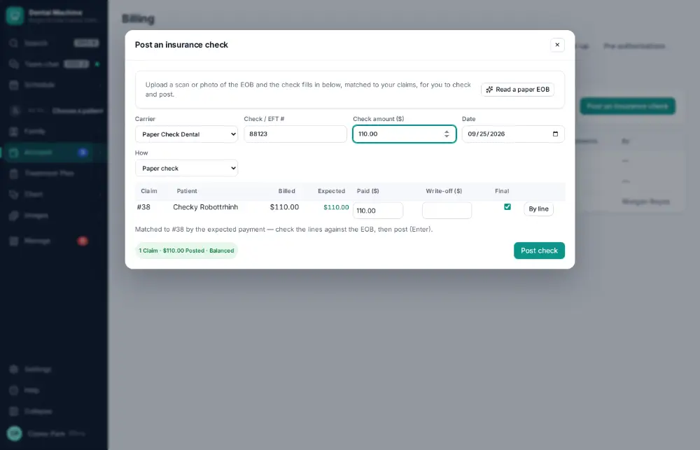
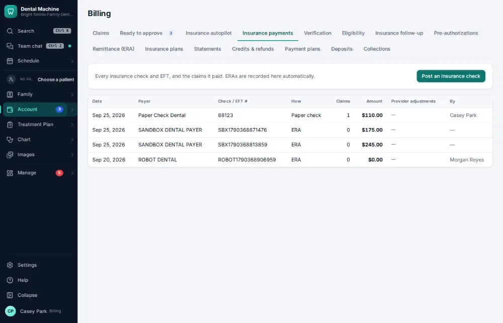

# How do I post a paper EOB / insurance check?

**Who:** billing · **Where:** Account ▾ → Billing & claims → Insurance payments · **How often:** Every day

Post an insurance check that came by mail: pick the carrier, type the check number and amount, and it is matched to the claims it pays.

## Where to start

## Steps

1. Billing → Insurance payments: click "Post an insurance check"

   

2. Pick the carrier: their open claims are listed, and the cursor moves to the check number

   

3. Type the check number, Enter; type the check amount: it is matched to the claim it pays (paid as expected)  
   Keys: <kbd>Enter</kbd>

   

4. Press Enter: posted to the claim (audited; a check posted twice is caught)  
   Keys: <kbd>Enter</kbd>

   

## Tips

- “Read a paper EOB” reads a scanned EOB and fills in paid and write-off per procedure for you to check.

## If something goes wrong

- **“Check … was already posted on …”** — The same check was posted before. Post it again only if the payer really sent it twice.
- **“… payment plus write-off is more than was billed”** — Check the amounts against the EOB.

## Related

- [How do I post an insurance payment from an ERA?](A063-post-an-insurance-payment-from-an-era.md)
- [How do I reconcile insurance payments with the bank?](A127-reconcile-insurance-payments-with-the-bank.md)
- [How do I make the daily bank deposit?](A084-make-the-daily-bank-deposit.md)
- [How do I call an insurance company about an unpaid claim?](A075-call-an-insurance-company-about-an-unpaid-claim.md)
- [How do I send a pre-authorization?](A081-send-a-pre-authorization.md)

---
[All how-tos](README.md) · Action A072 · screenshots from the robot run of 2026-09-25
