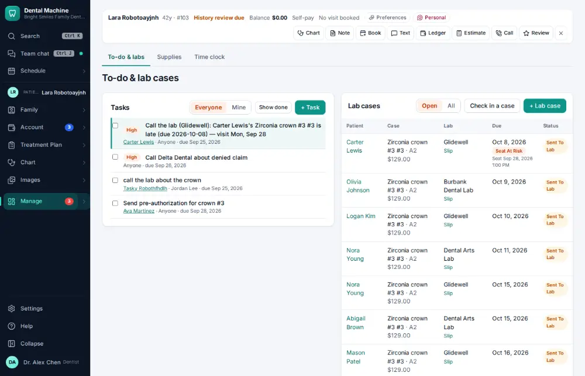
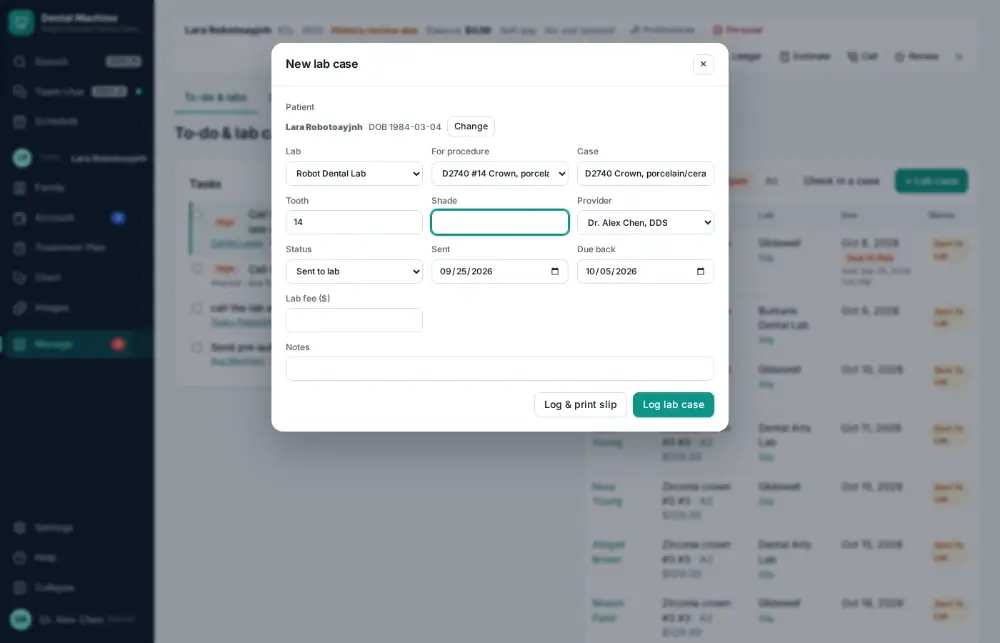
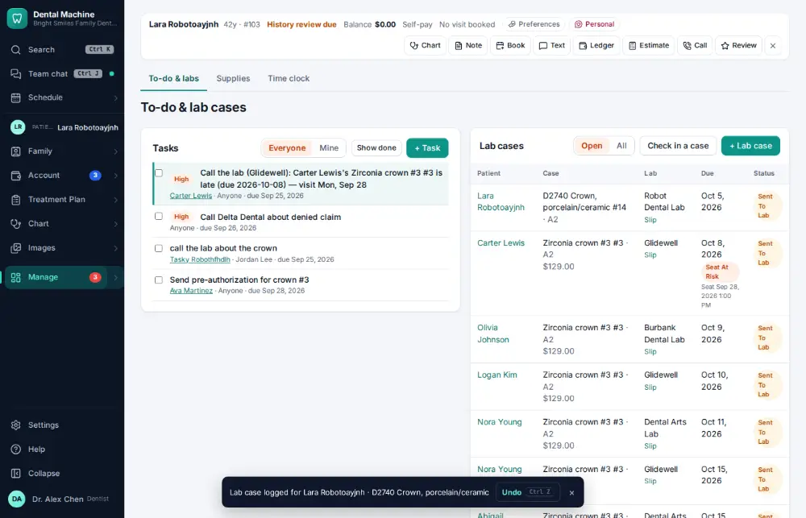

# How do I create a lab case?

**Who:** assistant, dentist · **Where:** Manage ▾ → To-do & labs · **How often:** Every day

L on To-do & labs starts a lab case for the active patient with the lab, the crown, the tooth and the dentist filled in; type the shade and press Enter.

## Where to start

## Steps

1. To-do & labs: press L — a lab case for the active patient with the lab, the crown, the tooth and the dentist filled in; cursor on Shade  
   Keys: <kbd>L</kbd>

   

2. Type the shade and press Enter: case logged (Undo cancels it)  
   Keys: <kbd>Enter</kbd>

   

## Tips

- Undo on the notice cancels the case.
- “Write and send to the lab” sends a digital prescription with scans and x-rays.

## Related

- [How do I check in a case back from the lab?](A074-check-in-a-case-back-from-the-lab.md)
- [How do I look up remaining lab cases / what is overdue?](A103-look-up-remaining-lab-cases-what-is-overdue.md)
- [How do I order supplies that are running low?](A111-order-supplies-that-are-running-low.md)
- [How do I receive a supply delivery?](A112-receive-a-supply-delivery.md)

---
[All how-tos](README.md) · Action A073 · screenshots from the robot run of 2026-09-25
