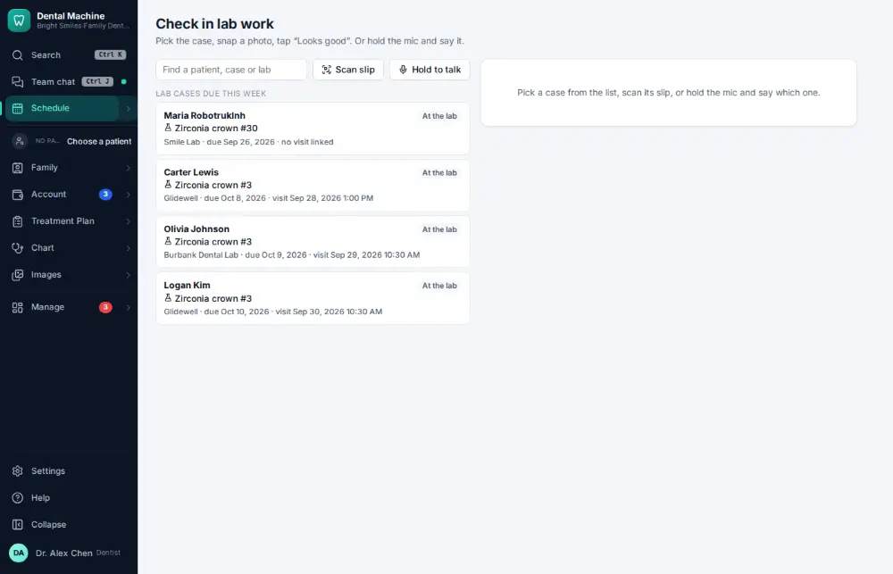
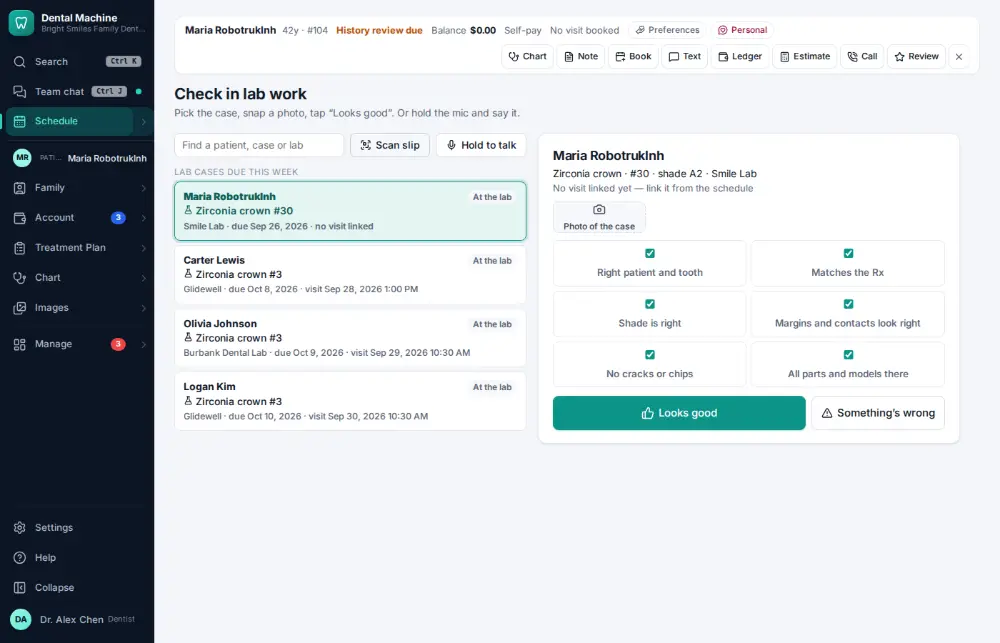
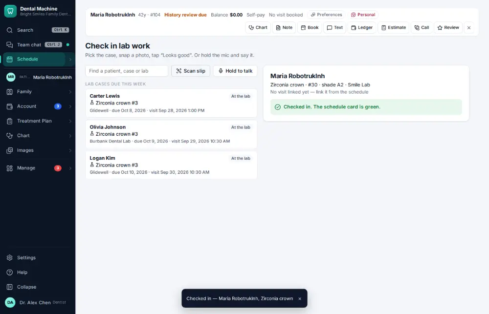

# How do I check in a case back from the lab?

**Who:** assistant · **Where:** Schedule ▾ → Lab check-in · **How often:** Every day

When a case comes back from the lab, check it in: G for “looks good”, P to note a problem. The visit’s card on the schedule turns green.

## Where to start

## Steps

1. Lab check-in: click the case that came back

   

2. Press G ("Looks good"): checked in, the visit’s card turns green  
   Keys: <kbd>G</kbd>

   

## Tips

- F finds a case; C takes a photo of it; S scans the lab slip.

## Related

- [How do I create a lab case?](A073-create-a-lab-case.md)
- [How do I look up remaining lab cases / what is overdue?](A103-look-up-remaining-lab-cases-what-is-overdue.md)
- [How do I order supplies that are running low?](A111-order-supplies-that-are-running-low.md)
- [How do I receive a supply delivery?](A112-receive-a-supply-delivery.md)

---
[All how-tos](README.md) · Action A074 · screenshots from the robot run of 2026-09-25
