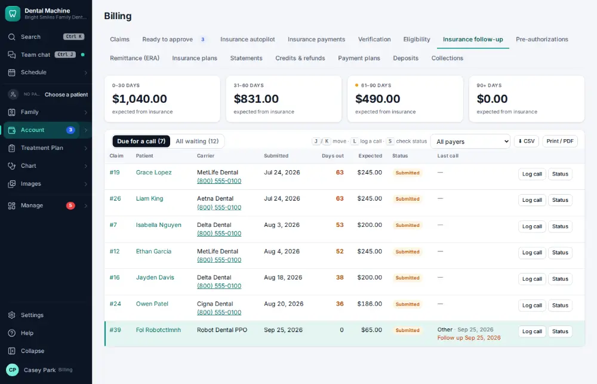
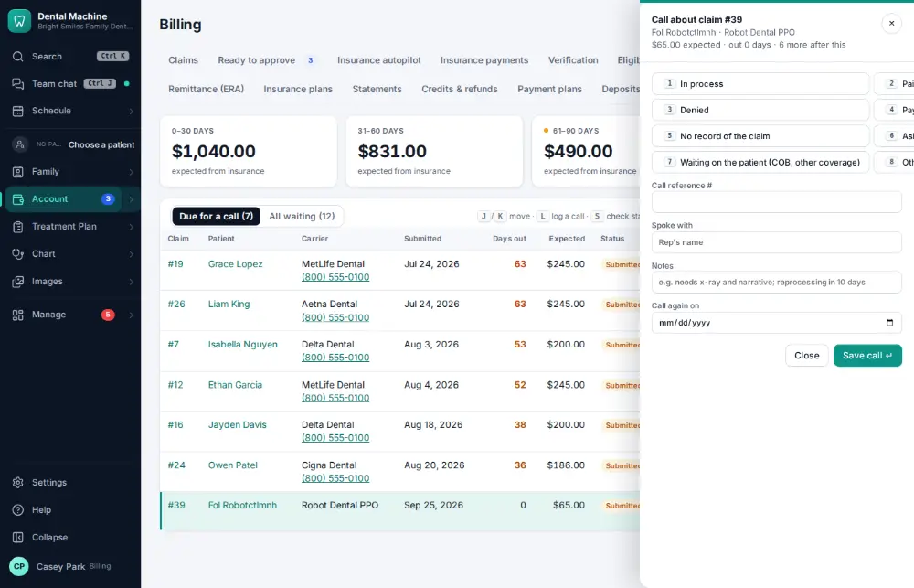
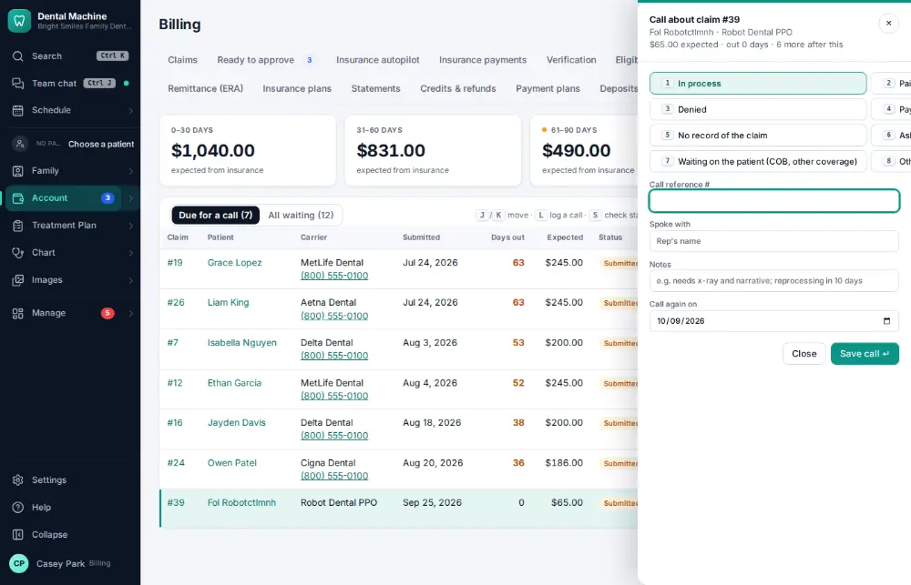
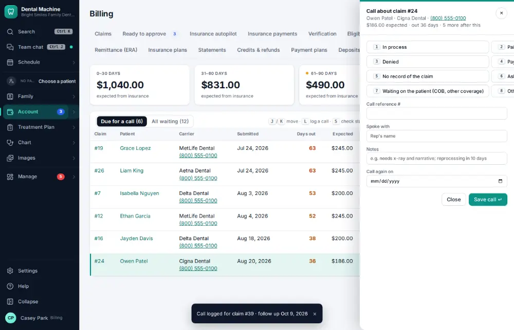

# How do I call an insurance company about an unpaid claim?

**Who:** billing · **Where:** Account ▾ → Billing & claims → Insurance follow-up · **How often:** Every day

Insurance follow-up lists unpaid claims, the ones due a call first. L opens the call panel for the highlighted claim; pick the answer, type the reference, and the next follow-up date is set.

## Where to start

## Steps

1. Insurance follow-up: claims due a call first. Press L: the call panel opens for the highlighted claim  
   Keys: <kbd>L</kbd>

   

2. Press 1 ("In process"): the cursor moves to the call reference  
   Keys: <kbd>1</kbd>

   

3. Type the reference and press Enter: logged, next follow-up set, on to the next claim  
   Keys: <kbd>Enter</kbd>

   

## Tips

- S checks the claim’s status with the payer electronically first — often no call is needed.

## Related

- [How do I look up a claim's status?](A067-look-up-a-claim-s-status.md)
- [How do I appeal a denied claim?](A109-appeal-a-denied-claim.md)
- [How do I review insurance A/R aging?](A124-review-insurance-a-r-aging.md)
- [How do I post a paper EOB / insurance check?](A072-post-a-paper-eob-insurance-check.md)
- [How do I send a pre-authorization?](A081-send-a-pre-authorization.md)

---
[All how-tos](README.md) · Action A075 · screenshots from the robot run of 2026-09-25
