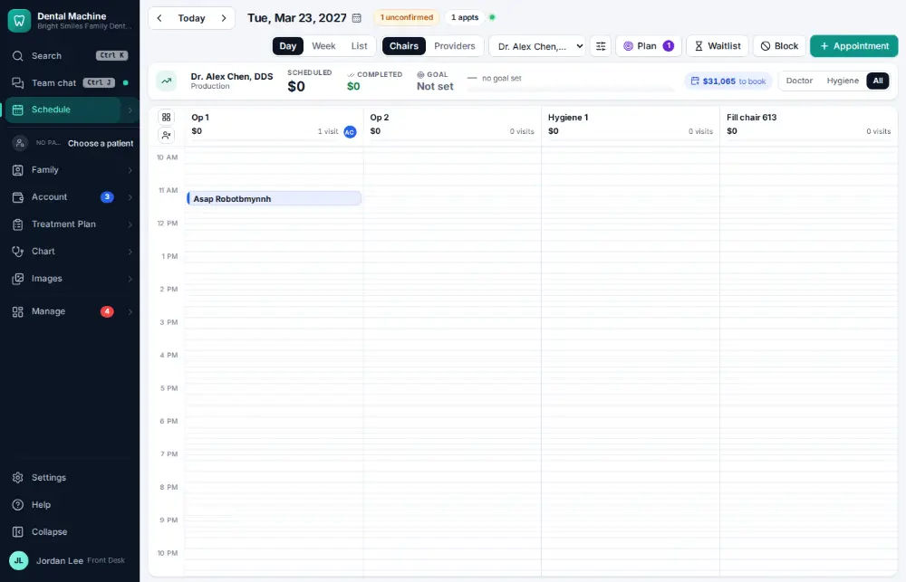
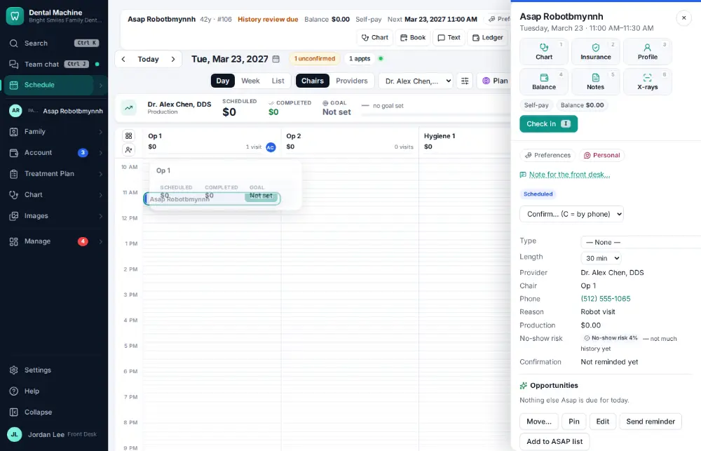
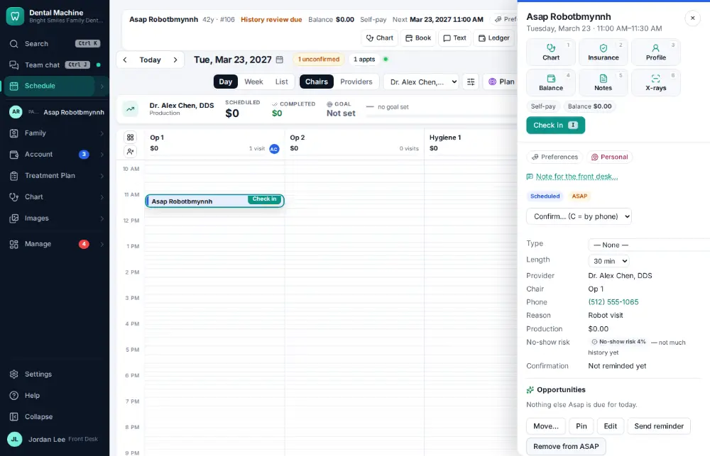

# How do I put a patient on the ASAP list?

**Who:** front desk · **Where:** Appointment drawer — ASAP · **How often:** Every day

Put a patient who wants an earlier visit on the ASAP list; they will be offered any opening that fits.

## Where to start

## Steps

1. Click the visit: its panel opens

   

2. Click "Add to ASAP list": they’ll be offered any earlier opening

   

## Tips

- The same button says “Remove from ASAP” once they are on it.

## Related

- [How do I fill an opening from the ASAP list?](A070-fill-an-opening-from-the-asap-list.md)
- [How do I cancel an appointment?](A054-cancel-an-appointment.md)
- [How do I mark a no-show?](A071-mark-a-no-show.md)
- [How do I book a same-day emergency visit?](A082-book-a-same-day-emergency-visit.md)
- [How do I accept an online booking request?](A058-accept-an-online-booking-request.md)

---
[All how-tos](README.md) · Action A076 · screenshots from the robot run of 2026-09-25
