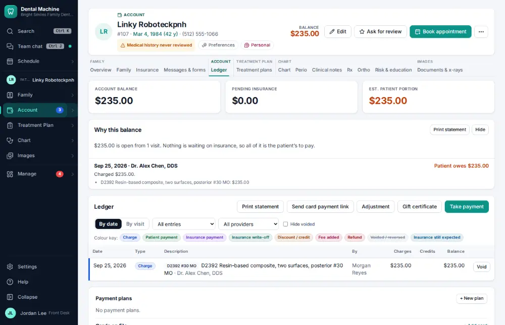
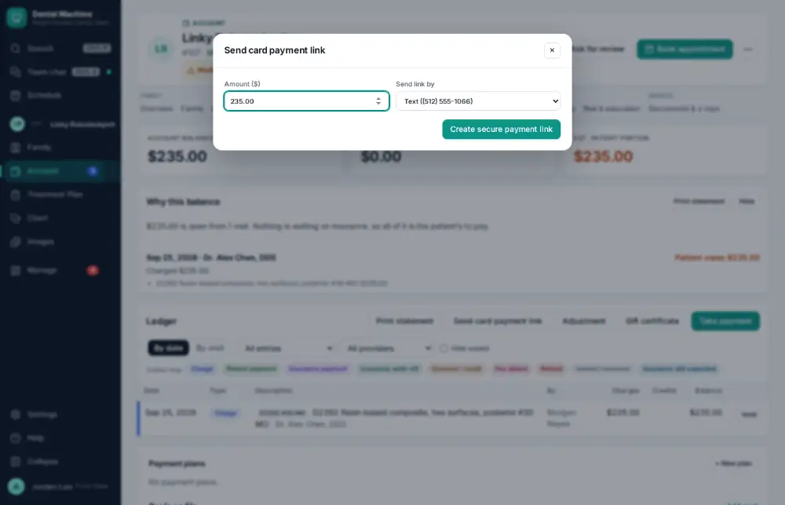
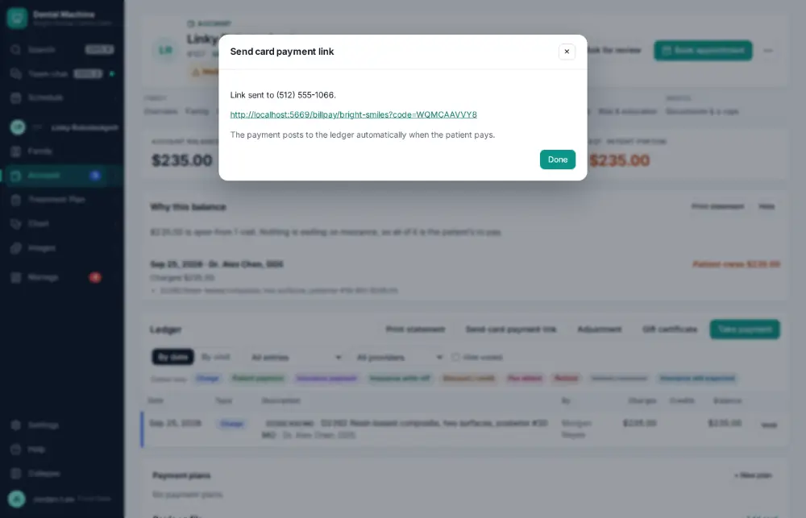

# How do I send a payment link by text?

**Who:** front desk, billing · **Where:** Ledger → Send card payment link · **How often:** Every day

Text the patient a secure link to pay their balance by card. The amount they owe is filled in. It needs card payments connected (the demo office uses the processor’s sandbox).

## Where to start

## Steps

1. Ledger: click "Send card payment link": the amount they owe is filled in

   

2. Click "Create secure payment link": texted to the patient (the demo office’s card payments are the sandbox: the link opens its Pay my bill page)

   

## Tips

- Payments made from the link post to the ledger by themselves.

## If something goes wrong

- **No “Send card payment link” on the ledger** — Card payments aren’t connected yet — an administrator connects them in Settings → Integrations.
- **“Patient has no reachable phone or email (or has opted out)”** — Add a mobile number or email first.

## Related

- [How do I take a patient payment?](A019-take-a-patient-payment.md)
- [How do I send a financing application?](A088-send-a-financing-application.md)
- [How do I post an adjustment or write-off?](A064-post-an-adjustment-or-write-off.md)
- [How do I make the daily bank deposit?](A084-make-the-daily-bank-deposit.md)
- [How do I count the cash drawer?](A086-count-the-cash-drawer.md)

---
[All how-tos](README.md) · Action A077 · screenshots from the robot run of 2026-09-25
