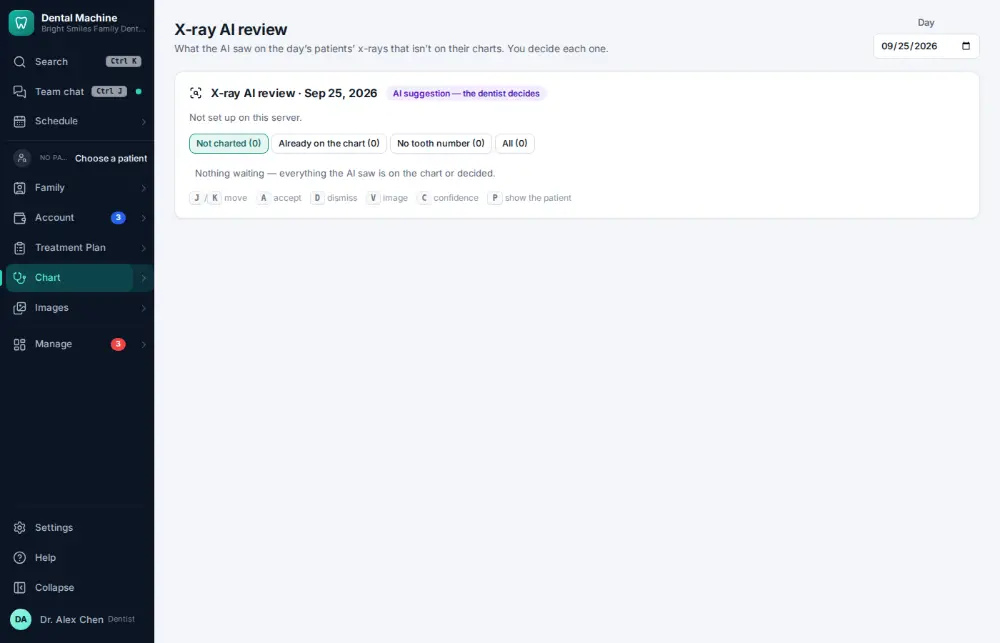

# How do I review x-ray AI findings?

**Who:** dentist · **Where:** Chart ▾ → X-ray AI review · **How often:** Every day

The AI outlines suspected caries, bone loss and other findings on x-rays; the dentist agrees (and charts them) or dismisses each one.

## Steps

1. Press Ctrl/⌘K, type "x-ray AI review", Enter  
   Keys: <kbd>Ctrl/⌘ K</kbd> type “x-ray ai review” <kbd>Enter</kbd>

   

## Tips

- The AI only suggests; nothing is charted until the dentist agrees.

## Related

- [How do I open a patient's x-rays?](A007-open-a-patient-s-x-rays.md)
- [How do I chart a finding on a tooth?](A006-chart-a-finding-on-a-tooth.md)
- [How do I upload a scanned paper document?](A069-upload-a-scanned-paper-document.md)
- [How do I take intraoral photos with the camera?](A050-take-intraoral-photos-with-the-camera.md)
- [How do I take x-rays with the sensor?](A030-take-x-rays-with-the-sensor.md)

---
[All how-tos](README.md) · Action A078 · screenshots from the robot run of 2026-09-25
