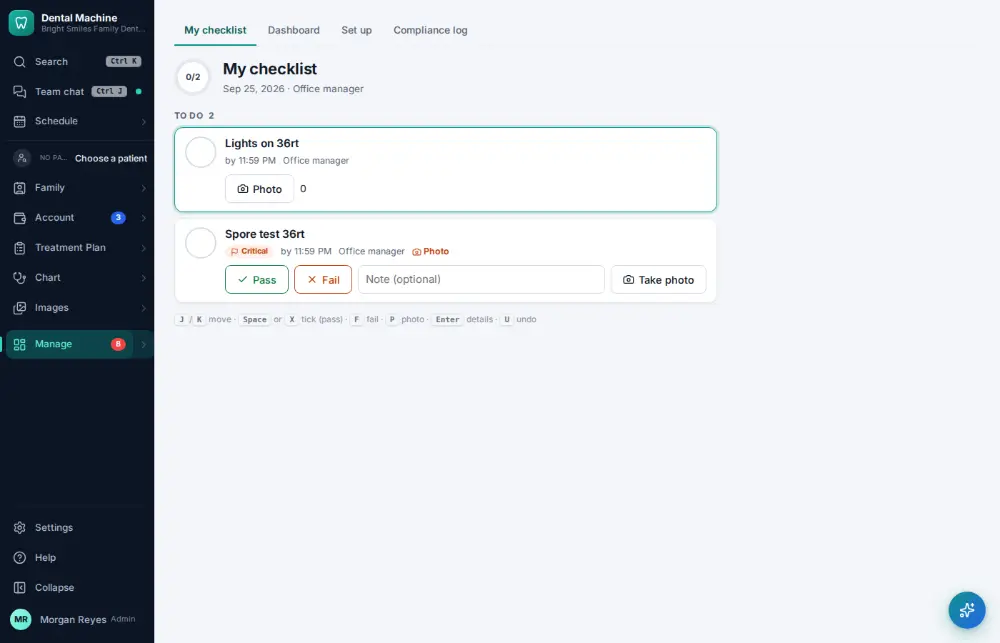
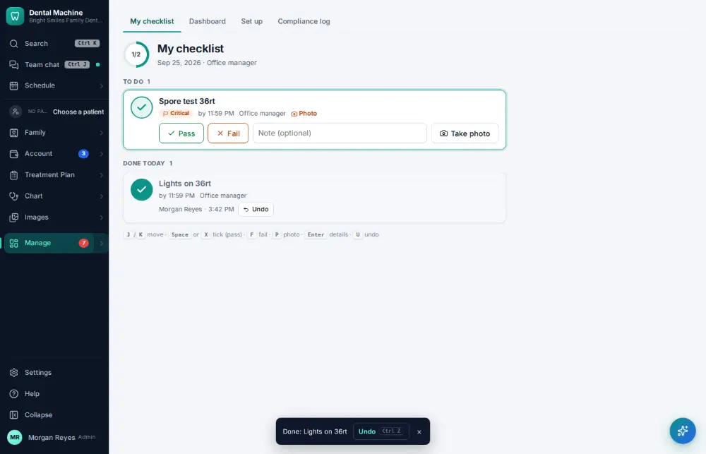

# How do I complete the opening or closing checklist?

**Who:** everyone · **Where:** Manage ▾ → Checklists · **How often:** Every day

Checklists shows today’s items for your position. Tick each as you do it.

## Where to start

## Steps

1. Checklists: today’s items for my position. Click the box of the first item: ticked (Undo shows)

   

## Tips

- J/K move; X or Space ticks; F records a fail; P adds a photo; U undoes a tick.

## Related

- [How do I log a sterilizer spore test?](A132-log-a-sterilizer-spore-test.md)
- [How do I mark a task done?](A034-mark-a-task-done.md)
- [How do I run the morning huddle?](A083-run-the-morning-huddle.md)
- [How do I work the Needs attention list?](A049-work-the-needs-attention-list.md)
- [How do I send a message in staff chat?](A036-send-a-message-in-staff-chat.md)

---
[All how-tos](README.md) · Action A079 · screenshots from the robot run of 2026-09-25
