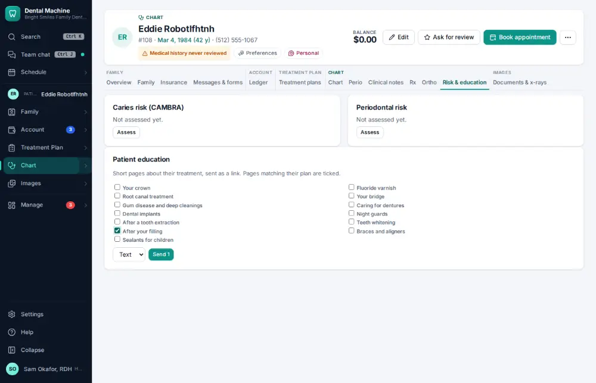
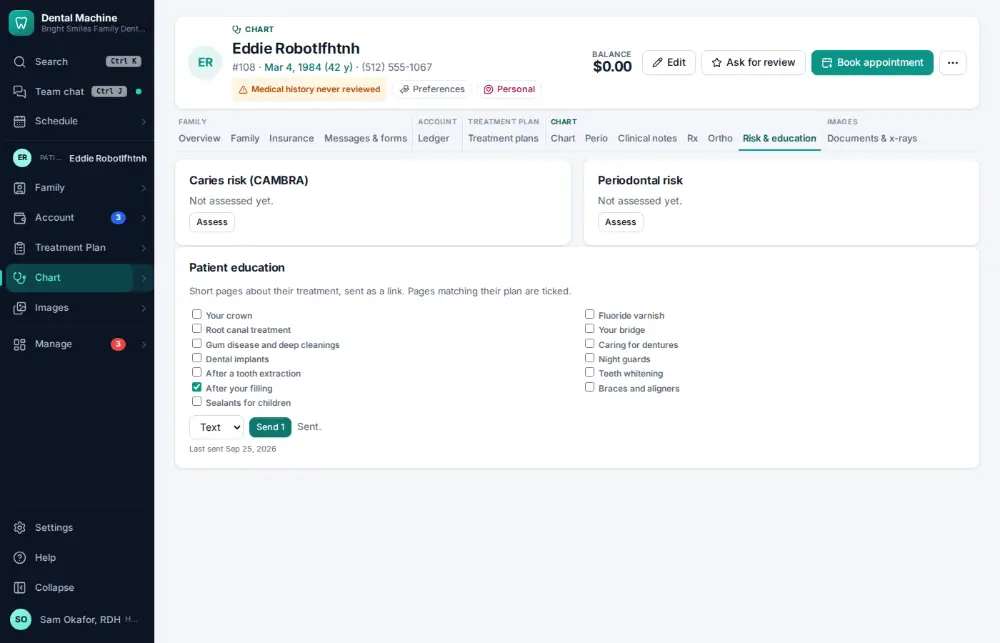

# How do I send patient education after a visit?

**Who:** dentist, hygienist · **Where:** Chart ▾ → Risk & education tab · **How often:** Every day

Tick the pages that fit the visit (for example “After your filling”) and send them by text.

## Where to start

## Steps

1. Patient education: tick "After your filling"

   

2. Click Send: texted to the patient

   

## Related

- [How do I record a caries risk assessment?](A068-record-a-caries-risk-assessment.md)
- [How do I text a patient?](A008-text-a-patient.md)
- [How do I ask a patient for a review?](A065-ask-a-patient-for-a-review.md)
- [How do I text back an unknown caller?](A066-text-back-an-unknown-caller.md)
- [How do I text a reminder to everyone unconfirmed?](A094-text-a-reminder-to-everyone-unconfirmed.md)

---
[All how-tos](README.md) · Action A080 · screenshots from the robot run of 2026-09-25
