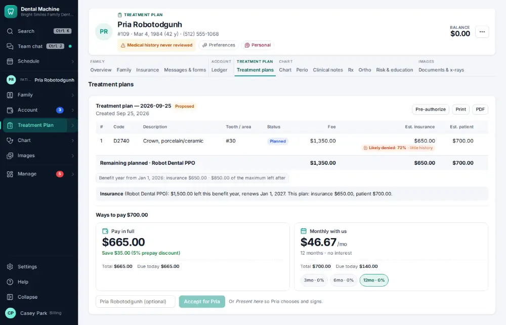
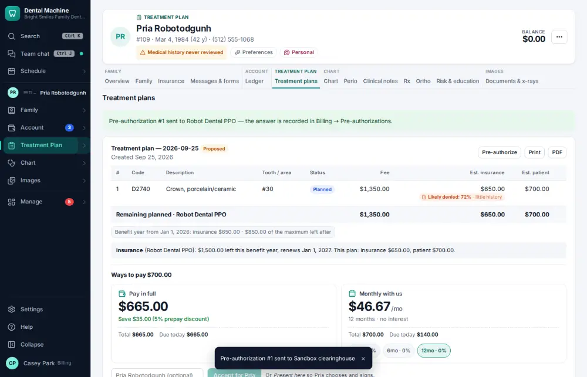

# How do I send a pre-authorization?

**Who:** billing · **Where:** Treatment Plan module → the plan → Pre-authorize · **How often:** Every day

Sends the treatment plan to the payer for a pre-authorization, through the clearinghouse.

## Where to start

## Steps

1. Click "Pre-authorize" on the plan: made and sent to the clearinghouse

   

## Tips

- Pre-authorizations are tracked under Billing & claims → Pre-authorizations.

## Related

- [How do I build a treatment plan?](A038-build-a-treatment-plan.md)
- [How do I create and send an insurance claim?](A022-create-and-send-an-insurance-claim.md)
- [How do I post a paper EOB / insurance check?](A072-post-a-paper-eob-insurance-check.md)
- [How do I call an insurance company about an unpaid claim?](A075-call-an-insurance-company-about-an-unpaid-claim.md)
- [How do I review tomorrow's insurance verification list?](A087-review-tomorrow-s-insurance-verification-list.md)

---
[All how-tos](README.md) · Action A081 · screenshots from the robot run of 2026-09-25
