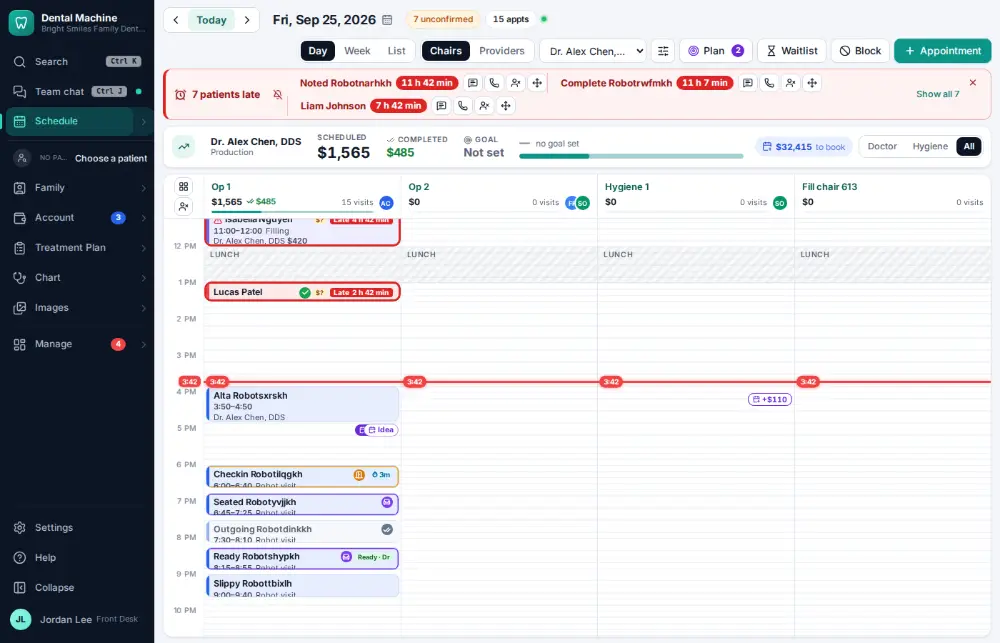
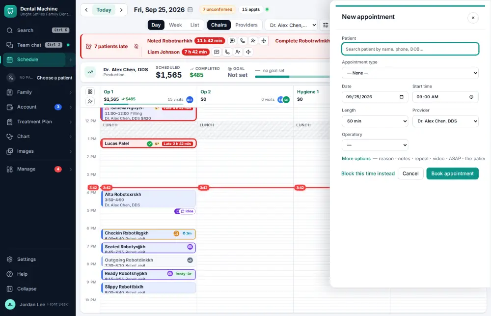
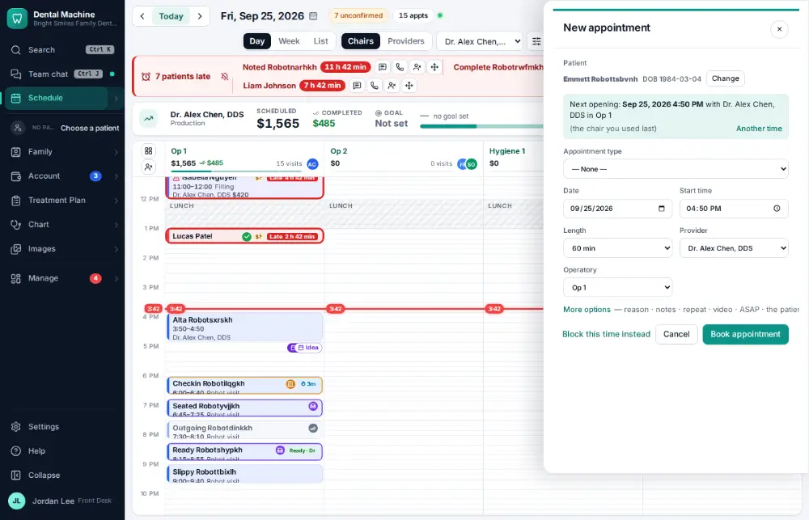
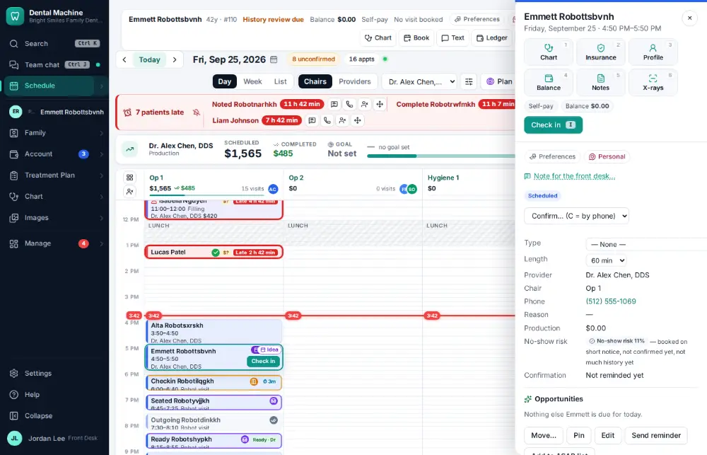

# How do I book a same-day emergency visit?

**Who:** front desk · **Where:** Schedule — N (first open time today) · **How often:** Every day

N on the schedule starts a booking; type the patient’s name and the first open time today is suggested.

## Where to start

Open the schedule on today.

## Steps

1. Press N: the booking form asks who  
   Keys: <kbd>N</kbd>

   

2. Type the patient’s name and press Enter: the first open time today is suggested  
   Keys: <kbd>Enter</kbd>

   

3. Press Enter: booked  
   Keys: <kbd>Enter</kbd>

   

## Tips

- The command bar also books: “book jane”.

## Related

- [How do I book an appointment for an existing patient?](A020-book-an-appointment-for-an-existing-patient.md)
- [How do I fill an opening from the ASAP list?](A070-fill-an-opening-from-the-asap-list.md)
- [How do I mark a no-show?](A071-mark-a-no-show.md)
- [How do I put a patient on the ASAP list?](A076-put-a-patient-on-the-asap-list.md)
- [How do I accept an online booking request?](A058-accept-an-online-booking-request.md)

---
[All how-tos](README.md) · Action A082 · screenshots from the robot run of 2026-09-25
