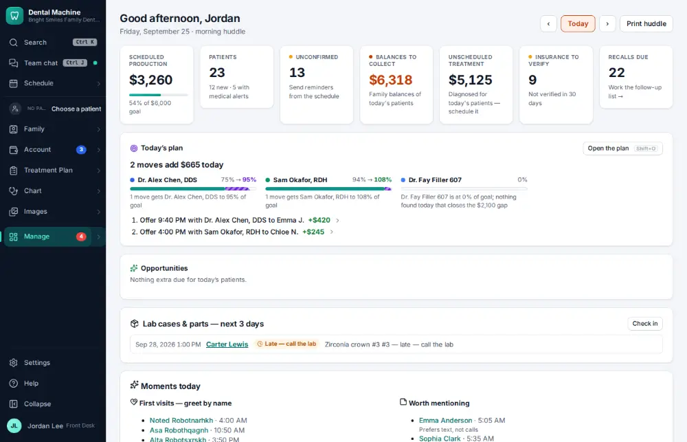
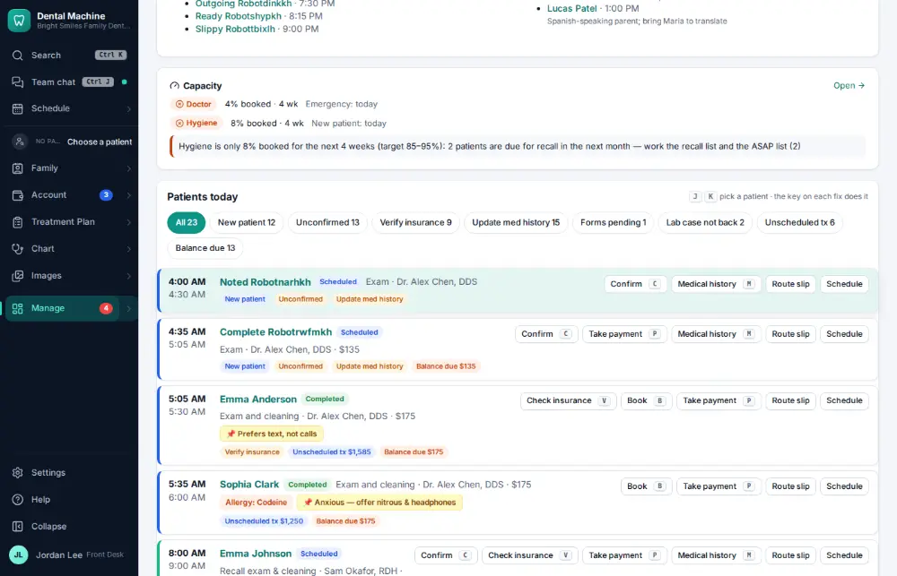
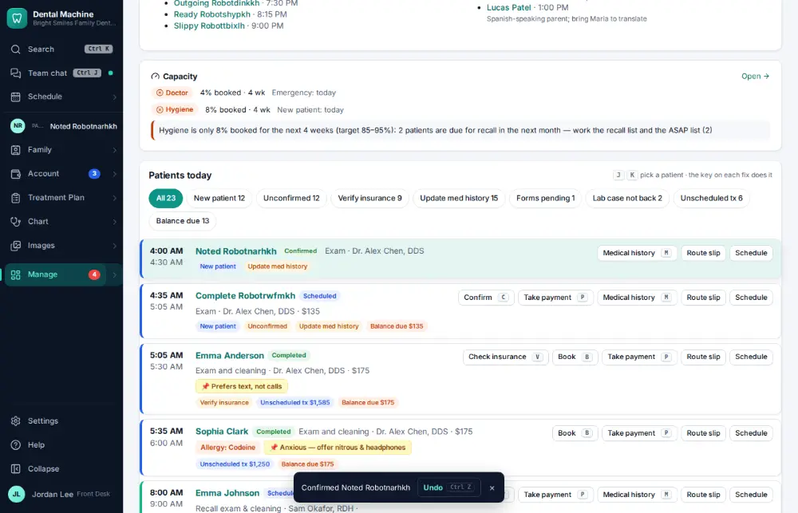

# How do I run the morning huddle?

**Who:** everyone · **Where:** Manage (Today’s dashboard, /) — G then T · **How often:** Every day

Today’s dashboard is the huddle: each visit is flagged with what needs doing (unconfirmed, balance due, unscheduled treatment, insurance not verified). Fix a flag right on the row.

## Where to start

## Steps

1. Today’s dashboard: the huddle flags each visit. Click the visit flagged "unconfirmed"

   

2. Press C: confirmed on the row (Undo shows)  
   Keys: <kbd>C</kbd>

   

## Tips

- J/K move between patients; the keys shown on the row fix its flags (C confirms).

## Related

- [How do I work the Needs attention list?](A049-work-the-needs-attention-list.md)
- [How do I confirm an appointment?](A016-confirm-an-appointment.md)
- [How do I print the route slip / walkout for a visit?](A044-print-the-route-slip-walkout-for-a-visit.md)
- [How do I complete the opening or closing checklist?](A079-complete-the-opening-or-closing-checklist.md)
- [How do I read the office manual?](A108-read-the-office-manual.md)

---
[All how-tos](README.md) · Action A083 · screenshots from the robot run of 2026-09-25
