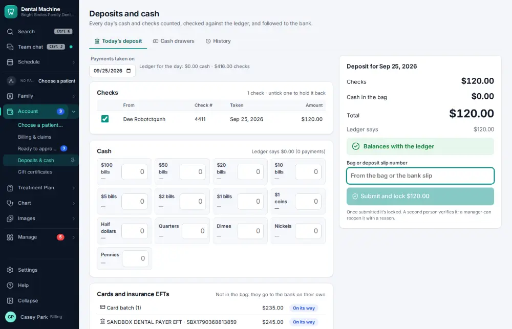
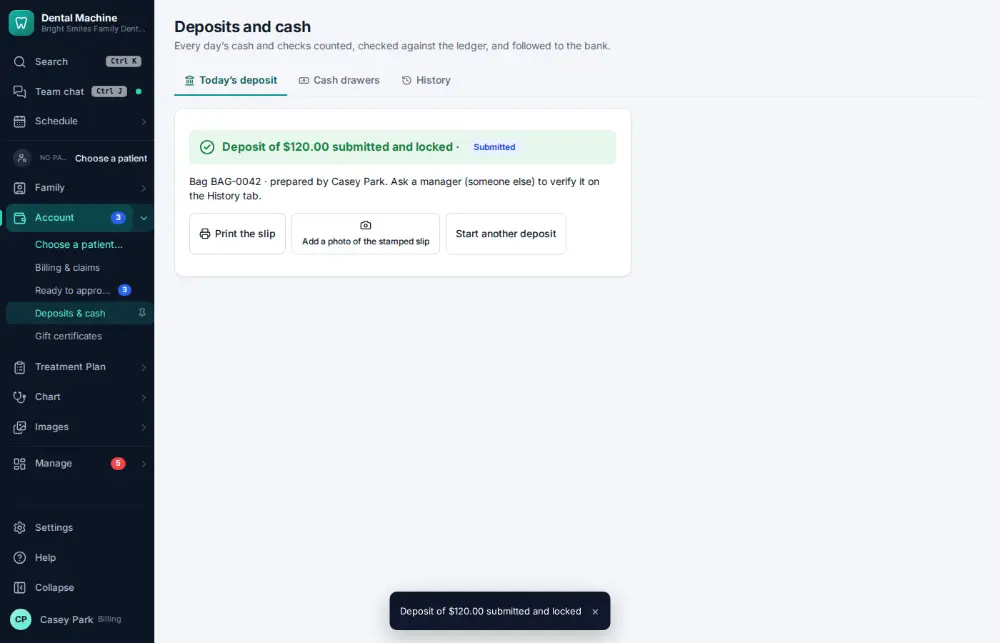

# How do I make the daily bank deposit?

**Who:** billing, office manager · **Where:** Account ▾ → Deposits & cash · **How often:** Every day

Deposits & cash gathers the day’s cash and checks into one deposit, checked against the ledger. Type the bag or deposit slip number and press Enter; the deposit is locked and waits for a second person to verify it.

## Steps

1. In the menu open Account ▾ and click "Deposits & cash": today’s deposit is ready

   

2. Type the bag number and press Enter: deposit made  
   Keys: <kbd>Enter</kbd>

   

## Tips

- Someone other than the person who made the deposit verifies it on the History tab.
- Print the slip, and add a photo of the stamped slip from the bank.
- Cash drawers must be counted ([A086](A086-count-the-cash-drawer.md)) before their cash can go on a deposit.

## If something goes wrong

- **“Enter the bag or deposit slip number”** — Type the number printed on the bag or slip.
- **“This deposit doesn’t match the ledger — say why before submitting”** — Recount; if it still doesn’t match, type the reason.
- **“A submitted deposit is locked…”** — A manager can reopen it with a reason; a new deposit then replaces it.
- **“Someone other than the person who prepared the deposit has to verify it”** — Ask a colleague to verify it.

## Related

- [How do I count the cash drawer?](A086-count-the-cash-drawer.md)
- [How do I check the day sheet at the end of the day?](A085-check-the-day-sheet-at-the-end-of-the-day.md)
- [How do I reconcile insurance payments with the bank?](A127-reconcile-insurance-payments-with-the-bank.md)
- [How do I send a financing application?](A088-send-a-financing-application.md)
- [How do I void a payment posted by mistake?](A102-void-a-payment-posted-by-mistake.md)

---
[All how-tos](README.md) · Action A084 · screenshots from the robot run of 2026-09-25
