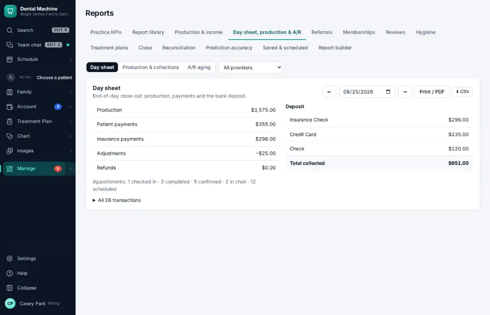

# How do I check the day sheet at the end of the day?

**Who:** office manager, billing · **Where:** Manage ▾ → Reports → Day sheet · **How often:** Every day

The day sheet lists the day’s production, collections and adjustments by provider, to check before closing the day.

## Steps

1. Press Ctrl/⌘K, type "day sheet", Enter: today’s day sheet  
   Keys: <kbd>Ctrl/⌘ K</kbd> type “day sheet” <kbd>Enter</kbd>

   

## Tips

- Every report can be downloaded as a spreadsheet ([A142](A142-export-a-report-to-a-spreadsheet.md)) or printed.

## Related

- [How do I make the daily bank deposit?](A084-make-the-daily-bank-deposit.md)
- [How do I look at the production & collections report?](A104-look-at-the-production-collections-report.md)
- [How do I close the month?](A146-close-the-month.md)
- [How do I check practice KPIs and metrics?](A105-check-practice-kpis-and-metrics.md)
- [How do I review insurance A/R aging?](A124-review-insurance-a-r-aging.md)

---
[All how-tos](README.md) · Action A085 · screenshots from the robot run of 2026-09-25
