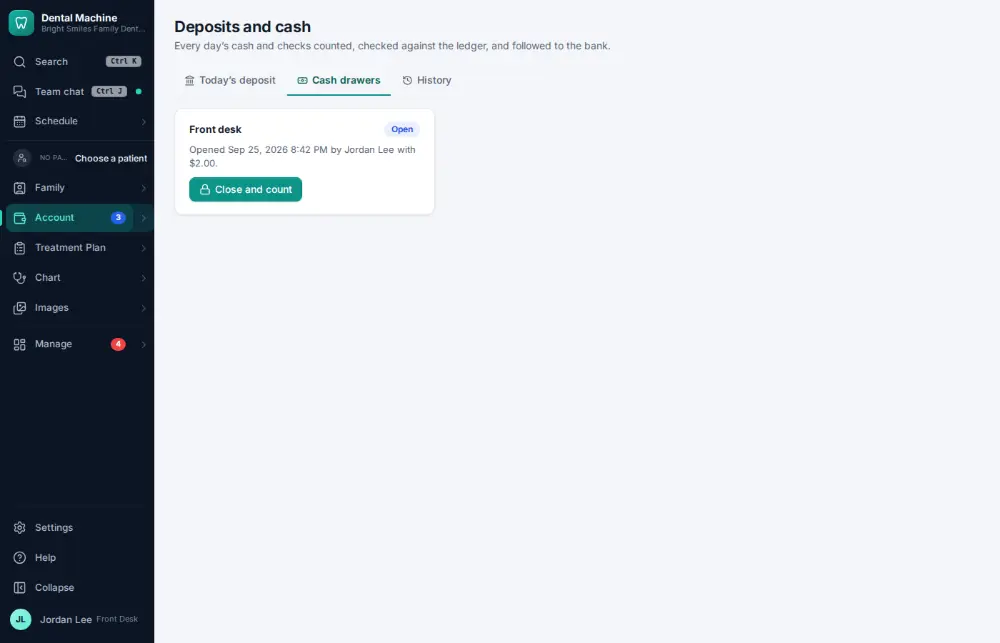
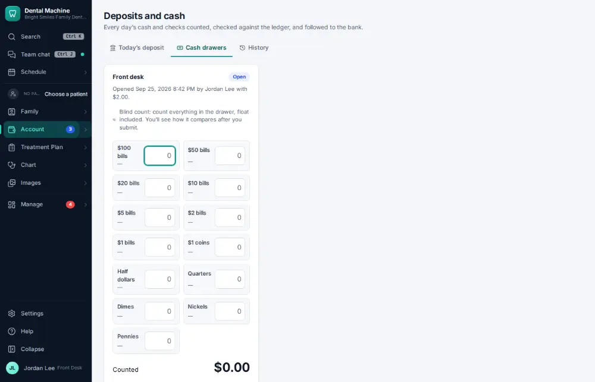
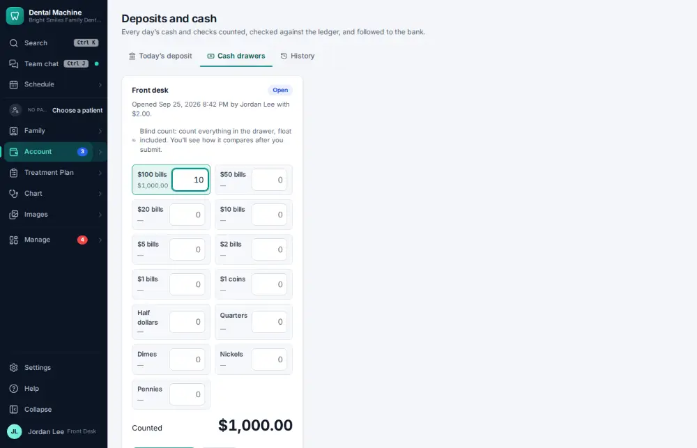
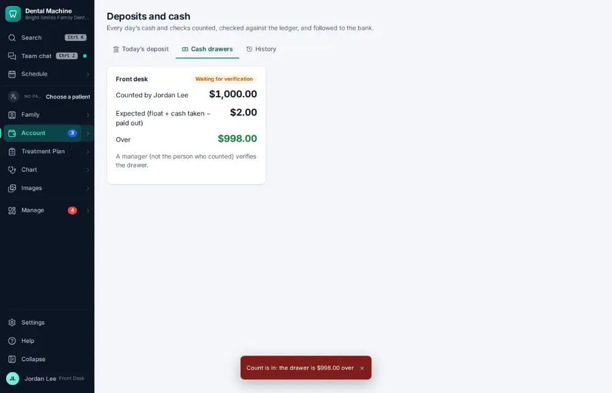

# How do I count the cash drawer?

**Who:** front desk · **Where:** Account ▾ → Deposits & cash → Cash drawers · **How often:** Every day

Close and count the cash drawer: type how many of each note and coin. It is a blind count (the expected total is hidden) and is compared with the ledger when you submit.

## Where to start

## Steps

1. Deposits & cash → Cash drawers: click "Close and count" (a blind count: the expected total is hidden)

   

2. Type how many of each note and coin (the cursor starts on the first one)

   

3. Click "Submit count": compared with the ledger

   

## Tips

- A second person verifies the count; then the cash can go on the deposit.

## If something goes wrong

- **“This drawer’s count is waiting for a second person to verify it”** — Ask a colleague to verify it.

## Related

- [How do I make the daily bank deposit?](A084-make-the-daily-bank-deposit.md)
- [How do I send a financing application?](A088-send-a-financing-application.md)
- [How do I void a payment posted by mistake?](A102-void-a-payment-posted-by-mistake.md)
- [How do I send a payment link by text?](A077-send-a-payment-link-by-text.md)
- [How do I post an adjustment or write-off?](A064-post-an-adjustment-or-write-off.md)

---
[All how-tos](README.md) · Action A086 · screenshots from the robot run of 2026-09-25
