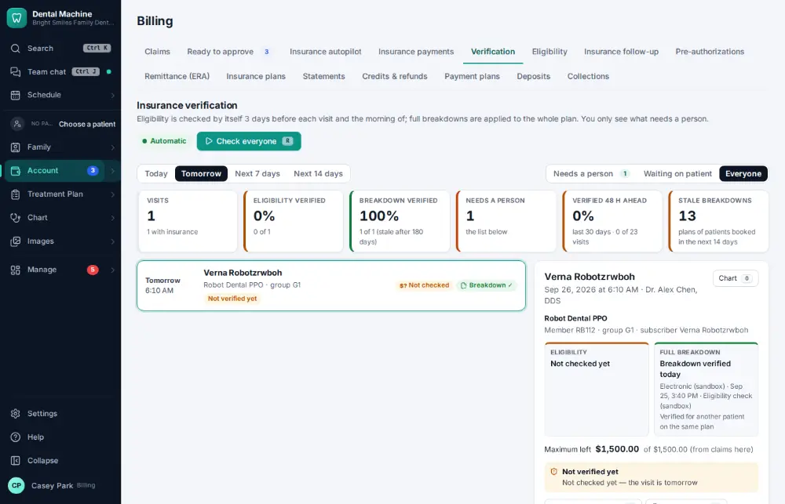
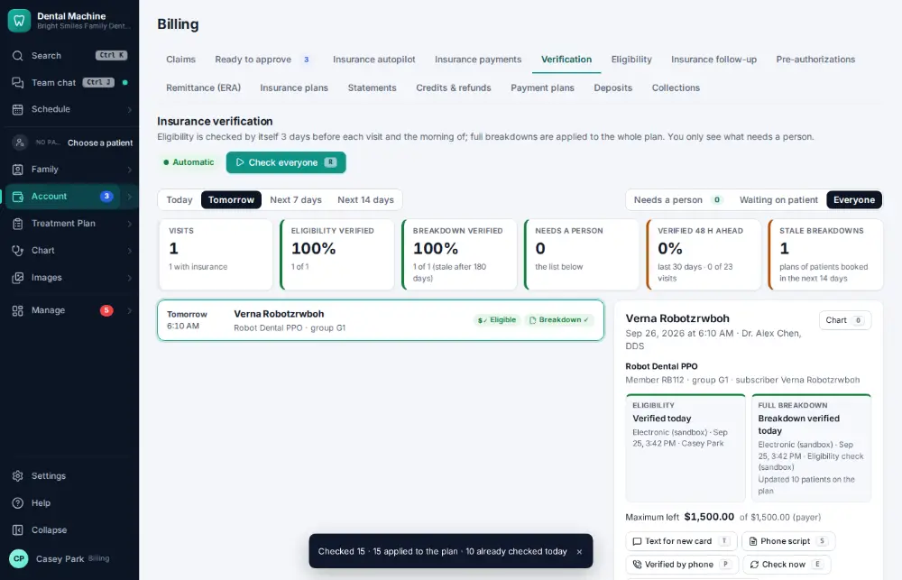

# How do I review tomorrow's insurance verification list?

**Who:** billing, front desk · **Where:** Account ▾ → Billing & claims → Verification · **How often:** Every day

Billing → Verification lists tomorrow’s patients and their insurance status. R checks everyone now; clean answers are applied, and only the ones that need a person stay on the list.

## Where to start

## Steps

1. Billing → Verification, tomorrow: press R to check everyone; clean answers are applied  
   Keys: <kbd>R</kbd>

   

## Tips

- J/K move; E checks one; P records a phone verification; S shows the payer phone script; T texts the patient for a new card.

## Related

- [How do I verify insurance eligibility?](A026-verify-insurance-eligibility.md)
- [How do I scan a new insurance card into a policy?](A047-scan-a-new-insurance-card-into-a-policy.md)
- [How do I add a secondary insurance policy?](A091-add-a-secondary-insurance-policy.md)
- [How do I send a pre-authorization?](A081-send-a-pre-authorization.md)
- [How do I post a paper EOB / insurance check?](A072-post-a-paper-eob-insurance-check.md)

---
[All how-tos](README.md) · Action A087 · screenshots from the robot run of 2026-09-25
