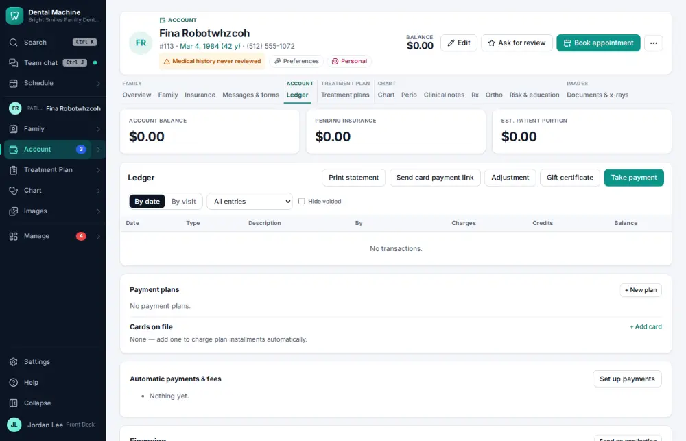
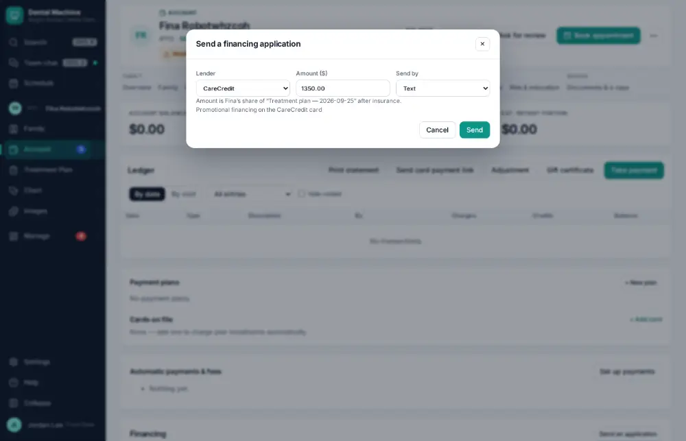
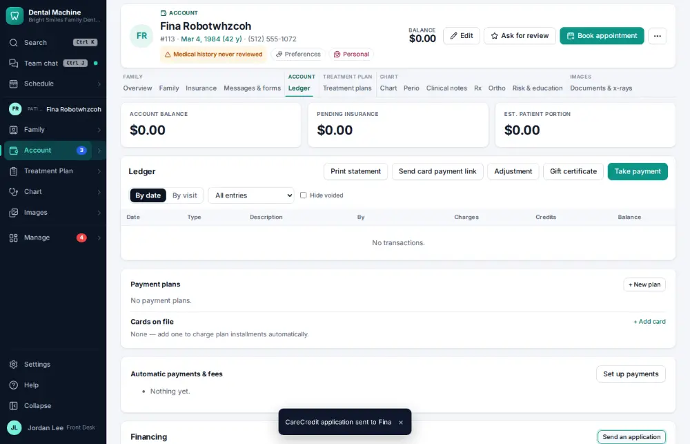

# How do I send a financing application?

**Who:** front desk · **Where:** Ledger → Send an application · **How often:** Every day

Text the patient a financing application (CareCredit, Sunbit or Cherry). The lender and the plan’s patient share are filled in.

## Where to start

## Steps

1. Click "Send an application": the lender and the plan’s patient share are filled in, Send focused

   

2. Press Enter: the application link is texted  
   Keys: <kbd>Enter</kbd>

   

## Tips

- Approvals and funding come back and post to the ledger.
- The lenders’ links are set in Settings → Practice → Financing.

## Related

- [How do I set up a payment plan?](A113-set-up-a-payment-plan.md)
- [How do I send a payment link by text?](A077-send-a-payment-link-by-text.md)
- [How do I make the daily bank deposit?](A084-make-the-daily-bank-deposit.md)
- [How do I count the cash drawer?](A086-count-the-cash-drawer.md)
- [How do I void a payment posted by mistake?](A102-void-a-payment-posted-by-mistake.md)

---
[All how-tos](README.md) · Action A088 · screenshots from the robot run of 2026-09-25
