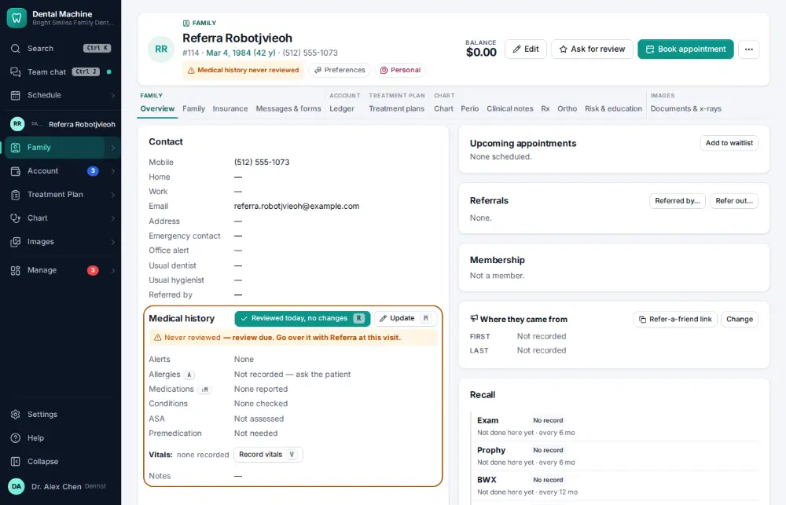
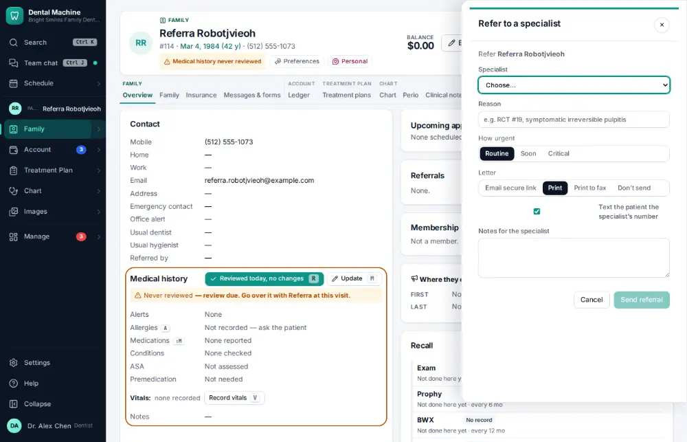
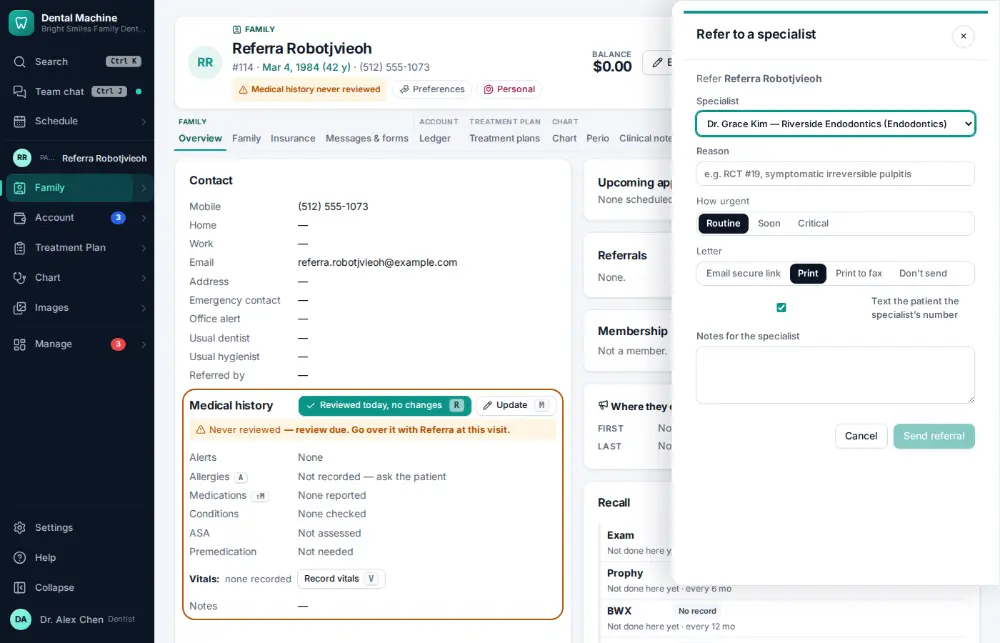
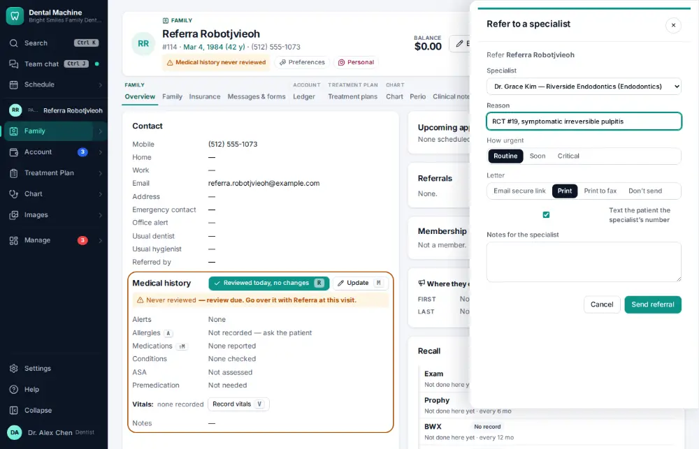
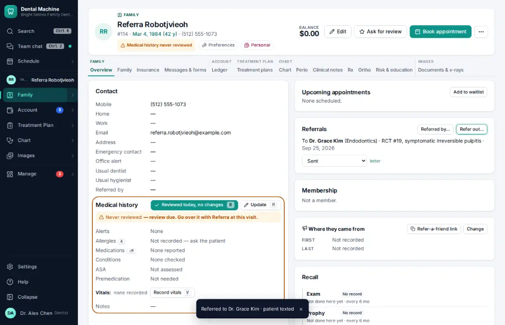

# How do I refer a patient to a specialist?

**Who:** dentist, front desk · **Where:** Chart header (Family module) → Refer out… · **How often:** Every day

Refer out opens beside the chart with the usual specialist chosen; type the reason and send. The letter prints or emails, and the patient gets the specialist’s number.

## Where to start

## Steps

1. Click "Refer out…" on the chart: the referral panel opens beside it with the usual specialist chosen

   

2. Pick the specialist

   

3. Type the reason (the cursor is already there)

   

4. Press Ctrl/⌘+Enter: sent (the letter prints or emails; the patient gets the specialist’s number)  
   Keys: <kbd>Ctrl/⌘ Enter</kbd>

   

## Tips

- Family ▾ → Referrals tracks each referral until the report comes back.

## Related

- [How do I record who referred a new patient?](A092-record-who-referred-a-new-patient.md)
- [How do I check where new patients come from?](A152-check-where-new-patients-come-from.md)
- [How do I print a treatment plan?](A096-print-a-treatment-plan.md)
- [How do I record an orthodontic adjustment visit?](A101-record-an-orthodontic-adjustment-visit.md)
- [How do I write a prescription?](A062-write-a-prescription.md)

---
[All how-tos](README.md) · Action A089 · screenshots from the robot run of 2026-09-25
