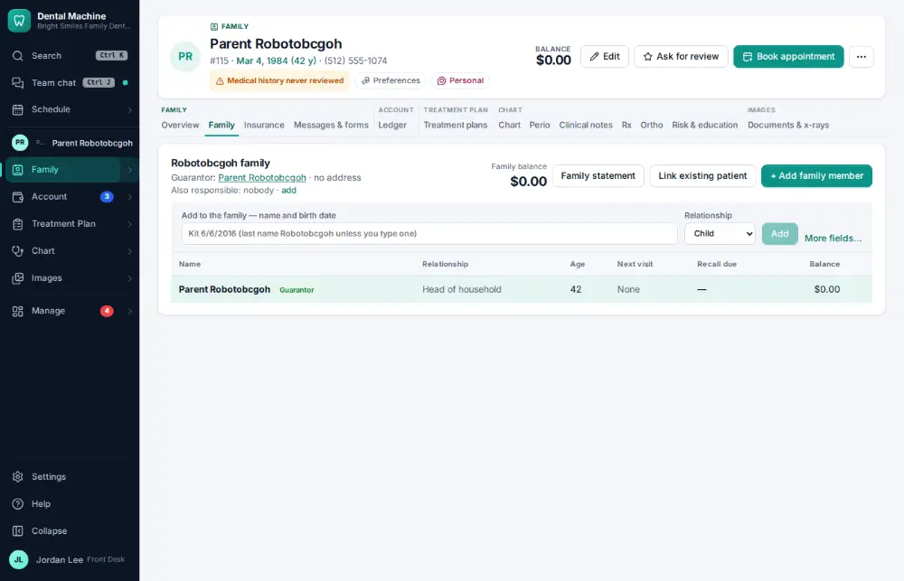
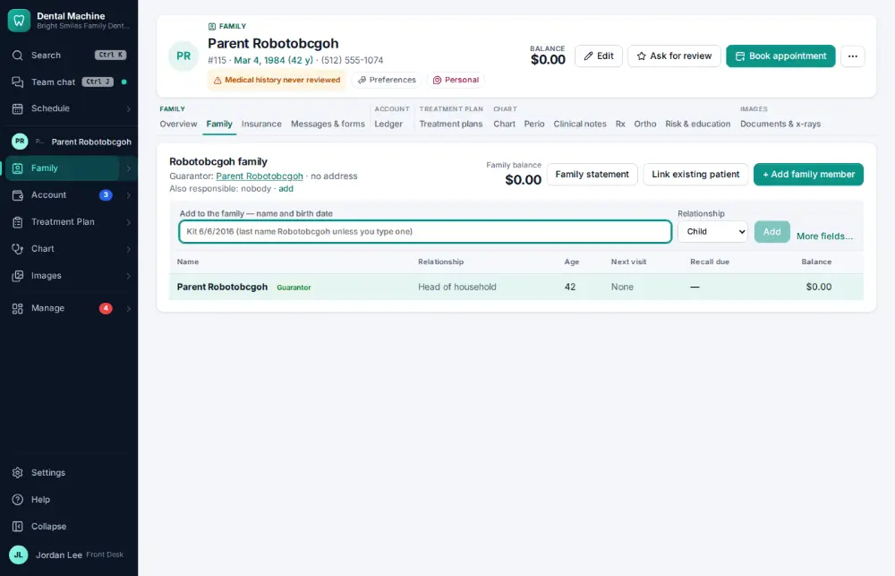
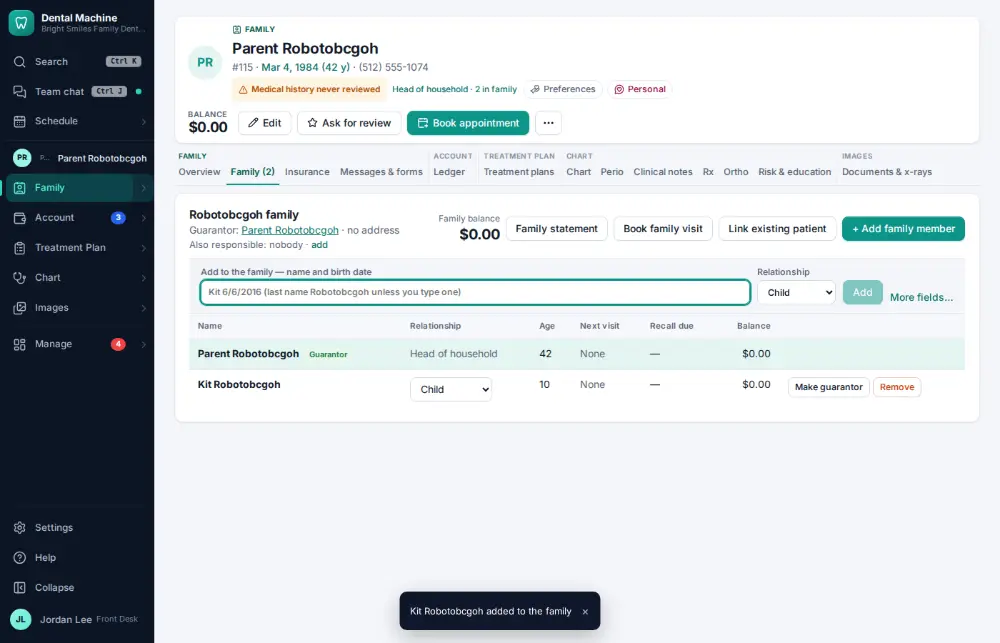

# How do I add a family member to a household?

**Who:** front desk · **Where:** Family module → Family tab · **How often:** Every day

Type the new family member’s first name and birth date in one box; the address, phone, last name and guarantor come from this patient.

## Where to start

## Steps

1. Family tab: click the "Add to the family" line (address, phone and guarantor come from this patient)

   

2. Type "Kit 6/6/2016" — first name and birth date in one box (a child, with this family’s last name) — and press Enter  
   Keys: <kbd>Enter</kbd>

   

## If something goes wrong

- **“Choose the head of household as guarantor”** — Pick the adult responsible for the account.

## Related

- [How do I set up a new patient?](A055-set-up-a-new-patient.md)
- [How do I add a secondary insurance policy?](A091-add-a-secondary-insurance-policy.md)
- [How do I record who referred a new patient?](A092-record-who-referred-a-new-patient.md)
- [How do I change a patient's usual provider or hygienist?](A098-change-a-patient-s-usual-provider-or-hygienist.md)
- [How do I add an office alert to a patient?](A099-add-an-office-alert-to-a-patient.md)

---
[All how-tos](README.md) · Action A090 · screenshots from the robot run of 2026-09-25
