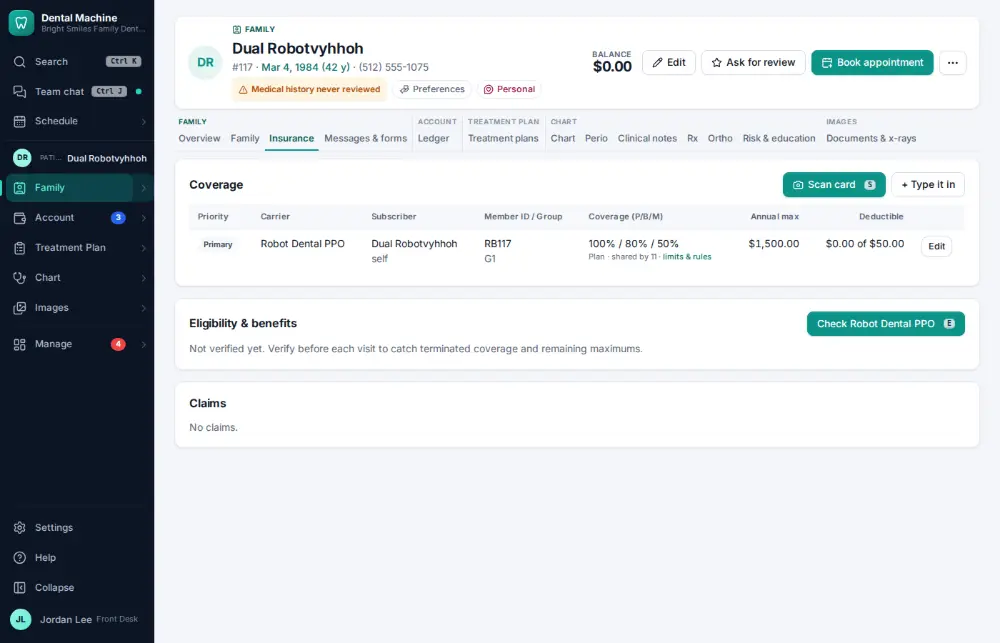
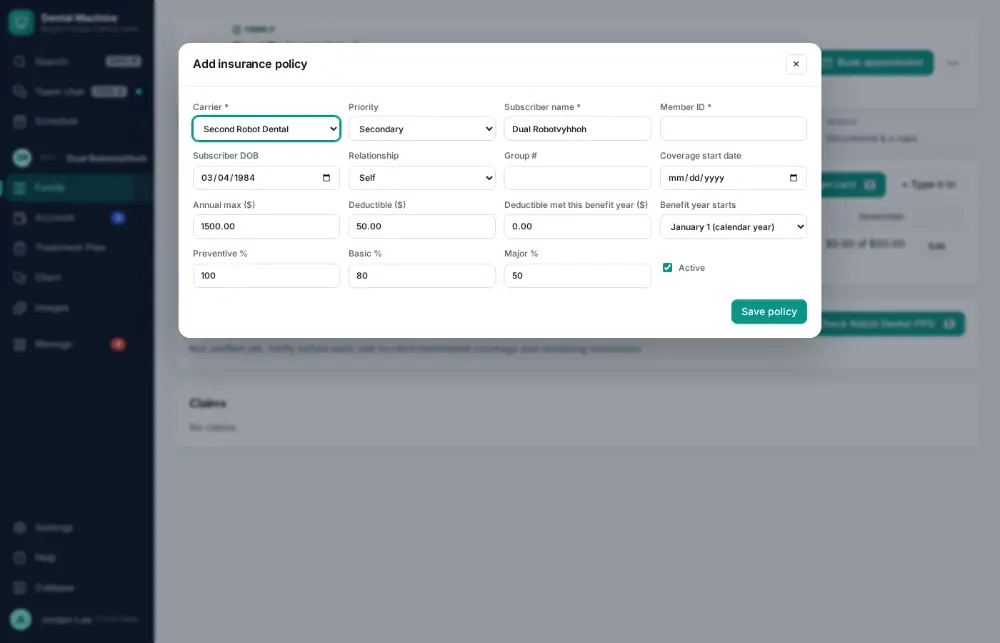
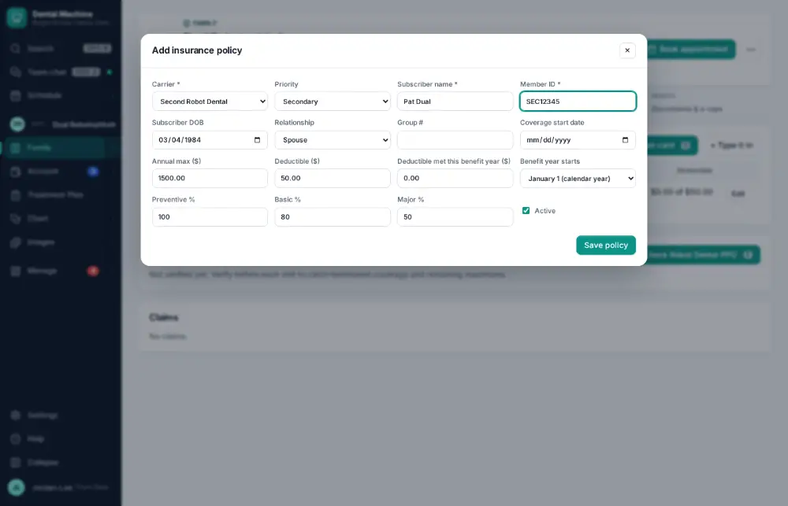
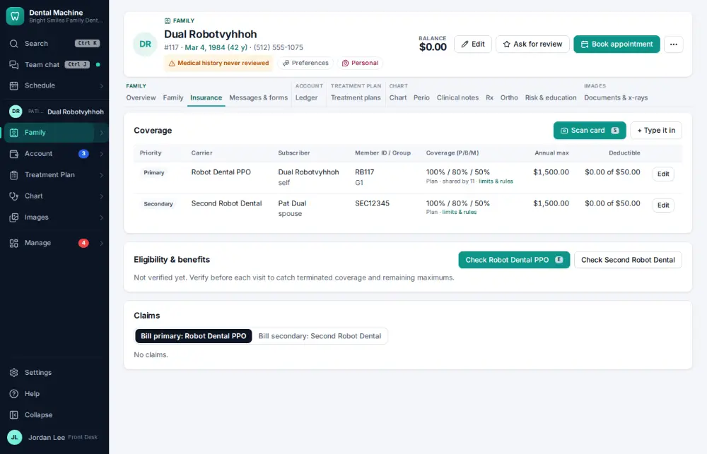

# How do I add a secondary insurance policy?

**Who:** front desk · **Where:** Family module → Insurance tab → + Type it in · **How often:** Every day

Add a second policy: pick the carrier, set Priority to Secondary and type the subscriber and member ID.

## Where to start

## Steps

1. Insurance tab (they already have a primary): click "+ Type it in"

   

2. Pick the carrier; set Priority to Secondary

   

3. Type the subscriber (the spouse), their member ID and relationship  
   Keys: <kbd>Ctrl/⌘ A</kbd>

   

4. Click Save

   

## Tips

- Scanning the card ([A047](A047-scan-a-new-insurance-card-into-a-policy.md)) fills most of the form for you.

## Related

- [How do I scan a new insurance card into a policy?](A047-scan-a-new-insurance-card-into-a-policy.md)
- [How do I verify insurance eligibility?](A026-verify-insurance-eligibility.md)
- [How do I review tomorrow's insurance verification list?](A087-review-tomorrow-s-insurance-verification-list.md)
- [How do I send a pre-authorization?](A081-send-a-pre-authorization.md)
- [How do I post a paper EOB / insurance check?](A072-post-a-paper-eob-insurance-check.md)

---
[All how-tos](README.md) · Action A091 · screenshots from the robot run of 2026-09-25
