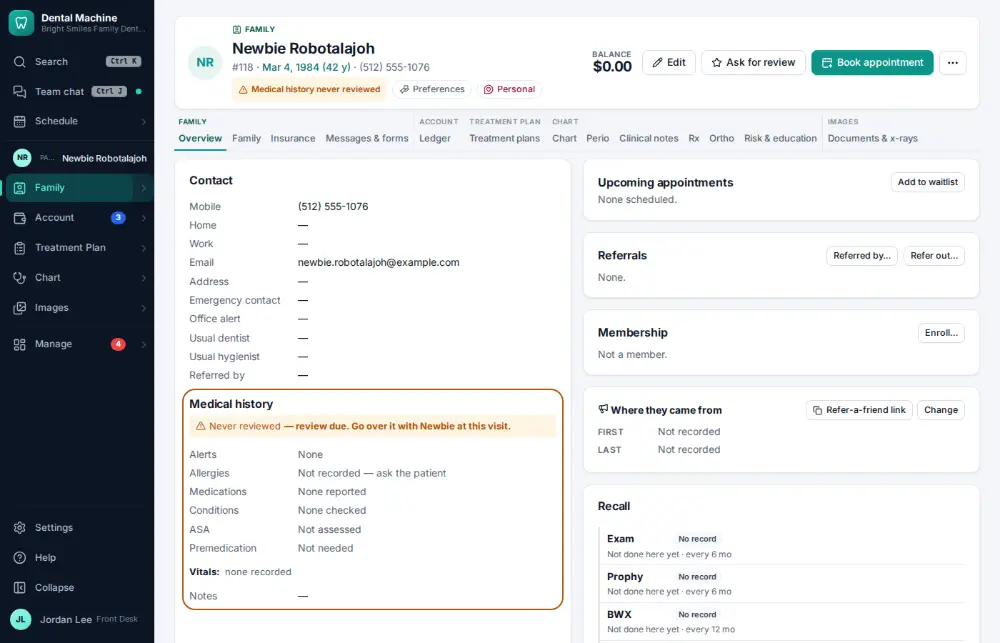
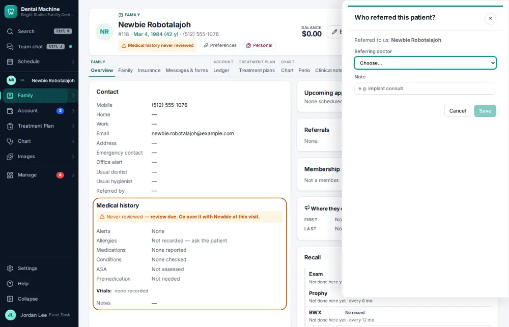
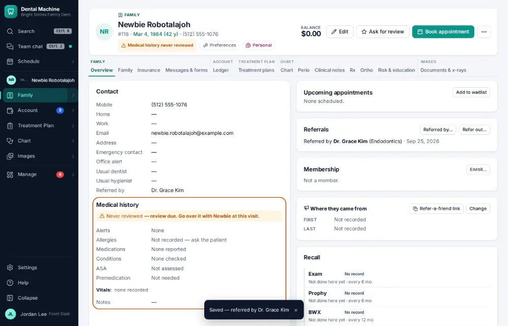

# How do I record who referred a new patient?

**Who:** front desk · **Where:** Chart header → Referred by… · **How often:** Every day

Records who referred the patient (a doctor, another patient, an ad). It feeds the referrals report ([A152](A152-check-where-new-patients-come-from.md)).

## Where to start

## Steps

1. Click "Referred by…" on the chart: "Who referred this patient?" opens beside it

   

2. Pick the referring doctor from the list and click Save

   

## Related

- [How do I check where new patients come from?](A152-check-where-new-patients-come-from.md)
- [How do I refer a patient to a specialist?](A089-refer-a-patient-to-a-specialist.md)
- [How do I add a family member to a household?](A090-add-a-family-member-to-a-household.md)
- [How do I change a patient's usual provider or hygienist?](A098-change-a-patient-s-usual-provider-or-hygienist.md)
- [How do I add an office alert to a patient?](A099-add-an-office-alert-to-a-patient.md)

---
[All how-tos](README.md) · Action A092 · screenshots from the robot run of 2026-09-25
