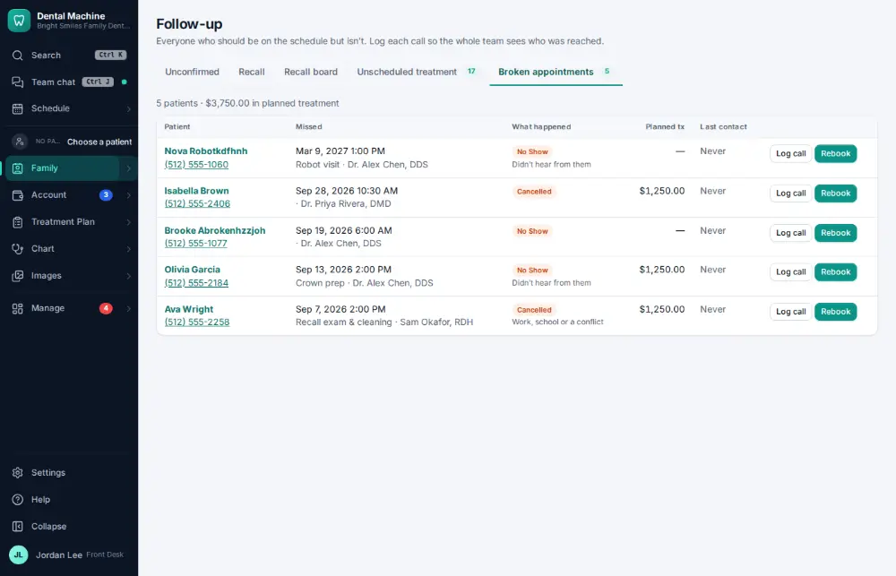
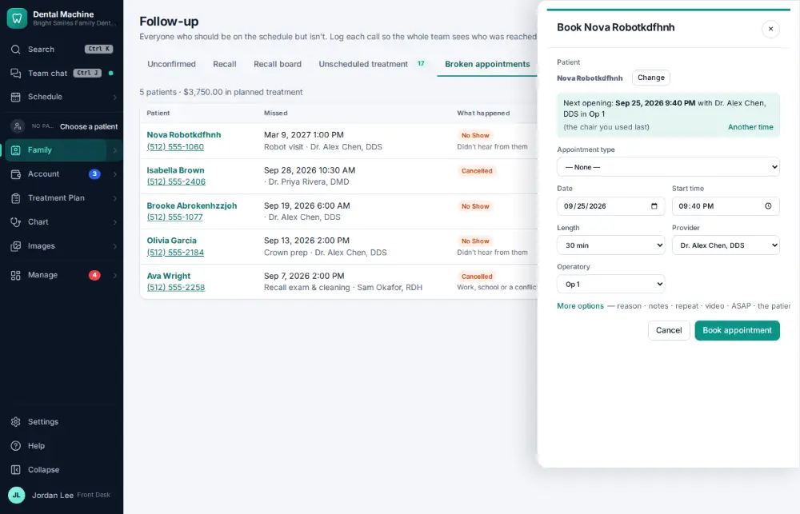
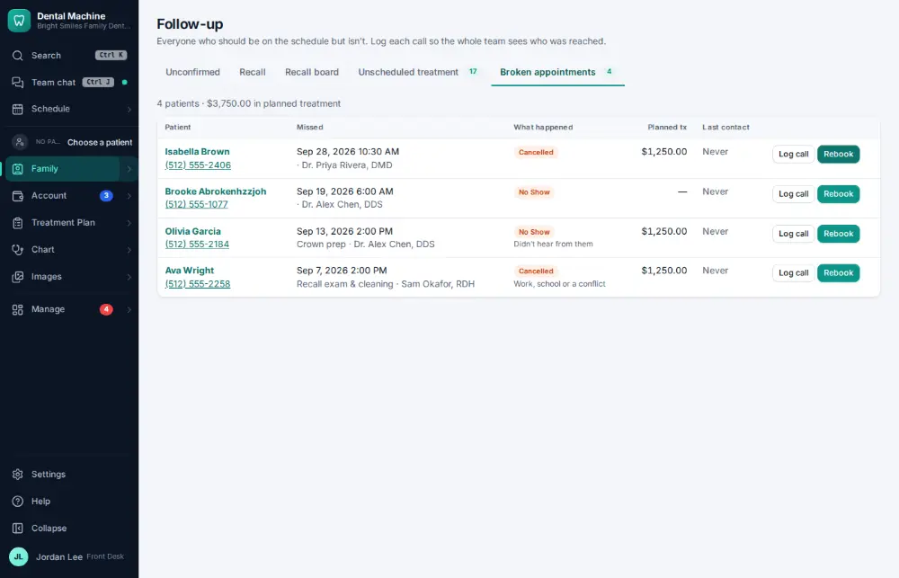

# How do I work the broken-appointments list?

**Who:** front desk · **Where:** Family ▾ → Follow-up lists → Broken appointments · **How often:** Every day

Broken appointments lists recent no-shows and cancellations who haven’t rebooked. Rebook opens the booking on a suggested time.

## Where to start

## Steps

1. Follow-up → Broken appointments: click "Rebook" on the first row

   

2. Book the suggested time  
   Keys: <kbd>Enter</kbd>

   

## Related

- [How do I mark a no-show?](A071-mark-a-no-show.md)
- [How do I cancel an appointment?](A054-cancel-an-appointment.md)
- [How do I change a patient's recall interval?](A097-change-a-patient-s-recall-interval.md)
- [How do I call a patient about unscheduled treatment?](A057-call-a-patient-about-unscheduled-treatment.md)
- [How do I mark a recall call as “left a message”?](A051-mark-a-recall-call-as-left-a-message.md)

---
[All how-tos](README.md) · Action A093 · screenshots from the robot run of 2026-09-25
