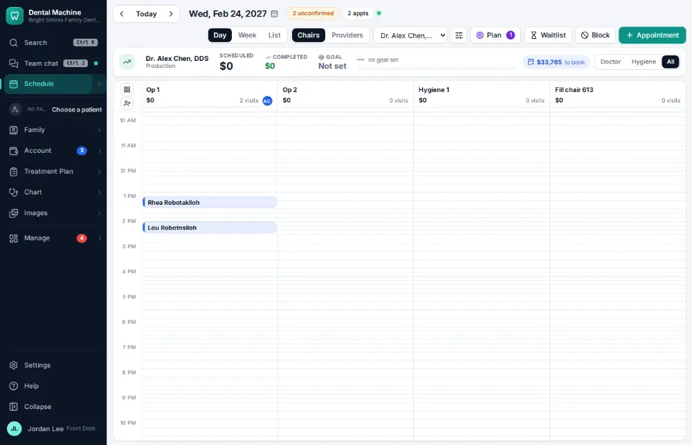
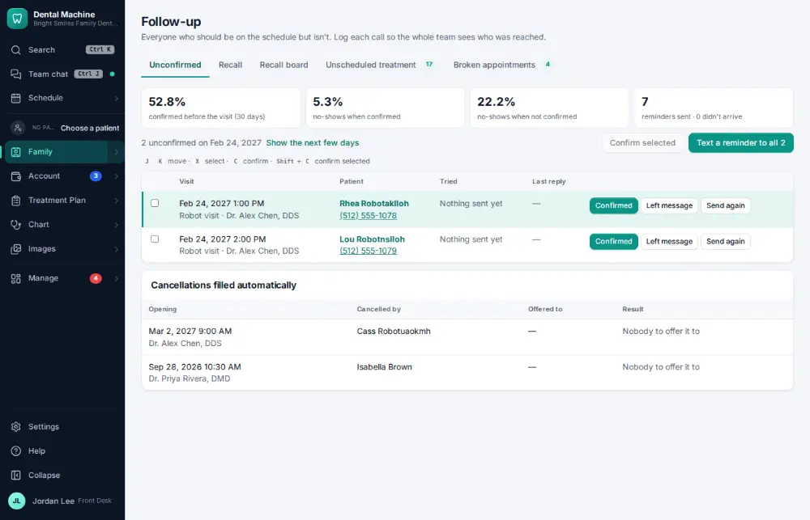
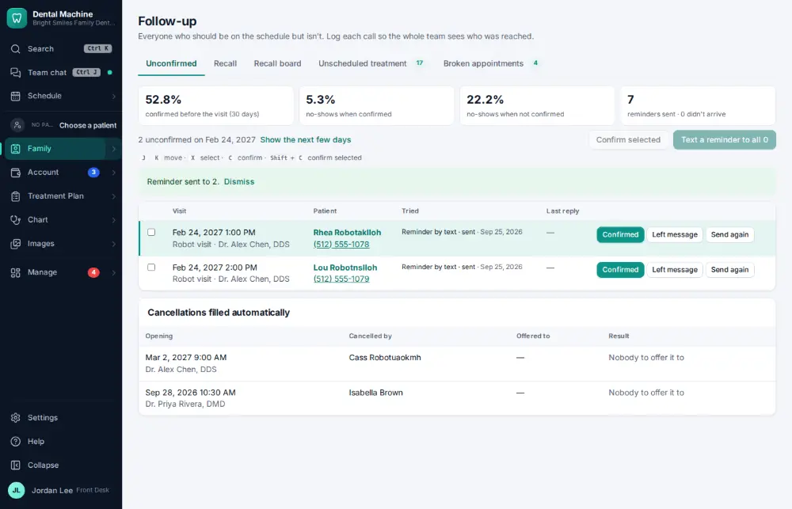

# How do I text a reminder to everyone unconfirmed?

**Who:** front desk · **Where:** Schedule → “N unconfirmed” → Text a reminder to all · **How often:** Every day

The schedule shows how many visits aren’t confirmed. Open the list and text a reminder to all of them at once.

## Where to start

## Steps

1. Click "N unconfirmed": the list opens

   

2. Click "Text a reminder to all": texts go out, a count shows

   

## Tips

- Reminders also go out automatically on the schedule set in Settings → Messages & reviews.
- In the list, C confirms a visit by phone.

## Related

- [How do I confirm an appointment?](A016-confirm-an-appointment.md)
- [How do I change reminder and message settings?](A167-change-reminder-and-message-settings.md)
- [How do I send patient education after a visit?](A080-send-patient-education-after-a-visit.md)
- [How do I ask a patient for a review?](A065-ask-a-patient-for-a-review.md)
- [How do I text back an unknown caller?](A066-text-back-an-unknown-caller.md)

---
[All how-tos](README.md) · Action A094 · screenshots from the robot run of 2026-09-25
