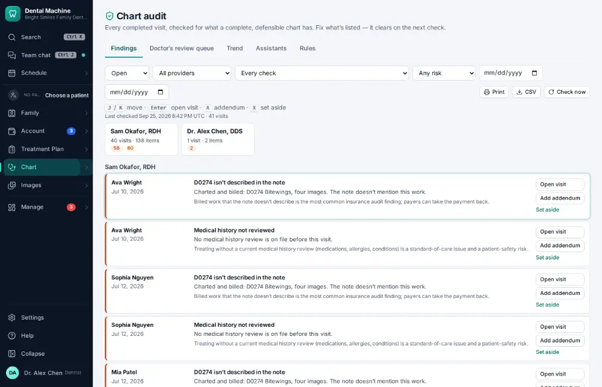

# How do I fix unsigned or incomplete notes?

**Who:** dentist, office manager · **Where:** Chart ▾ → Chart audit · **How often:** Every day

Chart audit lists notes waiting to be signed and charts that need fixing.

## Steps

1. Press Ctrl/⌘K, type "chart audit", Enter: notes to sign and charts to fix  
   Keys: <kbd>Ctrl/⌘ K</kbd> type “chart audit” <kbd>Enter</kbd>

   

## Tips

- J/K move; Enter opens the visit; A adds an addendum; X sets one aside with a reason.
- Alt+K checks the chart you are in.

## Related

- [How do I sign a clinical note?](A023-sign-a-clinical-note.md)
- [How do I write a clinical note?](A011-write-a-clinical-note.md)
- [How do I log a sterilizer spore test?](A132-log-a-sterilizer-spore-test.md)
- [How do I give a patient a copy of their record?](A141-give-a-patient-a-copy-of-their-record.md)
- [How do I file an office document?](A153-file-an-office-document.md)

---
[All how-tos](README.md) · Action A095 · screenshots from the robot run of 2026-09-25
