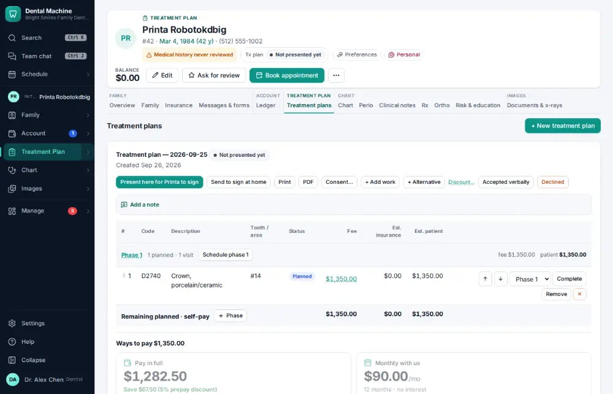
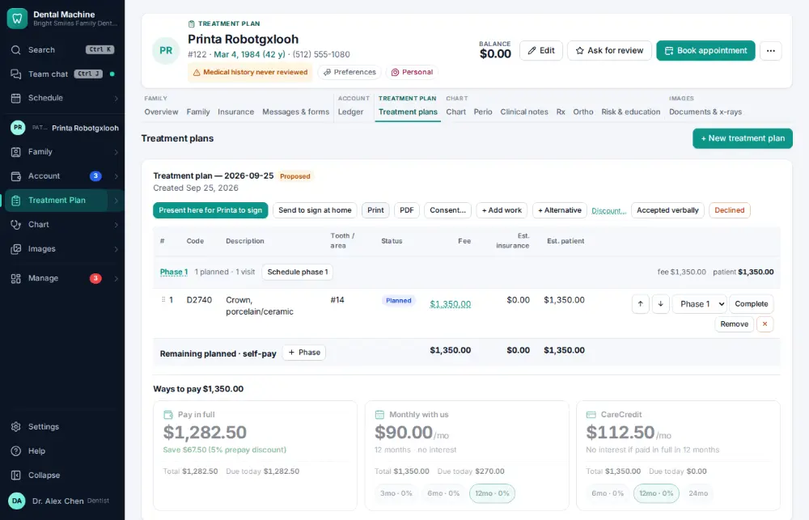

# How do I print a treatment plan?

**Who:** front desk · **Where:** Treatment Plan module → the plan → Print · **How often:** Every day

Prints the treatment plan with fees, insurance estimates and the patient’s share, for the patient to take home.

## Where to start

## Steps

1. Click "Print" on the plan: the printable plan opens in a new tab

   

## Tips

- The printable plan opens in a new browser tab; print it from there with Ctrl/⌘ P.

## Related

- [How do I present a treatment plan and get it signed?](A042-present-a-treatment-plan-and-get-it-signed.md)
- [How do I build a treatment plan?](A038-build-a-treatment-plan.md)
- [How do I refer a patient to a specialist?](A089-refer-a-patient-to-a-specialist.md)
- [How do I record an orthodontic adjustment visit?](A101-record-an-orthodontic-adjustment-visit.md)
- [How do I write a prescription?](A062-write-a-prescription.md)

---
[All how-tos](README.md) · Action A096 · screenshots from the robot run of 2026-09-26
