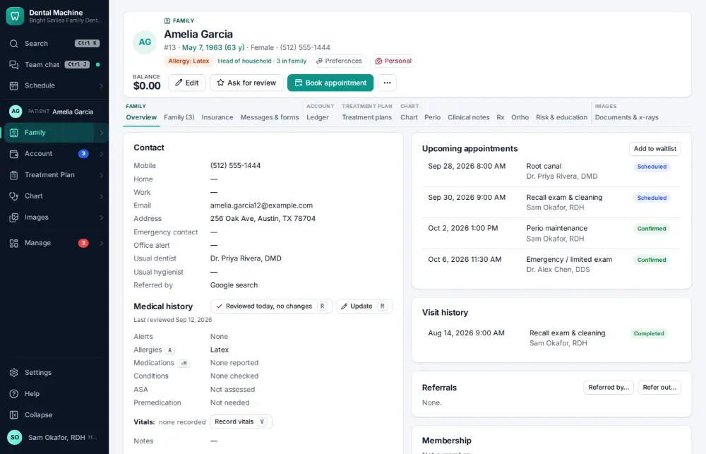
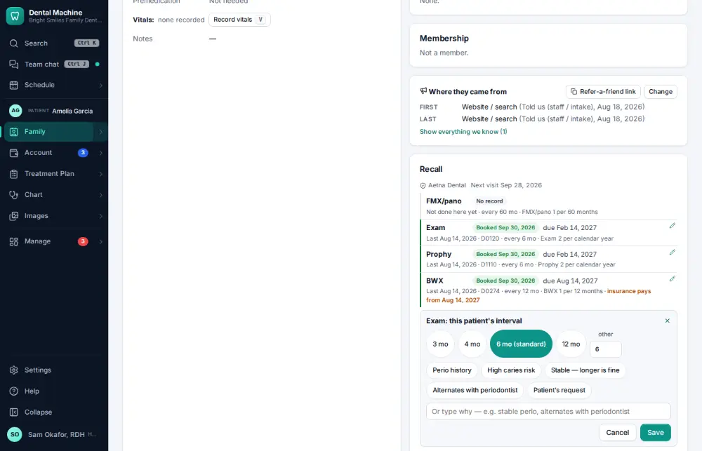
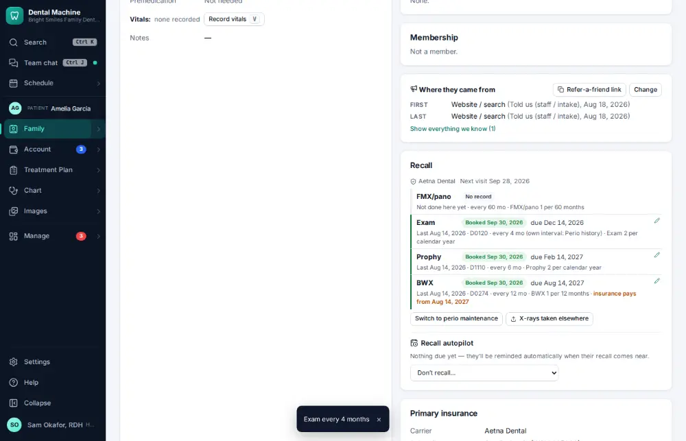

# How do I change a patient's recall interval?

**Who:** hygienist · **Where:** Family module → Overview → Recall · **How often:** Every day

Change how often a patient is due for a cleaning. The usual intervals and reasons are one click each.

## Where to start

## Steps

1. Chart overview → Recall: click the ✎ next to the cleaning’s interval (the usual intervals and reasons are chips)

   

2. Click "4 mo", then the reason "Perio history": saved

   

## Tips

- The reason is kept with the change, so the next person knows why.

## Related

- [How do I call a patient who is due for recall?](A037-call-a-patient-who-is-due-for-recall.md)
- [How do I check what the recall autopilot did?](A125-check-what-the-recall-autopilot-did.md)
- [How do I chart perio?](A045-chart-perio.md)
- [How do I work the broken-appointments list?](A093-work-the-broken-appointments-list.md)
- [How do I call a patient about unscheduled treatment?](A057-call-a-patient-about-unscheduled-treatment.md)

---
[All how-tos](README.md) · Action A097 · screenshots from the robot run of 2026-09-25
