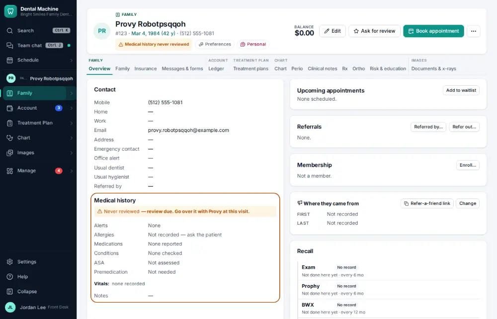
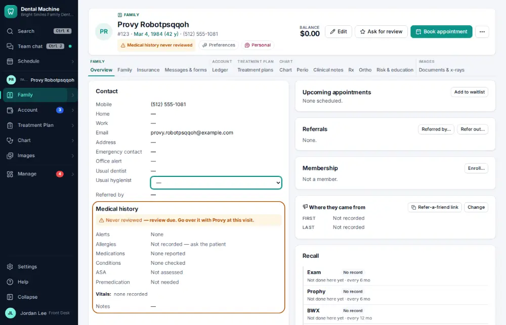
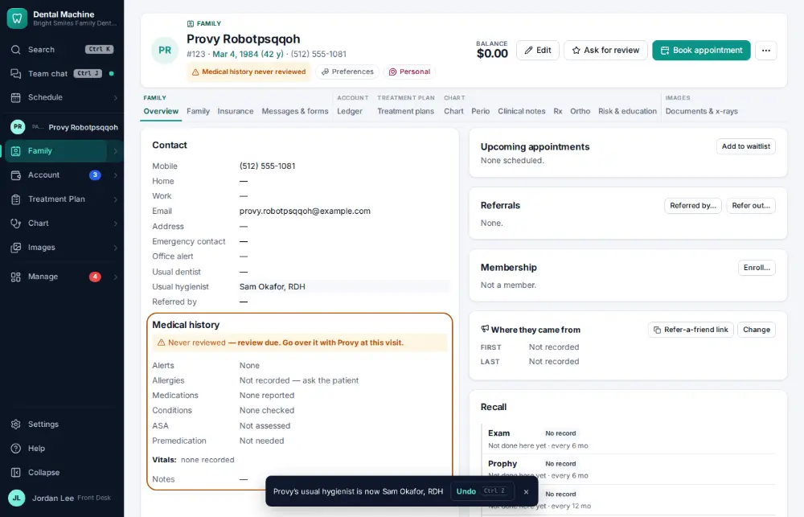

# How do I change a patient's usual provider or hygienist?

**Who:** front desk · **Where:** Family module → Overview → Contact card · **How often:** Every day

Sets the dentist or hygienist the patient usually sees. Bookings then default to them.

## Where to start

## Steps

1. Contact card: click "Usual hygienist" — the list of hygienists opens in place

   

2. Pick Sam Okafor, RDH: saved at once (Undo shows)

   

## Tips

- It saves as soon as you pick; Undo on the notice takes it back.

## Related

- [How do I book an appointment for an existing patient?](A020-book-an-appointment-for-an-existing-patient.md)
- [How do I add an office alert to a patient?](A099-add-an-office-alert-to-a-patient.md)
- [How do I add a family member to a household?](A090-add-a-family-member-to-a-household.md)
- [How do I record who referred a new patient?](A092-record-who-referred-a-new-patient.md)
- [How do I make a patient inactive?](A117-make-a-patient-inactive.md)

---
[All how-tos](README.md) · Action A098 · screenshots from the robot run of 2026-09-25
