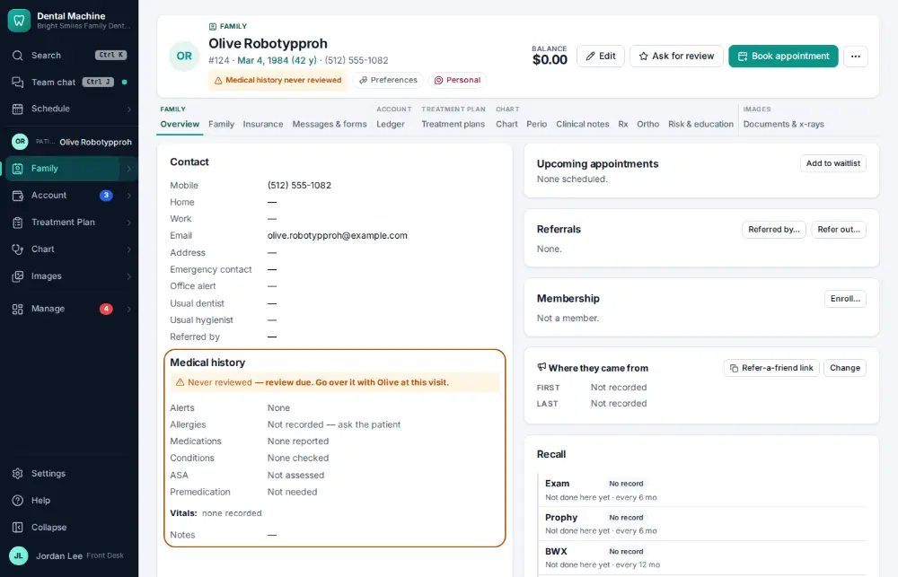
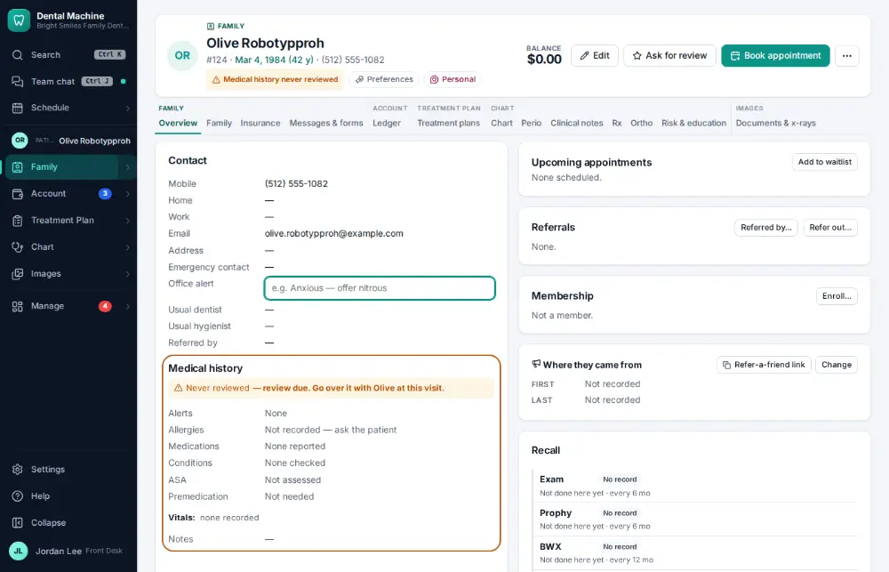
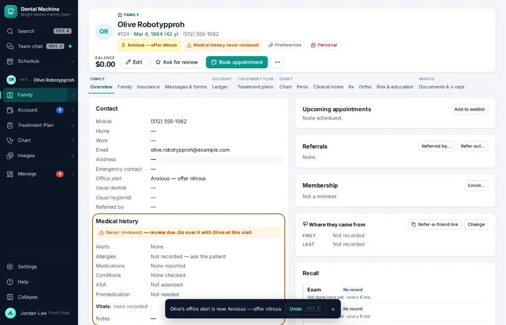

# How do I add an office alert to a patient?

**Who:** front desk · **Where:** Family module → Overview → Contact card → Office alert · **How often:** Every day

An office alert pops up for the next person who opens the chart (for example “Always ask for the co-pay upfront”). Medical alerts belong in the medical history instead.

## Where to start

## Steps

1. Contact card: click "Office alert" — it opens for typing in place

   

2. Type the alert and press Enter: saved (Undo shows); it pops up for the next person who opens the chart  
   Keys: <kbd>Enter</kbd>

   

## Tips

- Undo on the notice takes it back. Clear the text to remove the alert.

## Related

- [How do I see a patient’s alerts, balance, insurance and next visit at a glance?](A003-see-a-patient-s-alerts-balance-insurance-and-next-visit-at-a.md)
- [How do I update medical history?](A032-update-medical-history.md)
- [How do I add a family member to a household?](A090-add-a-family-member-to-a-household.md)
- [How do I record who referred a new patient?](A092-record-who-referred-a-new-patient.md)
- [How do I change a patient's usual provider or hygienist?](A098-change-a-patient-s-usual-provider-or-hygienist.md)

---
[All how-tos](README.md) · Action A099 · screenshots from the robot run of 2026-09-25
