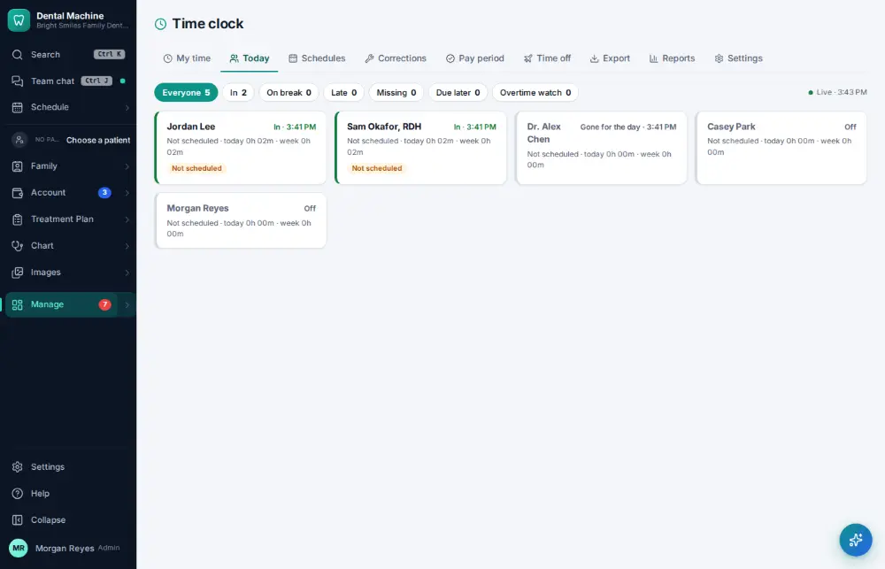

# How do I see who is clocked in today?

**Who:** office manager · **Where:** Manage ▾ → Time clock → Today · **How often:** Every day

Shows everyone’s time-clock status today: in, on a break, out, or not in yet.

## Steps

1. Press Ctrl/⌘K, type "who’s in today", Enter: everyone’s status today  
   Keys: <kbd>Ctrl/⌘ K</kbd> type “who’s in today” <kbd>Enter</kbd>

   

## Related

- [How do I clock in?](A059-clock-in.md)
- [How do I fix a missed time-clock punch?](A107-fix-a-missed-time-clock-punch.md)
- [How do I approve payroll hours?](A122-approve-payroll-hours.md)
- [How do I clock out?](A060-clock-out.md)
- [How do I start or end a lunch break?](A061-start-or-end-a-lunch-break.md)

---
[All how-tos](README.md) · Action A100 · screenshots from the robot run of 2026-09-25
